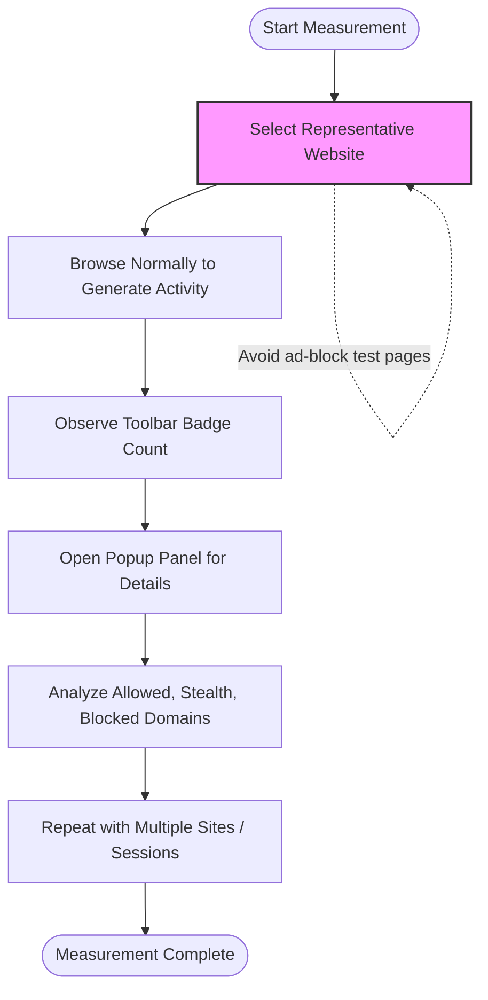

# Best Practices for Accurate Network Measurement with uBO Scope

Unlock reliable insights into your browser’s third-party connections by following this guide. You'll learn how to position uBO Scope for the most accurate real-world network measurement, avoid misleading scenarios like ad blocker test pages, and interpret connection data to distinguish essential traffic from extraneous noise.

---

## 1. Understanding the Measurement Context

Before diving into practical steps, it's important to set the right context for what network measurement means with uBO Scope:

- **Focus on Real-World Browsing Behavior:** uBO Scope reveals connections your browser makes while loading typical websites.
- **Avoid Synthetic or Test Pages:** Pages designed as "ad blocker tests" produce artificial network requests and can skew data.
- **Outcome Categories:** The extension distinguishes connections as **allowed**, **stealth-blocked**, or **blocked** to reflect your actual browsing environment.

### Why Real-World Matters

Many so-called "test" websites send requests to fabricated or rarely used servers, which do not reflect typical browsing. Measuring on genuine sites ensures you capture connections that matter – such as content delivery networks (CDNs), analytics, social buttons, ads, and other third-party services.

---

## 2. Preparing for Accurate Measurement

### Prerequisites

- **uBO Scope Installed and Enabled:** Confirm installation from your browser’s extension/add-on store.
- **Browser Compatible:** Chromium 122+, Firefox 128+, or Safari 18.5+.
- **Content Blockers Configured:** If you use other blockers, set them up as usual to measure their effect with uBO Scope.

### Recommended Environment

- Use a **clean browser profile** or a profile representative of your usual browsing habits.
- Avoid incognito/private mode unless you want to test that exact context.
- Disable VPNs or proxies that may alter network request visibility.

---

## 3. Step-by-Step Best Practices for Measurement

<Steps>
<Step title="Choose Representative Websites">
Measure network connections on websites you visit regularly or popular, content-rich domains. Examples:

- News outlets
- E-commerce and social media
- Educational or governmental sites

Avoid ad blocker test sites to prevent misleading spikes in connection counts.
</Step>

<Step title="Generate Meaningful Network Activity">
Interact naturally with the page:

- Scroll to load dynamic resources
- Click links, open additional pages
- Allow full page load and network activity to complete

This ensures uBO Scope captures third-party connections triggered by real page elements.
</Step>

<Step title="Observe the Toolbar Badge and Popup Panel">

- The badge shows the distinct count of third-party domains successfully connected.
- Open the popup to see detailed allowed, stealth-blocked, and blocked domain lists.

Use this data to evaluate which third-party domains are active.
</Step>

<Step title="Repeat for Multiple Sites and Sessions">
Run measurements across multiple browsing sessions and websites to get consistent results. Expect variation due to dynamic content and personalized ads.
</Step>

<Step title="Avoid Bias by Disabling Other Network Interferers Temporarily (Optional)">
To isolate uBO Scope and your content blockers’ impact, temporarily disable other extensions or network settings such as VPNs or DNS filtering that may mask or reroute traffic.
</Step>
</Steps>

---

## 4. Interpreting uBO Scope Data in Context

### Distinguish Essential Connections From Extraneous Ones

- **Low Counts Can Be Healthy:** Many legitimate sites rely on a few essential third-party servers, usually CDNs.
- **High Counts May Signal Ad or Tracker Exposure:** More allowed third-party servers generally indicate greater exposure to advertisers or analytics.
- **Stealth-Blocked Domains Represent Invisible Block Attempts:** These are domains your content blocker stopped stealthily.

### Use Practical Browser Examples

- A typical news site might connect to ~3-5 distinct third-party domains (CDNs, social APIs).
- Sites heavy in advertisements might show 10+ third-party domains.

Interpret counts comparatively, but not absolutely — some third parties are necessary for site functionality.

---

## 5. Common Pitfalls to Avoid

<AccordionGroup title="Common Pitfalls and How to Avoid Them">
<Accordion title="Relying on Ad Blocker Test Pages">
<h4>Why to Avoid</h4>
These pages generate fictitious network requests not reflective of real browsing. Content blockers often stealthily block these requests, resulting in distorted counts.

<h4>What to Do Instead</h4>
Use popular real websites and browsing scenarios for measurement to obtain meaningful data.
</Accordion>

<Accordion title="Assuming High Block Counts Means Better Blocking">
High block counts can sometimes mean your browser loads more third-party domains overall, which is worse. Focus on the number of allowed distinct third-party servers — lower is better.
</Accordion>

<Accordion title="Ignoring Browser and Network Environment Variations">
An unstable network, VPN usage, or browser quirks can affect request visibility. Keep your environment consistent while measuring to ensure accurate results.
</Accordion>
</AccordionGroup>

---

## 6. Practical Tips for Success

- **Refresh the Page Fully:** Ensure network activity is not prematurely interrupted.
- **Use uBO Scope’s Popup for Detailed Insight:** It gives domain-level counts helping to spot common third-party services.
- **Check Permissions and Setup If Data Isn't Appearing:** Refer to troubleshooting guides if the badge shows no counts.

---

## 7. Troubleshooting Common Issues

<AccordionGroup title="Troubleshooting Measurement Accuracy">
<Accordion title="No Network Activity Showing in Badge or Popup">
- Verify uBO Scope is enabled and permissions are granted.
- Confirm your browser’s version meets minimum requirements.
- Browsers may restrict network tracking on some private or non-standard pages.
</Accordion>

<Accordion title="Unexpectedly High Number of Third-Party Domains">
- Ensure you are not measuring on ‘test’ websites with artificial content.
- Temporarily disable other interfering extensions and VPNs.
- Check if your content blockers are properly active.
</Accordion>

<Accordion title="Inconsistent Badge Counts Across Reloads">
- Tabs reset data on close; test with stable sessions.
- Dynamic site content may change third-party network requests on reload.
</Accordion>
</AccordionGroup>

---

## 8. Next Steps and Related Resources

- Explore the [Getting Started with uBO Scope](https://github.com/gorhill/uBO-Scope/guides/core-workflows/getting-started) guide for initial setup.
- Deepen your understanding in [Interpreting the Toolbar Badge and Popup Panel](https://github.com/gorhill/uBO-Scope/guides/core-workflows/interpreting-badge-and-popup).
- Refer to the [Troubleshooting Installation and First Use](https://github.com/gorhill/uBO-Scope/getting-started/troubleshooting/troubleshooting-installation) guide if you experience issues.
- Learn about the meaning of allowed, stealth, and blocked outcomes from [Core Concepts & Terminology](https://github.com/gorhill/uBO-Scope/overview/getting-started/core-concepts).

The combination of these guides ensures you harness uBO Scope effectively for precise and trustworthy network insights.

---

## 9. Summary Diagram: Ideal User Network Measurement Flow

---

# Additional Resources

- [uBO Scope GitHub Repository](https://github.com/gorhill/uBO-Scope)
- [Detailed Popup Interface Documentation](https://github.com/gorhill/uBO-Scope/blob/main/popup.html)
- [Troubleshooting Installation](https://github.com/gorhill/uBO-Scope/getting-started/troubleshooting/troubleshooting-installation)

<Tip>
Accurate network measurement hinges on capturing meaningful, real-world traffic — avoid artificial test pages to ensure uBO Scope reveals the connections that matter.
</Tip>

<Check>
Confirm you are running the latest supported browser version and uBO Scope 1.0.1 or later for best measurement reliability.
</Check>

<Note>
Lower toolbar badge counts indicate fewer distinct third-party connections, which usually translates to better privacy protection.
</Note>
