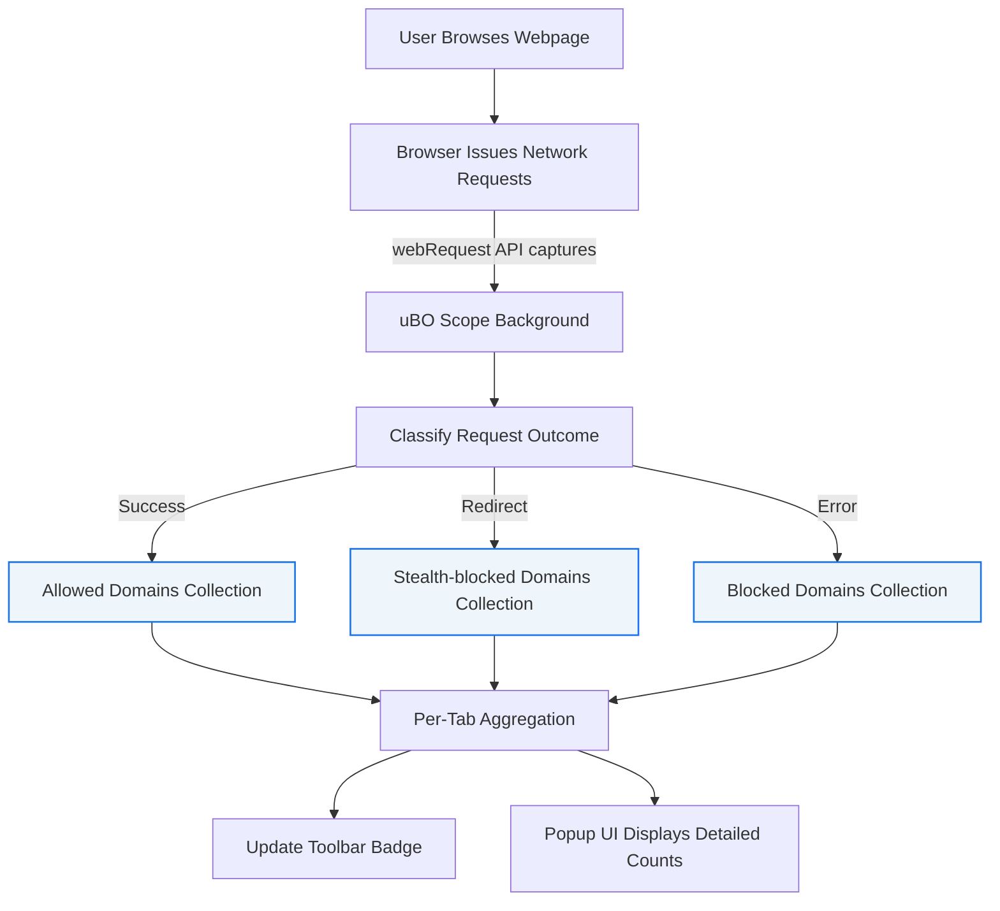

# Extracting Detailed Request Data

## Overview

This guide helps you access and interpret granular statistics about all network request outcomes observed by uBO Scope, including requests that are allowed, stealth-blocked, or blocked. The detailed data provided by uBO Scope can be invaluable for forensic analysis, auditing third-party network activity, and supporting filter list maintenance.

By the end of this guide, you will confidently understand how uBO Scope collects and presents detailed request data and how to interpret the categorized domain connections within the extension's popup interface.

---

## 1. What This Page Covers

- How uBO Scope tracks network requests by outcome categories.
- Understanding domains and hostnames statistics per category.
- Using the popup UI to explore detailed request counts.
- Practical tips for forensic and analytical usage of connection data.

## 2. Prerequisites

Ensure that:

- You have uBO Scope installed and running on a supported browser (Chromium 122+, Firefox 128+, Safari 18.5+).
- You have a current active browsing session with some network activity (page loads) to produce data.
- You are familiar with basic network connection concepts and the terminology used by uBO Scope (see the Core Terminology documentation).

## 3. Expected Outcome

Following this guide, you will be able to:

- Access per-tab detailed statistics on network requests.
- Distinguish allowed, stealth-blocked, and blocked domains.
- Understand counts of unique domains and request frequencies per category.
- Use this data effectively for auditing or troubleshooting network behaviors.

## 4. How uBO Scope Tracks and Categorizes Requests

uBO Scope monitors outgoing network requests made by web pages within your browser. It uses the browser's `webRequest` API to gather detailed information about each request made per tab.

Requests are classified into three outcome categories:

- **Allowed:** Requests that completed successfully, resulting in connections to third-party domains.
- **Stealth-blocked:** Requests that were intercepted or redirected stealthily by content blockers or network controls without being explicitly blocked.
- **Blocked:** Requests that failed or were actively blocked.

The extension aggregates data for each tab separately, tracking:

- Hostnames from which requests originated.
- Unique domains derived from those hostnames using the Public Suffix List to determine registered domains.
- Counts of requests per domain and hostname within each category.

## 5. Accessing Detailed Request Data in the Popup UI

### Step-by-Step Instructions

<Steps>
<Step title="Open the uBO Scope Popup">
Click the uBO Scope icon in your browser's toolbar to open the popup interface. This popup displays real-time data for the active tab.
</Step>
<Step title="Identify the Current Tab Domain">
At the top of the popup, the hostname and registered domain of the current tab are shown. This contextualizes the data.
</Step>
<Step title="Review the Summary Section">
Below the tab domain, the total number of distinct allowed third-party domains connected from this tab is displayed.
</Step>
<Step title="Explore Outcome Categories">
The popup is divided into three sections for 'not blocked' (allowed), 'stealth-blocked', and 'blocked' domains. Each section lists:

- Domains with network requests in that category.
- Badges showing the count of requests made per domain.
</Step>
<Step title="Interpret Request Counts">
Higher counts next to a domain indicate more requests made to that domain. This granular insight helps detect heavy network activity or potential stealth blocking.
</Step>
</Steps>

### What You Should See

- A clear list of domains under each category with their request counts.
- Accurate reflection of all distinct third-party domains contacted from the active tab.

## 6. Understanding Domains vs. Hostnames

To provide meaningful aggregation, uBO Scope uses the Public Suffix List to parse hostnames into their registrable domains. For example, requests to `cdn.example.co.uk` and `images.example.co.uk` are grouped under the domain `example.co.uk`.

- **Hostname:** The full host portion of a URL where a request is sent.
- **Domain:** The registered domain part used for grouping multiple hostnames.

This grouping helps you assess the exposure to distinct external domains rather than numerous subdomains.

## 7. Practical Use Cases

- **Forensics:** Quickly identify which third-party domains your browser connected to during a session, including stealthy or blocked attempts.
- **Analytics:** Measure the volume and distribution of requests by domain category to better understand network behavior.
- **Filter Maintenance:** Detect domains frequently blocked or stealth-blocked to refine filter lists.

## 8. Tips for Effective Analysis

- Regularly clear browser tabs or restart sessions to maintain accurate per-tab data, as uBO Scope tracks requests by tab.
- Use the request counts to spot abnormal or unexpected network activity that might indicate tracking or unapproved connections.
- Combine this data with other uBO Scope guides such as 'Investigating Third-Party Requests in Real Time' for a complete workflow.

## 9. Common Pitfalls and Troubleshooting

<Tip>
If you see no data or zero counts shortly after loading a page, ensure that the page has completed initial network activity and that the extension has had time to process requests (usually up to 1 second).
</Tip>

<Tip>
Network requests made by pages outside `http`, `https`, `ws`, or `wss` protocols cannot be tracked as uBO Scope relies on `webRequest` API which currently supports these.
</Tip>

<Tip>
Stealth blocking may not always show detailed hostnames if the requests were redirected or silently intercepted; such domains appear under the stealth category grouped by domain.
</Tip>

## 10. Advanced Understanding (For Filter Maintainers)

uBO Scope's data granularity can expose nuanced request patterns often hidden behind content blockers or DNS filters. Consider:

- Evaluating multiple request counts per domain to identify persistent resource servers.
- Tracking stealth-blocked domains to detect refined blocking techniques that evade straightforward detection.

This detailed data empowers the creation of more effective and precise filter lists.

## 11. Summary Diagram: Workflow of Data Collection and Display

## 12. Next Steps and Related Documentation

- Read the [Investigating Third-Party Requests in Real Time](../exploring-network-insight-workflows/investigating-third-party-requests) guide to apply these data insights live.
- Consult the [Understanding the Toolbar Badge & Popup](../getting-started-with-ubo-scope/understanding-badge-and-popup) page for detailed UI explanations.
- Review [Best Practices: Interpreting Content Blockers with uBO Scope](../exploring-network-insight-workflows/best-practices-content-blockers) to maximize analysis effectiveness.
- For installation or first-run issues, see [Installing uBO Scope on Your Browser](../../getting-started-with-ubo-scope/installation-on-chromium-firefox-safari) and [Troubleshooting Installation & First Run Issues](../../getting-started/first-steps-usage-validation/troubleshooting).

---

## 13. Quick Reference Example

After opening a news website in a tab:

- Open uBO Scope popup.
- You see "domains connected: 5" in the summary.
- The 'not blocked' section lists `cdn.example.com (12)`, `ads.network.com (3)`, etc., indicating 12 requests to the CDN domain and 3 to the ads domain.
- The 'stealth-blocked' section shows `tracker.evil.com (7)`, indicating stealth block attempts.
- The 'blocked' section shows `ads.evil.com (1)`, a blocked request.

This immediate insight provides a forensic-level view of network activity.

---

Remember, uBO Scope's power lies in its transparency and detailed network request counting—use this data to make informed decisions about your browsing privacy and filtering strategies.