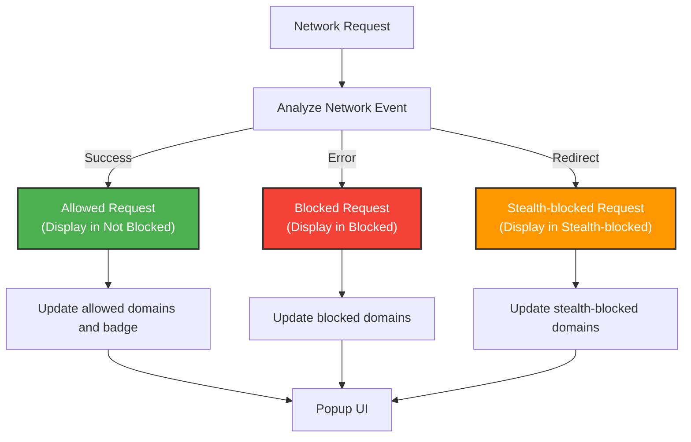

# Understanding Stealth Blocking and Network Statuses

## Overview

This guide helps you understand how uBO Scope classifies network connections in three categories: **allowed**, **blocked**, and **stealth-blocked**. It explains how uBO Scope reveals network requests that were blocked invisibly—requests your browser made but the web page cannot detect — alongside visibly blocked and allowed requests. By learning these distinctions, you gain clearer insight into the invisible privacy protections that content blockers apply and the true exposure of your network activity.

---

## What You Will Learn

- What distinguishes allowed, blocked, and stealth-blocked network requests
- How uBO Scope detects and displays stealth blocking that normal pages cannot see
- Practical interpretation of network statuses in uBO Scope’s popup
- Why stealth blocking matters for privacy and accurate network transparency

---

## Prerequisites

- uBO Scope installed and enabled in your Chromium, Firefox, or Safari browser
- Basic familiarity with your browser’s network activity
- Understanding how to open and use the uBO Scope popup interface (covered in [Understanding the Popup: Reading Domain Data](/guides/getting-started-guides/first-look-at-popup))

---

## Expected Outcome

By following this guide, you will confidently interpret the three network request outcome categories in uBO Scope, enabling you to distinguish between visible blocking and stealth blocking. This mastery empowers more informed privacy decisions, accurate assessment of content blocker effectiveness, and deeper understanding of network visibility.

---

# Key Concepts of Network Request Statuses

### 1. Allowed Requests

**Definition:** These are network connections your browser successfully made to remote third-party servers that were neither blocked nor stealthily hidden.

**What you see:** The domains that appear under the **not blocked** section in the uBO Scope popup represent allowed requests.

**What it means:** These connections were permitted by the content blocker or no blocking was applied, so resources loaded normally.

---

### 2. Blocked Requests

**Definition:** These are network requests your content blocker explicitly blocked and your browser recognizes as failed.

**What you see:** The domains listed under the **blocked** section in uBO Scope’s popup.

**What it means:** These are visible blocks—network connections stopped outright and known by the browser to be blocked.

---

### 3. Stealth-blocked Requests

**Definition:** Network requests blocked in a stealthy way, so the web page and sometimes even the browser cannot directly detect the block.

**What you see:** Domains under the **stealth-blocked** section in uBO Scope’s popup.

**What it means:** These requests were intercepted or prevented without giving any indication to the web page or standard browser APIs. This kind of blocking aims to prevent tracking or fingerprinting that can detect blocking behavior.

<u>Stealth blocks reveal hidden privacy protections that are often invisible to typical browser developer tools or webpages themselves.</u>

---

# How uBO Scope Detects and Classifies Network Requests

uBO Scope listens to all network requests via the browser's webRequest API and processes events like redirects, errors, and successful responses. It maintains categorized records per browser tab:

- **Allowed:** Requests with successful responses
- **Blocked:** Requests ending in errors (explicit blocking)
- **Stealth-blocked:** Redirects or blocks that do not raise obvious errors but are controlled to hide from the page

When network requests occur, uBO Scope updates its records accordingly and displays counts and domain lists in the popup, reflecting these three categories.

---

# Step-by-Step Workflow: Interpreting Network Statuses

<Steps>
<Step title="Open uBO Scope Popup">
Open the extension’s popup by clicking the uBO Scope toolbar icon in your browser.
</Step>
<Step title="Locate the Network Status Sections">
Notice three sections labeled **not blocked**, **stealth-blocked**, and **blocked**.
</Step>
<Step title="Review Allowed Domains">
Focus first on the **not blocked** section to see third-party domains your browser connected to successfully.
</Step>
<Step title="Examine Stealth-blocked Domains">
Look at **stealth-blocked** domains — these represent requests that were blocked invisibly, meaning the web page could not detect the block.
</Step>
<Step title="Check Blocked Domains">
Review **blocked** domains which are explicitly blocked and detected by the browser.
</Step>
<Step title="Understand the Badge Count">
Know that the toolbar icon badge shows the count of distinct domains in the **allowed** category, reflecting actual visible network activity.
</Step>
</Steps>

---

# Practical Examples

Imagine visiting a news website where uBO Scope shows:

- **Not blocked:** `cdn.news-site.com`, `images.news-site.com`
- **Stealth-blocked:** `tracker.adservice.com`
- **Blocked:** `ads.fakedomain.com`

This means your browser loaded legitimate resources normally, some tracking requests were stealthily blocked preventing detection, and some known ad servers were explicitly blocked.

---

# Best Practices & Tips

- **Trust the presence of stealth-blocked domains:** Their presence means your content blocker is actively protecting your privacy by silently blocking requests that would otherwise betray your blocking.

- **A lower allowed count is better:** Fewer allowed third-party domains indicate less exposure to tracking or unwanted networking.

- **Compare blocked and stealth-blocked:** Some content blockers prefer stealth blocking to avoid breakage; both protect your privacy but affect visibility differently.

- **Use uBO Scope alongside your content blocker:** It complements blockers by showing what is truly allowed, blocked, or stealth-blocked across all network layers.

---

# Troubleshooting Stealth Blocking

<AccordionGroup title="Troubleshooting Stealth and Network Status Issues">
<Accordion title="No Stealth-blocked Domains Shown?">
Make sure your content blocker supports stealth blocking and is enabled. Stealth blocking depends on browser API events and may vary.
</Accordion>
<Accordion title="Unexpectedly High Allowed Domains Count">
Review your content blocker’s settings for rules and whitelist. A high allowed count can imply ineffective blocking or whitelist entries.
</Accordion>
<Accordion title="Stealth-blocked Section Empty But Blocking Occurs">
Certain browser or extension updates may affect stealth detection. Refresh the page or reinstall uBO Scope if needed.
</Accordion>
</AccordionGroup>

---

# Additional Insights

- uBO Scope distinguishes between **redirect** events (`stealth`) and **error** events (`blocked`) to classify stealth blocks.
- It aggregates counts by domain using the Public Suffix List for accurate domain grouping.
- Stealth blocking enhances privacy by hiding blocking activity from scripts that attempt to detect ad blockers.

---

# Next Steps

- Explore the detailed network data in the [uBO Scope Popup: Reading Domain Data](/guides/getting-started-guides/first-look-at-popup).
- Deepen your understanding of domain counting and network visibility at [Making Sense of Domain Counts and Network Visibility](/guides/advanced-usage-guides/understanding-domain-counts).
- Learn practical everyday use cases and mythbusting from [Real-World Uses](/guides/advanced-usage-guides/real-world-uses).
- If facing setup problems, consult [Troubleshooting Your Setup](/getting-started/first-use-validation/troubleshooting-setup).

---

# References

- [What is uBO Scope?](/overview/product-introduction/what-is-ubo-scope): Intro to the extension's purpose and capabilities.
- [Core Concepts & Terminology](/overview/core-concepts-and-architecture/fundamental-concepts): Definitions for domain and network concepts.
- [Extension Architecture Overview](/overview/core-concepts-and-architecture/arch-overview): How network data flows within uBO Scope.
- [Integration and Compatibility](/overview/core-concepts-and-architecture/integration-and-compatibility): Browser support and technical notes.

---

# Summary

| Category | Meaning | Popup Section | Impact | Visibility to Webpage |
| -------- | ------- | ------------- | ------ | -------------------- |
| Allowed (Success) | Requests allowed and loaded | Not Blocked | Resources loaded | Fully visible |
| Blocked (Error) | Requests blocked obviously | Blocked | No resources loaded | Visible blocking event |
| Stealth-blocked (Redirect) | Requests blocked invisibly | Stealth-blocked | No resource loaded, invisible blocking | Hidden from webpage |

---

# Illustrative Diagram of Network Request Classification

---

# Frequently Asked Questions

<AccordionGroup title="FAQs about Stealth Blocking and Network Statuses">
<Accordion title="Q1: What is stealth blocking and why is it important?">
Stealth blocking is a method for blocking requests without letting the web page or standard browser APIs detect that blocking occurred. This prevents websites from detecting your content blocker or targeting you with anti-blocker measures.
</Accordion>
<Accordion title="Q2: How does uBO Scope detect stealth-blocked requests?">
uBO Scope leverages the browser’s network event APIs, identifying requests that appear as redirects or invisible blocks rather than outright errors.
</Accordion>
<Accordion title="Q3: Can I disable stealth blocking in uBO Scope?">
uBO Scope does not itself block requests but reports their status. Stealth blocking is implemented by your content blocker, not uBO Scope.
</Accordion>
<Accordion title="Q4: Why might a domain appear in both allowed and stealth-blocked?">
Some domains may make multiple requests; some succeed and are allowed, others are stealth-blocked. The popup reflects counts of each type.
</Accordion>
</AccordionGroup>

---

# Summary
This page guides you through understanding uBO Scope’s network connection statuses: allowed, blocked, and stealth-blocked. It explains how stealth blocking unveils invisible protections that protect privacy while preventing detection by web pages.

Master these concepts with practical workflows and examples to confidently audit your browsing privacy with uBO Scope.

---