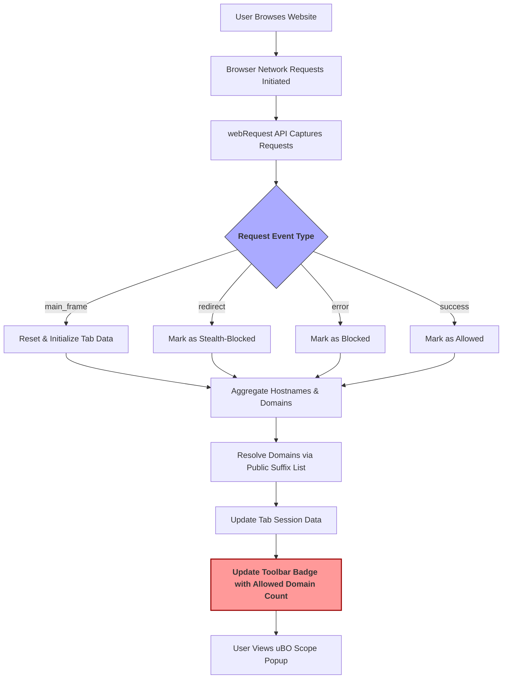

# Making Sense of Domain Counts and Network Visibility

## Overview

This guide explains how uBO Scope tracks and displays unique third-party domains your browser interacts with during web browsing. It clarifies why the toolbar badge count represents a **lower number as better privacy**, how this counting methodology differs from typical content blocker statistics, and how you can interpret these numbers effectively to assess your network exposure and privacy risks.


---

## 1. Understanding the Purpose of Domain Counts

uBO Scope focuses on revealing the number of *distinct third-party remote servers* connected to by your browser. Unlike common ad blockers or content blockers that prioritize counting **blocked requests**, uBO Scope measures **allowed connections** to unique domains.

### Why is the count of distinct domains important?
- **Privacy Indicator:** Each distinct third-party domain represents a potential network entity that can track or collect data.
- **True Exposure:** Counting unique domains shows the real breadth of your browser's remote server interaction.
- **Block Count is Misleading:** High block counts can indicate more requests initiated but don’t guarantee better blocking outcomes.

### What does a lower badge count mean?
- A lower count means fewer third-party domains were contacted, which translates to reduced tracking surface and better privacy.
- Typical well-configured blocking setups yield a low number, mostly limited to essential CDNs and legitimate third parties.

<Tip>
Remember that not all third-party domains are harmful. Some are required for content delivery or functionality (like CDNs). Your goal is to minimize unnecessary and potentially intrusive domains.
</Tip>


## 2. How uBO Scope Differentiates Domain Counting

Traditional blockers often show block request counts or total request counts, which can be misleading. uBO Scope:

- **Counts unique domains, not requests:** Multiple requests to the same domain count once.
- **Includes allowed, blocked, and stealth-blocked domains separately:** This shows a clearer picture of what connections your browser *actually* makes.
- **Reflects actual network behavior:** Using the browser `webRequest` API, it logs the real network connections your browser performs, independent of content blocker UI or fake statistics.


## 3. Interpreting the uBO Scope Popup Domains and Badge

The popup interface organizes domains into three sections:

| Section        | Description                                     |
|----------------|------------------------------------------------|
| **Not Blocked** (Allowed)  | Domains for which connections succeeded and were not blocked.  |
| **Stealth-Blocked**         | Domains where connections were redirected or stealth blocked (hidden from the webpage).  |
| **Blocked**                 | Domains where connections failed or were explicitly blocked.  |

The toolbar badge count corresponds to the **number of distinct allowed third-party domains**—a direct measure of your browser's exposure.

### What to expect after browsing a page:
- The popup will update dynamically listing domains under these categories.
- The badge count gives you the total unique allowed domains count.


## 4. How uBO Scope Uses the Public Suffix List to Organize Domains

uBO Scope leverages the Public Suffix List (PSL) to accurately identify the "registrable domain" part of hostnames. This means it:

- **Groups hostnames to their effective second-level domains**
- **Counts the domain, not just the hostname, to avoid inflated tallies**

This approach prevents counting multiple subdomains of the same registrable domain as separate entities, ensuring a realistic and meaningful domain count.

<Note>
The PSL is updated regularly and cached in the extension session for accuracy. If you notice unusual groupings, this might be due to PSL updates.
</Note>


## 5. Practical User Flow: Checking Your Network Visibility

<Steps>
<Step title="Open uBO Scope popup after browsing a website">
Navigate to any web page with your uBO Scope extension active and click the extension icon in the toolbar.
</Step>
<Step title="Review the badge count on the toolbar icon">
The badge number represents how many distinct third-party domains your browser contacted on this page.
</Step>
<Step title="Interpret the popup domain sections">
Within the popup:
- Check the "not blocked" (allowed) domains to see which servers your browser talked to.
- Check "stealth-blocked" to understand hidden redirects and background connections.
- Check "blocked" to confirm domains your content blocker prevented connections to.
</Step>
<Step title="Use domain counts to assess privacy">
A lower number on the badge and fewer allowed third parties generally indicate better privacy and blocking.
</Step>
<Step title="Investigate unexpected high counts or unknown domains">
If the count is unusually high, consider inspecting the listed domains for unfamiliar or suspicious entries.
</Step>
</Steps>


## 6. Common Scenarios and Insights

| Scenario | Explanation | What To Do |
| -------- | ----------- | ---------- |
| **High badge count but low block counts** | Many allowed third-party connections despite some blocks; blocker may be letting through many third-party domains. | Review filter lists and blocking rules to tighten privacy.
| **No data or empty popup** | Possibly no network activity, or extension not fully initialized. | Reload the page, verify extension is active, check troubleshooting guides.
| **Unexpected domains in allowed section** | Legitimate or potentially tracking domains loaded with the page. | Use popup data to investigate and block unwanted domains.

<Tip>
Keep in mind some domains categorized as stealth-blocked are invisible to the webpage but tracked by the extension for your awareness.
</Tip>


## 7. Best Practices for Effective Usage

- Regularly monitor your badge count during browsing to identify increasing network exposure.
- Use domain lists in the popup to audit which third parties your browser connects to.
- Understand that absolute zero connections is rarely practical; focus on minimizing unnecessary third parties.
- Keep your extension updated to leverage the latest domain resolution improvements.


## 8. Troubleshooting Domain Count Issues

<AccordionGroup title="Troubleshooting Common Network Visibility Issues">
<Accordion title="Badge Count Not Updating">
- Ensure the extension has required permissions (`webRequest`, `activeTab`).
- Browse pages with active network requests.
- Reload the browser or disable-then-enable the extension.
- Check browser compatibility and version.
- Refer to [Troubleshooting Your Setup](https://github.com/gorhill/uBO-Scope/blob/main/docs/getting-started/first-use-validation/troubleshooting-setup.mdx).
</Accordion>
<Accordion title="Popup Shows No Data or 'NO DATA'">
- Confirm you are on an active tab with network traffic.
- The extension requires the tab to be active and network requests observable through the browser.
- Try visiting different websites.
- Check console logs for errors.
</Accordion>
<Accordion title="Unexpected High Domain Counts">
- Domains may include legitimate CDNs or analytics services.
- Check if the domain is a known Content Delivery Network or service.
- Consider updating your content blocker filter lists to block unnecessary domains.
- Use the popup lists to selectively investigate suspicious entries.
</Accordion>
</AccordionGroup>


## 9. Next Steps

After familiarizing yourself with domain counts and network visibility:

- Explore the [Understanding Stealth Blocking and Network Statuses](https://github.com/gorhill/uBO-Scope/blob/main/docs/guides/advanced-usage-guides/interpreting-stealth-blocks.mdx) guide to dive deeper into stealth blocking.
- Use the [Validate uBO Scope Is Working](https://github.com/gorhill/uBO-Scope/blob/main/docs/getting-started/first-use-validation/validate-extension-operation.mdx) guide to confirm your extension setup.
- For advanced analysis and filter list enhancement, see [Using uBO Scope for Filter List Maintenance](https://github.com/gorhill/uBO-Scope/blob/main/docs/guides/power-tips-maintainers/filter-list-insights.mdx).


---

## Appendix: Example Popup Representation

Here is an example of how allowed domains with counts are presented:

```html
<section class="outcome allowed">
  <h3>not blocked</h3>
  <div class="domains">
    <div class="row"><span class="domain">example.com</span><span class="count badge">5</span></div>
    <div class="row"><span class="domain">cdn.example.net</span><span class="count badge">2</span></div>
  </div>
</section>
```

Each row shows a domain and how many connections were made to it during the session.


---

## Resources and References

- Public Suffix List: https://publicsuffix.org/list/
- uBO Scope Source Repository: https://github.com/gorhill/uBO-Scope
- Extension Permissions and API References


---

## Diagram: Network Event Flow to Domain Count Update



This flow depicts how network requests detected by `webRequest` are categorized and summarized into unique domain counts, culminating in the toolbar badge update and popup display.


---