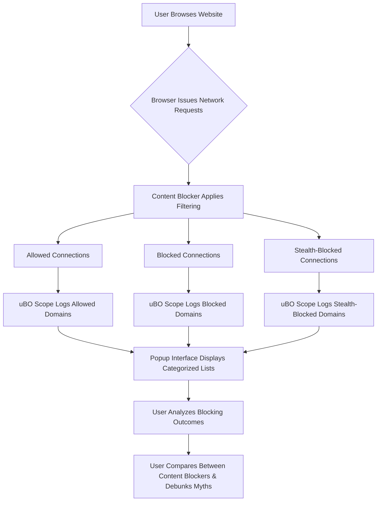

# Analyzing Blocking Outcomes Across Content Blockers

## Overview

This guide empowers you to use uBO Scope’s detailed reporting to compare how effectively different content blockers prevent or allow network connections. By examining the categorized outcomes — **allowed**, **blocked**, and **stealth-blocked** connections — you can move beyond misleading badge counts and gain a precise, practical understanding of real-world content blocking performance.

With this knowledge, you can debunk common myths around block counts and make more informed decisions about your browser’s privacy and security settings.

---

## What You Will Learn

- How uBO Scope reports network connection outcomes independent of which content blocker you use
- How to interpret the distinct categories of connection outcomes in real browsing scenarios
- Why badge block counts are often misleading when comparing blockers
- Techniques to systematically analyze and compare blocking performance

---

## Prerequisites

- uBO Scope extension installed in a supported browser (Chrome, Firefox, Safari)
- Basic familiarity with how content blockers work in your browser
- An active browsing session with some third-party network requests happening (visit typical web pages)

---

## Time Estimate

10-15 minutes to understand concepts and apply the analysis during routine browsing

---

## Understanding Blocking Outcomes

uBO Scope categorizes each network request outcome into one of three groups:

| Category          | Description                                                                                      | User Insight                                           |
|-------------------|--------------------------------------------------------------------------------------------------|--------------------------------------------------------|
| **Allowed**       | Connections successfully established, not blocked by content blockers                            | Represents the actual number of third-party servers your browser contacted successfully
|
| **Blocked**       | Connections explicitly blocked by the content blocker, typically by extensions or filters      | Shows requests the blocker actively prevented
|
| **Stealth-Blocked** | Network requests that were silently redirected or inhibited, typically by stealth techniques used by blockers to avoid detection by websites | Reveals advanced blocking tactics that do not trigger obvious block indicators
|

---

## Step-by-Step Workflow to Analyze Blocking Outcomes

### Step 1: Open the uBO Scope Popup

1. Click the uBO Scope icon in your browser’s toolbar.
2. The popup will display the current tab's hostname and three sections listing domains for allowed, stealth-blocked, and blocked connections.
3. At the top, observe the **domains connected** count — this reflects the number of distinct third-party domains successfully connected.

> The popup categorizes network connections precisely, independently of which content blocker or DNS-level filter is active.

### Step 2: Explore the Allowed Domains

- Review the list under **not blocked**.
- Each domain shows how many network requests to that domain succeeded.
- This list indicates the servers from which resources were actually fetched, representing your exposure footprint.

> A lower number here translates to fewer third-party connections, typically signifying better blocking effectiveness.

### Step 3: Examine the Stealth-Blocked Domains

- These are connections that were suppressed using stealth techniques.
- They may not appear in traditional block counts but are effectively prevented.
- Recognizing stealth blocking is crucial as it shows that some blockers avoid detectable blocking behaviors.

### Step 4: Analyze the Blocked Domains

- These are the requests explicitly blocked and reported as errors.
- This count can be inflated in some blockers depending on specific filter rules or how blocking is implemented.

### Step 5: Compare Against Other Content Blockers

- Repeat Steps 1–4 on similar pages with different content blockers active one at a time.
- Instead of trusting badge block counts, compare the **allowed domains** count and lists to identify which blocker restricts connections more effectively.
- Check stealth-blocked entries as they represent invisible blocking mechanisms not reflected in badge counts.

> Remember, a blocker showing a high block count does not necessarily mean it allows fewer connections.

### Step 6: Form Your Conclusions

- Prioritize the number of distinct allowed domains over block counts to assess privacy exposure.
- Consider stealth-blocking domains as added protection.
- Use these insights to choose or configure content blockers that best fit your privacy needs.

---

## Practical Example

Imagine you visit `example.com` using two different content blockers.

| Content Blocker | Badge Block Count | Allowed Domains Count | Stealth Domains Count | User Conclusion                        |
|-----------------|-------------------|----------------------|----------------------|-------------------------------------|
| Blocker A       | 30                | 12                   | 5                    | Allows fewer third-party connections despite lower block count
|
| Blocker B       | 50                | 20                   | 1                    | Has higher block count but more connections allowed (worse privacy)
|

Using uBO Scope's categorized network domain lists, you see precisely which domains remain connected and which are blocked stealthily, giving you a clearer picture than badge counts alone.

---

## Best Practices & Tips

- **Don’t rely on toolbar block count badges** as the sole measure of blocker efficacy.
- Use uBO Scope to validate privacy impact by focusing on allowed third-party domains.
- Periodically check stealth-blocked connections to understand blockers using advanced techniques.
- When testing blockers, clear your browser cache and cookies to prevent skewed results.
- Combine uBO Scope data with your knowledge of known trackers and legitimate third-party services for better analysis.

---

## Common Pitfalls

- Confusing a high block count badge with better blocking performance.
- Ignoring stealth blocking, thereby underestimating actual protection.
- Using synthetic 'ad blocker test' websites that do not reflect real-world connection behaviors.
- Overlooking that some third-party connections are essential (like CDNs) and not harmful.

---

## Troubleshooting

- If the popup shows **NO DATA** or empty domain lists:
  - Ensure uBO Scope is enabled and has the required permissions.
  - Verify your browser supports the `webRequest` API.
  - Refresh the browsing tab to trigger network events.
  - Close and reopen the popup to reload data.

- If you suspect blocking reports are inaccurate:
  - Disable other extensions that might interfere.
  - Confirm you are testing on real-world websites, not artificial test sites.

---

## Next Steps

- For onboarding, see [Understanding the UI: Badge & Popup Explained](/guides/getting-started-core-flows/understanding-ui-badge-popup) to deepen your grasp of the interface.
- Explore [Monitoring Network Requests on Any Webpage](/guides/getting-started-core-flows/monitor-network-page) for a comprehensive workflow on network monitoring.
- For troubleshooting setup issues, refer to [Troubleshooting Setup Issues](/getting-started/first-use-validation/troubleshooting-setup).
- To evaluate your filter lists more rigorously, review [Using uBO Scope for Filter List Evaluation](/guides/advanced-usage-patterns/filter-list-maintainers-mode).

---

## References

- uBO Scope GitHub Repository: [https://github.com/gorhill/uBO-Scope](https://github.com/gorhill/uBO-Scope)
- Public Suffix List (used internally by uBO Scope): [https://publicsuffix.org](https://publicsuffix.org)

---

## Summary Diagram

This flow shows how network requests pass through filtering, get categorized by uBO Scope, and enable users to analyze and compare blocking outcomes across different content blockers transparently.
