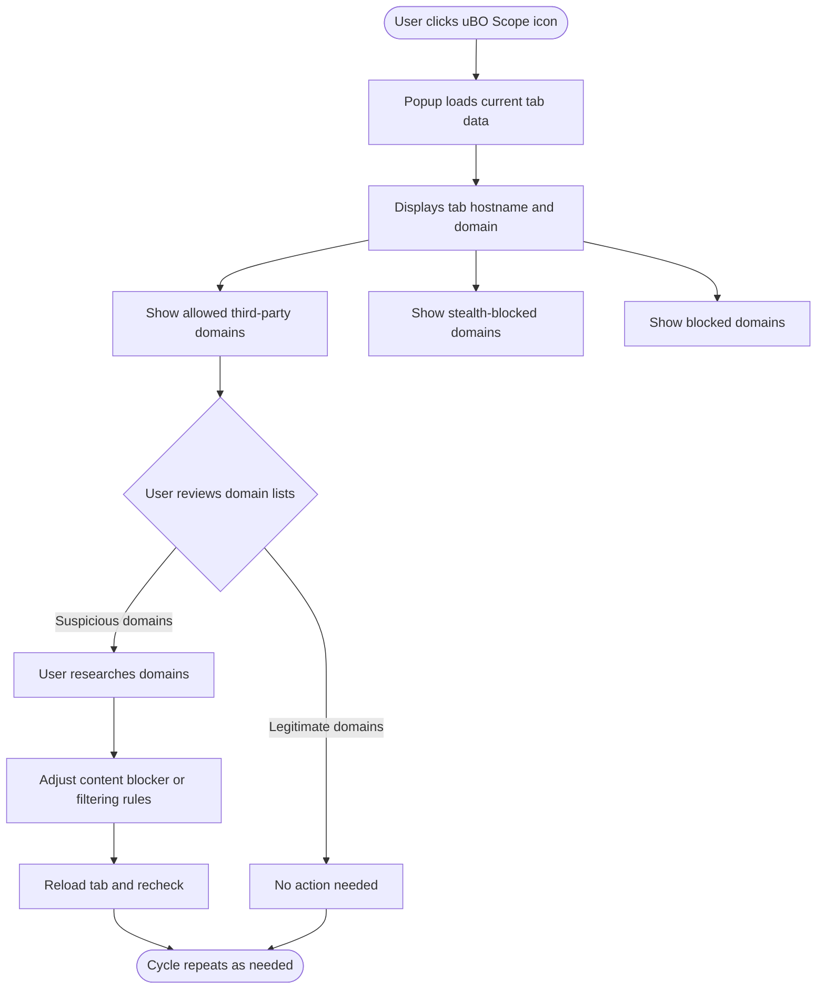

# Analyzing Third-Party Server Connections for Better Privacy

## Overview
This guide empowers you to use **uBO Scope** effectively to identify and evaluate third-party connections detected during your browsing sessions. By examining the domains interacting with webpages you're visiting, you can distinguish between legitimate third-party services like CDNs and those that may raise privacy concerns due to excessive or suspicious behavior.

Understanding and analyzing third-party connections is a critical step toward safeguarding your online privacy and making informed decisions about content blockers and filtering strategies.

---

## Prerequisites

- **uBO Scope installed and active** on your browser (Chrome, Firefox, or Safari).
- Basic familiarity with opening extension popups via the toolbar icon.
- Awareness of the importance of third-party connections for privacy.

## Expected Outcome

By following this guide, you will:

- Identify third-party domains contacted by active webpages.
- Recognize legitimate services vs. potentially privacy-invasive connections.
- Use uBO Scope's categorized outcome data to evaluate connection behavior.
- Make informed decisions to adjust privacy settings or filter lists as needed.

## Time Estimate

15-20 minutes to complete the initial analysis and gain confidence in interpreting connection data.

## Difficulty Level

Intermediate: Requires understanding domain relationships and network privacy implications.

---

## Step-by-Step Instructions

### 1. Open uBO Scope Popup for the Active Tab

1. Click on the uBO Scope toolbar icon.
2. The popup panel loads data about the current active tab's network connections.

**Expected Result:**
- The panel displays your tab's hostname and domain.
- Summary count shows how many distinct third-party domains were contacted.

---

### 2. Review Domain Categories in the Popup

uBO Scope categorizes domains into three groups:

- **Not Blocked (Allowed):** Domains from which content was successfully fetched.
- **Stealth-Blocked:** Domains attempted but silently blocked or redirected out of sight.
- **Blocked:** Domains where network connections failed or were blocked outright.

Examine these lists in the popup to get a granular view of how the content is loaded.

---

### 3. Identify Third-Party Domains

Because uBO Scope aggregates connections by domain, its counts reflect distinct third parties contacted by the page.

- Examine if listed domains are expected third-party services such as content delivery networks (CDNs), analytics, or legitimate APIs.
- Use [public suffix awareness](https://publicsuffix.org/) to accurately interpret domain ownership and hierarchy.

**Practical Tip:**
- Look for domain patterns known for legitimate services (e.g., `akamai.net`, `cloudflare.net`).
- Watch for unusual or unexpected domains which might signal trackers or privacy-invading services.

---

### 4. Compare Connection Counts and Behavior

- Large numbers of allowed domains can indicate complex site dependencies or high third-party involvement.
- Review stealth-blocked and blocked domains for hints about resources your content filters are actively intercepting.

**Decision Point:**
- If you see excessive third-party connections, consider revisiting your filter lists or privacy settings.
- Conversely, too few connections might imply strict blocking but could cause site breakage.

---

### 5. Use Domain Details to Refine Privacy Strategy

- Investigate unknown or suspicious domains via web searches or domain info tools.
- Adjust your filtering rules in uBlock Origin or other blockers to limit unwanted third-party connections.

**Best Practice:**
- Prioritize reducing distinct third-party domains over simply blocking connections, since fewer third-party endpoints generally improve privacy.

---

## Real-World Example

Imagine visiting a news website where uBO Scope reports:

- **Allowed:** `cdn.examplecdn.com` (a known CDN), `images.example.com` (site-owned domain)
- **Blocked:** `tracker.badtracker.com`
- **Stealth-Blocked:** `ads.adnetwork.com`

From this, you can infer:
- Legitimate resources load from the CDN and site domain.
- Trackers and ad networks are being filtered or blocked, enhancing privacy.

You might choose to tighten blocking rules if you notice additional unwanted third-party domains.

---

## Troubleshooting & Tips

### Common Issues

- **Popup shows no data or "NO DATA":** Ensure the active tab has made network connections and that uBO Scope was installed and activated before navigating to the tab.

- **Badge count unexpectedly high or persistent:** This reflects distinct third-party domains contacted; verify your content blockers are configured correctly.

- **Unfamiliar domains appear allowed:** Check if resources load correctly; some third parties like CDNs or necessary APIs might be expected.

### Tips

- Use uBO Scope regularly to monitor privacy impact of sites you visit.
- Cross-reference domains with up-to-date public suffix list information automatically utilized by uBO Scope.
- Combine insights here with related guides on interpreting network request outcomes and understanding the badge count.

### Performance Considerations

- uBO Scope performs lightweight domain aggregation; it won’t significantly impact browser performance.
- Session data aids tracking per tab but refreshes with tab lifecycle events.

### Alternative Approaches

You can also observe third-party connections via browser developer tools, but uBO Scope provides a privacy-focused, independent view unaffected by content blockers.

---

## Next Steps & Related Content

- Explore ["Interpreting Allowed, Blocked, and Stealth Outcomes"](/guides/advanced-usage-patterns/interpreting-network-outcomes) to deepen understanding of domain status.
- Review ["Understanding and Using the Toolbar Badge Count"](/guides/core-workflows/understanding-the-badge-count) to contextualize third-party connection counts.
- Consult ["Monitoring Domain Connections in Real Time"](/guides/core-workflows/monitor-domain-connections) to use uBO Scope for active session insights.
- For installation and setup, see ["Installing uBO Scope"](/getting-started/installation-and-setup/installing-ubo-scope).

---

## Useful Links

- [uBO Scope GitHub Repository](https://github.com/gorhill/uBO-Scope)
- [Public Suffix List](https://publicsuffix.org/)

---

## Summary

Using uBO Scope to analyze third-party connections helps you comprehend webpages' network behavior and make privacy-conscious decisions. This guide walks you through opening the popup, interpreting domain categories, distinguishing legitimate services from suspicious domains, troubleshooting common issues, and advancing your privacy strategy with related documentation.

---

<AccordionGroup title="Quick Reference">
<Accordion title="Domain Categories Explained">
- **Allowed:** Successful connections.
- **Stealth-Blocked:** Silently blocked or redirected connections.
- **Blocked:** Explicitly blocked or failed connections.
</Accordion>
<Accordion title="Tips for Identifying Legitimate Third Parties">
- Recognize major CDNs (such as Akamai, Cloudflare).
- Legitimate APIs or partner services often appear consistently.
- Check unfamiliar domains via search or domain info tools.
</Accordion>
<Accordion title="Common Pitfalls to Avoid">
- Misinterpreting high block counts as better privacy (focus on unique third parties).
- Relying solely on third-party counts without context.
</Accordion>
</AccordionGroup>

---

## Diagram: User Flow for Analyzing Third-Party Connections

---

**End of Guide**
