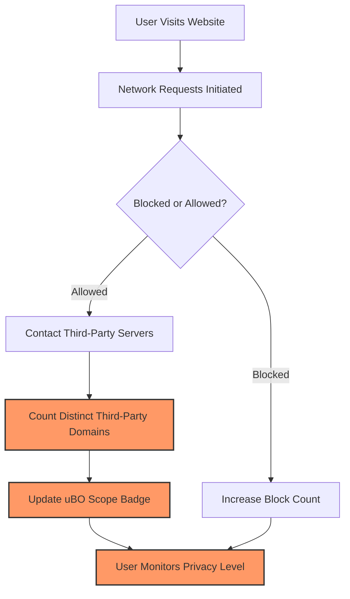

# Debunking 'Block Count' Myths in Content Blocking

## Workflow Overview

### Task Description
This guide helps you understand why relying on the number of blocked requests (block count) as a measure of content blocker effectiveness can be misleading. It illuminates the importance of focusing on the count of distinct third-party remote servers contacted as the key privacy metric, rather than just raw block counts. You will learn how to use uBO Scope’s data—especially its toolbar badge and popup panel—to evaluate privacy protection accurately and compare different content blockers.

### Prerequisites
- uBO Scope extension installed and active in your Chromium, Firefox, or Safari browser.
- Basic familiarity with the uBO Scope interface, including its badge and popup panel.
- Optionally, other content blockers installed (e.g., uBlock Origin, AdGuard) for comparative insights.

### Expected Outcome
By following this guide, you will:
- Gain clarity on why a higher block count can indicate less effective privacy protection.
- Learn to interpret uBO Scope’s toolbar badge and popup data effectively.
- Master techniques to compare content blocker outcomes based on distinct third-party server counts.

### Time Estimate
5-10 minutes

### Difficulty Level
Beginner to Intermediate

---

## Understanding the Myth: Why Block Count Can Be Misleading

Many users assume that a content blocker reporting a higher number of blocked requests (block count) is more effective. This is a common misconception:

- **Block Count Definition**: The block count is the total number of individual network requests that a content blocker prevented.
- **Why It’s Misleading**: A blocker with a high block count might still allow connections to a large number of distinct third-party servers. This means more third-party domains can track or collect data, decreasing overall privacy.

### Scenario Example
Imagine two content blockers:

| Content Blocker | Block Count | Distinct Third-party Domains Allowed |
|-----------------|-------------|-------------------------------------|
| Blocker A       | 15          | 30                                  |
| Blocker B       | 10          | 10                                  |

At a glance, Blocker A blocks more requests, but it actually allows connections to 30 distinct third-party servers, compared to only 10 for Blocker B. This makes Blocker B more privacy-friendly.

## Why You Should Focus on Distinct Third-Party Server Count

The **number of unique third-party remote servers contacted** is the crucial privacy metric.

- This reflects how many different external domains your browser communicated with in the context of the visited website.
- Fewer third-party servers contacted means less potential tracking and data exposure.
- uBO Scope’s toolbar badge reflects this count, giving you instant insight into your privacy exposure on the current active tab.

## How to Use uBO Scope to Compare Content Blockers

### Step 1: Monitor the Toolbar Badge
- The badge shows the number of distinct third-party domains your browser connected with **not blocked** (allowed).
- A lower badge number means better privacy protection.

### Step 2: Open the Popup Panel for Details
- Click the uBO Scope toolbar icon to open the popup panel.
- Review three categories of third-party connections:
  - **Not Blocked:** Third-party servers allowed through.
  - **Stealth-blocked:** Requests silently blocked by some blockers to avoid detection.
  - **Blocked:** Requests actively blocked and visible.

### Step 3: Compare Across Content Blockers
- Visit the same website with different content blockers enabled.
- Observe the uBO Scope badge and popup panel for each blocker.
- Focus on the **distinct third-party domains allowed**, not on the number of blocked requests.

### Step 4: Interpret Results
- A content blocker with a **lower badge count and fewer allowed third-party domains** is providing stronger privacy protection.
- High block counts paired with high numbers of allowed domains indicate less effective blocking.

## Practical Tips and Best Practices

- **Do not trust ad blocker test pages** that display block counts or fabricated scenarios—they are unreliable and do not reflect real-world browsing.
- Use uBO Scope as a neutral observer independent of any particular content blocker.
- Regularly monitor the badge when browsing sensitive sites to gauge privacy exposure.
- Combine uBO Scope insights with your chosen content blockers’ features for optimal protection.

## Troubleshooting Common Scenarios

<AccordionGroup title="Troubleshooting Common Issues with Block Counts and uBO Scope">
<Accordion title="Why does my content blocker have a high block count but I see many third-party connections?">
This can happen if the blocker blocks many individual requests but still allows multiple distinct third-party servers. Check uBO Scope’s badge for the count of distinct allowed domains, which better reflects privacy.
</Accordion>
<Accordion title="My badge count fluctuates a lot on the same site—why?">
Websites often load resources conditionally, sometimes contact different third parties on repeated visits. Use the popup panel to see which domains appear frequently and consider persistent trackers.
</Accordion>
<Accordion title="Are stealth-blocked connections a good thing?">
Stealth-blocking hides blocking activity from websites to prevent detection. While it may protect privacy better than outright blocking, focus still on minimizing allowed third-party domains.
</Accordion>
</AccordionGroup>

## Summary
- Always prioritize the number of distinct third-party remote servers your browser contacts when evaluating privacy.
- Use uBO Scope’s badge count and popup panel to get accurate, immediate insights, independent of content blocker claims.
- Avoid relying on block counts alone or on ad blocker test webpages that use contrived requests.

## Next Steps & Related Content

- Explore [Understanding Badge Counts and Reports](/getting-started/introduction-overview/understanding-badge-and-reports) for detailed badge and popup interpretations.
- Review [Integration with Content Blockers & Browsers](/overview/integration-context/ecosystem-integration) to understand how uBO Scope works alongside other blockers.
- Consult [Interpreting Third-party Connections and Outcomes](/guides/getting-started-workflows/interpreting-third-party-connections) for deeper analysis of connection results.

---

## Quick Reference Example

Imagine you have two content blockers enabled alternately to compare privacy:

| Step | Action | Expected Outcome |
|-------|----------|------------------|
| 1 | Visit your favorite news site with Blocker A enabled | uBO Scope badge shows 25 distinct third-party domains connected |
| 2 | Visit the same site with Blocker B enabled instead | uBO Scope badge shows 12 distinct third-party domains connected |
| 3 | Open the popup panel with Blocker B enabled | Fewer allowed domains listed means better privacy despite fewer blocks reported by some blockers |

This hands-on approach exposes true privacy protection beyond misleading block counts.

---

## Related GitHub Repository

For developers and filter list maintainers interested in the project code, visit the [uBO-Scope GitHub Repository](https://github.com/gorhill/uBO-Scope).

---

## Visual Diagram

This simplified flow illustrates why distinct third-party domains (tracked by uBO Scope’s badge) better indicate privacy than block count alone.

---