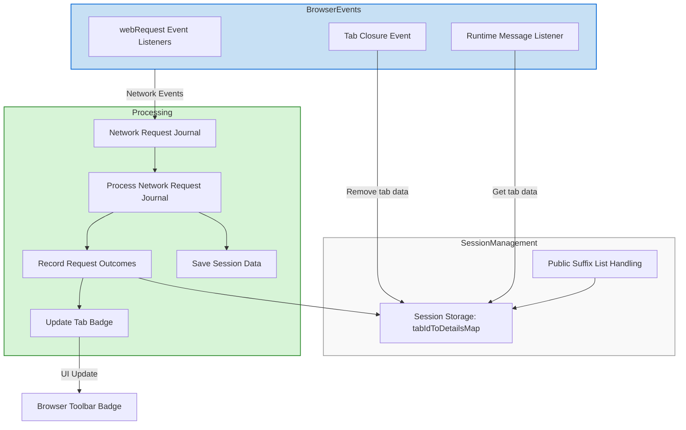

# Using uBO Scope for Filter List Research and Maintenance

## Overview
This guide empowers filter list maintainers and advanced users to leverage uBO Scope for auditing third-party domains, identifying stealth-blocked and outright blocked connections, and validating the real-world impact of filter lists on websites. It is especially valuable in scenarios where browser developer tools are unavailable or limited, providing clear, actionable insights into network activity affected by content blockers.

## Prerequisites
- uBO Scope installed on your supported browser (Chromium, Firefox, Safari).
- Basic familiarity with how content blockers and filter lists operate.
- Understanding of the badge count and popup panel concepts from uBO Scope.

## What You Will Achieve
By following this guide, you'll acquire practical methods to:
- Interpret uBO Scope’s popup panel with confidence in a research context.
- Detect stealth blocking behavior that may not be otherwise visible.
- Confirm which third-party domains are blocked or allowed by your filters.
- Validate the effect of filter updates on real websites.

---

## Step 1: Open the Popup Panel to Gather Tab-Specific Data
1. **Navigate to the tab you want to audit** — preferably a site representative of your filter list’s target scope.
2. **Click the uBO Scope toolbar icon** to open the popup panel.
3. Observe the **badge number** on the toolbar icon — this reflects the distinct third-party remote servers contacted.
4. Review the lists in the popup panel sections:
   - **Not blocked:** domains from which requests succeeded.
   - **Stealth-blocked:** domains where requests were redirected or otherwise stealth-blocked.
   - **Blocked:** domains where requests were explicitly blocked.

> Tip: Use the badge count as a high-level privacy indicator; fewer third-party connections generally mean better privacy exposure reduction.

## Step 2: Analyze Domain Details for Filter List Validation

1. **Examine domain counts:** Each domain listed includes request counts. Higher counts indicate more network activity involving that domain.
2. **Leverage domain grouping by the Public Suffix List (PSL):** This helps consolidate related subdomains under their effective organizational domain.
3. **Identify stealth blocking:** Stealth-blocked domains might indicate active, silent filtering typically implemented to avoid webpage breakage or detection.
4. **Compare allowed vs blocked domains:** This reveals how your filter rules affect actual network requests on the site.

> Note: Stealth blocking is a subtle filtering outcome where network requests are not plainly blocked but rerouted or altered, which affects resource loading and privacy.

## Step 3: Use uBO Scope for Research Workflow

1. **Monitor changes post-filter update:** Refresh the audited webpage after you update your filter list to observe changes in connection outcomes.
2. **Track additions or removals:** Take note of new domains appearing in the allowed list or disappearing from blocked/stealth lists.
3. **Cross-check suspicious connections:** Investigate new allowed domains that might be unwanted third parties or trackers.
4. **Leverage the data for filter tuning:** Adjust filters based on real-world connection outcomes to improve efficacy and minimize false positives.

## Step 4: Collect and Share Evidence

- Use the serialized tab data feature (via messaging API) if you need to archive or share insights:
  - The background script serializes per-tab connection data.
  - This data can be examined offline or used for collaboration with other maintainers.

- Export or screenshot the popup panel to document filtering outcomes relevant to your list research.

## Practical Example
Suppose you maintain a filter list updating regularly to block new ad servers:
1. Visit a popular news website with uBO Scope active.
2. Open the popup panel and record the list of third-party domains labeled "Not blocked".
3. Update your filter list with new rules targeting recent ad domains.
4. Reload the website, reopen the uBO Scope popup, and compare domain lists.
5. Confirm that the new ad domains move from the "Not blocked" or "Stealth-blocked" lists to the "Blocked" list.
6. Adjust filter rules if some ad domains remain allowed.

## Common Pitfalls to Avoid
- **Relying solely on block counts:** Focus on allowed connections and domain counts rather than just how many requests were blocked.
- **Ignoring stealth blocking:** Overlooked stealth blocking can mislead assessment; always review stealth-blocked domains carefully.
- **Assuming all third parties are malicious:** Some third-party domains (e.g., CDNs) are legitimate and necessary for website functionality.

## Troubleshooting Tips
- If popup data appears empty or stale:
  - Confirm uBO Scope is enabled and has proper permissions.
  - Reload the webpage completely and try again.
  - Restart the browser if problems persist.

- If badge count does not update:
  - Check whether browser APIs (webRequest) are enabled and accessible.
  - Verify no conflicts with other extensions blocking network events.

## Best Practices
- Use uBO Scope as an **objective measurement tool** to complement manual testing and automated filter list updates.
- Regularly audit **real websites representative of your filter’s user base**.
- Share findings with your filter list community to maintain transparency and enhance collective filter accuracy.
- Track both blocked and stealth-blocked domains to catch subtle filtering effects.

## Next Steps & Related Resources
- Explore the guide ["Interpreting Third-party Connections and Outcomes"](/guides/getting-started-workflows/interpreting-third-party-connections) for in-depth badge and popup interpretation.
- Use ["Troubleshooting and Investigating Content Blocker Behavior"](/guides/advanced-usage-patterns/troubleshooting-content-blockers) for advanced investigative techniques.
- Review ["Debunking 'Block Count' Myths"](/guides/advanced-usage-patterns/debunking-block-count-myths) to distinguish between block counts and true privacy impact.
- Refer to the [System Architecture & Data Flow](/overview/architecture-core-concepts/system-architecture) documentation for a deeper understanding of uBO Scope internals.

---

# Visual Overview of uBO Scope Data Flow

---

For more information and code references, visit the [uBO Scope GitHub repository](https://github.com/gorhill/uBO-Scope).

