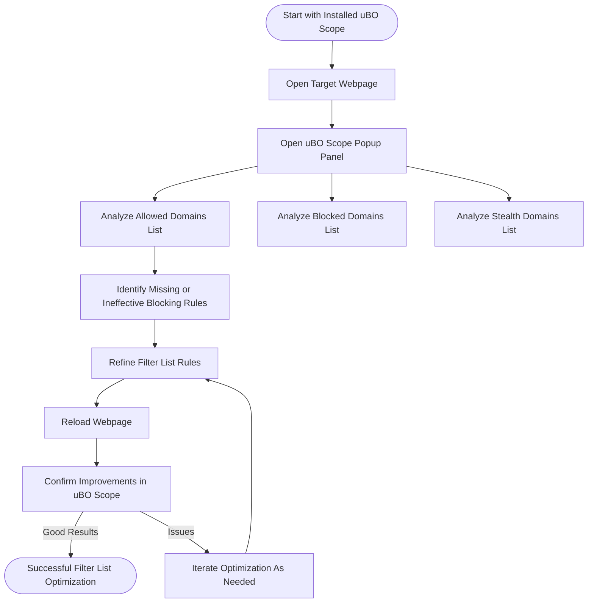

# Optimizing Filter Lists Using uBO Scope

Unlock the power of uBO Scope to validate, refine, and optimize your filter lists for maximum effectiveness in real-world browsing scenarios. This guide is invaluable for filter list maintainers and users who rely on limited browser tools and want to deepen their understanding of allowed, blocked, and stealth network requests.

---

## 1. Understanding the Role of uBO Scope in Filter List Optimization

uBO Scope is a diagnostic tool designed to reveal every remote server connection attempted or made by webpages, independently of any content blocker. It categorizes network requests into:

- **Allowed:** Requests that successfully completed and were permitted.
- **Blocked:** Requests that failed due to active blocking.
- **Stealth:** Requests intercepted or silently redirected by content blockers.

By analyzing these categories, you can assess how your filter lists perform, identify gaps, and optimize rules to increase blocking efficiency without breaking sites.

<Info>
The badge on uBO Scope’s toolbar icon shows the count of distinct allowed third-party domains per tab — an essential metric for filter list success.
</Info>

---

## 2. Prerequisites for Using uBO Scope for Filter List Optimization

Before diving into filter list optimization, ensure you have:

- Installed uBO Scope on your browser ([see installation guides](../getting-started/setup-overview/installing)).
- Basic familiarity with uBO Scope’s UI and core concepts ([refer to the Popup UI Quick Tour](../overview/feature-overview/popup-ui-quicklook) and [Key Terms and Definitions](../overview/core-concepts-architecture/key-terms-and-definitions)).
- Access to the filter list you want to optimize and a workflow to test it in your browser.
- The site(s) or type of pages where you want to assess and optimize filtering rules.

<Tip>
Using uBO Scope alongside filter list editing tools gives you a powerful feedback loop.
</Tip>

---

## 3. Workflow: Validating and Optimizing Filter Lists Using uBO Scope

Follow these steps to get actionable insights and improve your filter lists:

### Step 1: Open uBO Scope and Load the Target Webpage

1. Navigate to your browser’s extension toolbar and click the uBO Scope icon.
2. Ensure the webpage you want to analyze is open in the active tab.
3. Observe the badge count indicating the number of allowed third-party domains.

_Expected Result:_ The popup panel will list domains categorized as Allowed, Blocked, or Stealth for the active tab.

### Step 2: Analyze Allowed Domains

- Review the list of allowed domains closely. These are third-parties your filter list currently permits.
- Identify unexpected or potentially unwanted third-party domains, which may indicate missing filters.

_Best Practice:_ Use the domain counts to prioritize domains with frequent requests.

### Step 3: Examine Blocked and Stealth Lists

- Blocked domains represent requests your filter list blocks effectively.
- Stealth domains represent requests intercepted silently (e.g., via redirects) by the blocker.
- These categories help you understand which connections are managed and how stealth blocking affects requests.

_Common Pitfall:_ Don't confuse high block counts with better blocking; fewer distinct allowed domains are more important.

### Step 4: Refine Filter List Rules

- For unwanted allowed domains, draft new blocking rules.
- For over-blocking or broken functionality, consider making whitelist exceptions.
- Iterate your filter list offline or inline (depending on your tool), then refresh the webpage and revisit uBO Scope to observe changes.

### Step 5: Use Domain Grouping to Aid Interpretation

- uBO Scope groups hostnames into registered domains based on the Public Suffix List for clarity.
- This helps you spot dominant third-party domains supplying multiple hosts behind the scenes.

<Note>
Understanding domain grouping avoids overestimating third-party diversity.
</Note>

### Step 6: Repeat Testing Across Scenarios

- Test your filter list on varied websites with different network behaviors.
- Ensure optimizations do not impact legitimate site functionalities.

---

## 4. Practical Tips for Interpreting Connection Categories

- **Allowed:** Indicates third-party content still loaded; unnecessary allowed domains are optimization targets.
- **Blocked:** Successful blocking—ensure that these blockages do not cause site breakage.
- **Stealth:** Can reveal subtle content blocker actions invisible in standard network tools, reflecting advanced blocking.

<Tip>
Use stealth information especially when maintaining filter lists to detect evasion or silent bypass techniques.
</Tip>

---

## 5. Use Cases and Examples

### Example: Spotting Missing Blocking Rules

1. Visit your target website.
2. Open uBO Scope popup.
3. The Allowed Domains list shows `tracker.examplecdn.com` frequently.
4. Check your filter list—if no corresponding block rule for `examplecdn.com` exists, consider adding one.
5. Add rule and retest.

### Example: Differentiating Stealth vs Blocked

- If a known tracking domain is in the stealth list, your filter silently redirects or modifies requests to block tracking without raising errors.
- If a domain is blocked but the website breaks, consider whitelisting selectively.

---

## 6. Troubleshooting Common Issues

<AccordionGroup title="Troubleshooting Filter List Optimization with uBO Scope">
<Accordion title="No Domains Listed in uBO Scope Popup">
- Verify uBO Scope is properly installed and enabled.
- Confirm that you have navigated to an active tab with network activity.
- Refresh the page after changing filters to generate fresh data.
- See [First Launch and Verifying Installation](../getting-started/setup-overview/first-launch) for setup validation.
</Accordion>
<Accordion title="High Number of Allowed Domains Unexpectedly">
- Remember the badge reflects distinct allowed domains, not number of requests.
- Use the domain grouping info to spot aliases or subdomains.
- Review Allowed list for unusual or unwanted third parties.
</Accordion>
<Accordion title="Filter Changes Not Reflected in uBO Scope">
- Check that the filter list is active and properly loaded in your content blocker.
- Clear browser cache or reload the page.
- Restart browser if necessary.
</Accordion>
</AccordionGroup>

---

## 7. Advanced Considerations

- Combine uBO Scope with content blocker logging when possible to correlate requests.
- Use uBO Scope data to audit filter lists’ real-world performance rather than relying on synthetic test pages.
- Leverage knowledge of stealth blocking behavior to refine subtle filters that prevent detection or breakage.

---

## 8. Next Steps & Related Content

- Explore the [Privacy Audits: Identifying Stealth and Unexpected Requests](privacy-audits) guide for deeper analysis workflows.
- Learn how to interpret real-time data via the [Popup UI Quick Tour](../overview/feature-overview/popup-ui-quicklook).
- Understand core concepts in [How uBO Scope Reveals Connections](../overview/core-concepts-architecture/network-visibility-model) and [Key Terms and Definitions](../overview/core-concepts-architecture/key-terms-and-definitions).
- For installation and setup, refer to [Installing uBO Scope](../getting-started/setup-overview/installing) and [First Launch and Verifying Installation](../getting-started/setup-overview/first-launch).

---

## Appendix: Example Filter List Optimization Scenario

```plaintext
Scenario: You maintain a filter list targeting video streaming sites. After deploying your list, users report some video ads still appearing.

1. Use uBO Scope on popular streaming websites showing ads.
2. Review Allowed domains and identify ad-serving third-party domains still allowed.
3. Add blocking rules targeting these domains explicitly.
4. Reload the site and verify with uBO Scope the drop in allowed domains associated with ads.
5. Verify no site breakage by checking the Blocked and Stealth lists.

Outcome: Your filter list becomes more effective by targeting real-world allowed domains, validated through uBO Scope.
```

---

For further best practices, troubleshooting, and tips, consult the full suite of guides and documentation referenced above.

---

# Visual Overview



---

<u>Empower your filter list maintenance with precise, actionable network insights provided by uBO Scope.</u>


---

# References

- [Popup UI Quick Tour](../overview/feature-overview/popup-ui-quicklook)
- [Key Terms and Definitions](../overview/core-concepts-architecture/key-terms-and-definitions)
- [Network Visibility Model](../overview/core-concepts-architecture/network-visibility-model)
- [Privacy Audits Guide](privacy-audits)
- [Installing uBO Scope](../getting-started/setup-overview/installing)
- [First Launch and Verifying Installation](../getting-started/setup-overview/first-launch)
- [Interpreting the Badge Count and Popup Panel](../guides/core-workflows/interpreting-badge-popup)


---

# Glossary

| Term        | Meaning |
|-------------|----------|
| Allowed     | Network requests that completed and were allowed by filter rules |
| Blocked     | Requests that failed due to being actively blocked |
| Stealth     | Requests silently intercepted or redirected by the blocker |
| Filter List | A set of rules that determines which network requests are allowed or blocked |
| Third-party | Domains and servers not part of the visited website’s domain |


---

# Support

If you encounter any issues or have questions, consult the [Quick Validation & Troubleshooting](../getting-started/configuration-and-validation/quick-validation) guide or reach out via the official repository: [https://github.com/gorhill/uBO-Scope](https://github.com/gorhill/uBO-Scope).