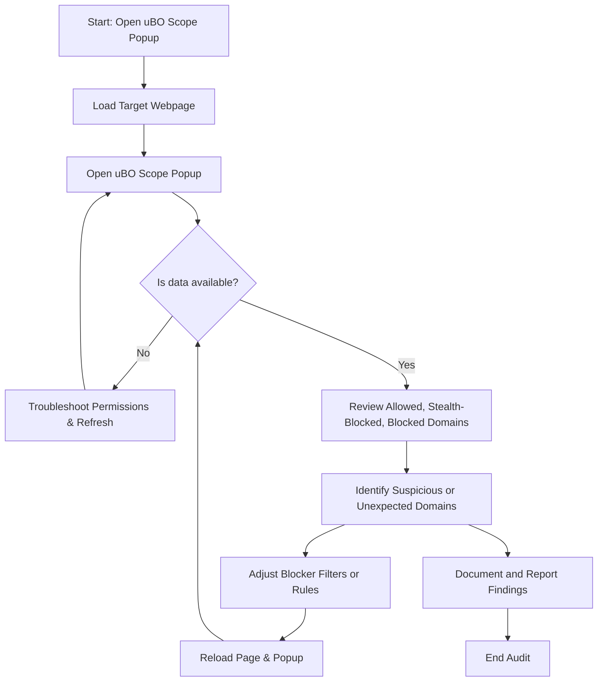

# Privacy Audits: Identifying Stealth and Unexpected Requests

Conducting privacy audits with uBO Scope elevates your ability to uncover all network connections a webpage attempts — whether clearly visible, stealthily blocked, or entirely unnoticed by other tools or content blockers. This guide empowers you to perform comprehensive network request audits to expose subtle or unexpected third-party connections for stronger privacy assurance and optimal filter tuning.

---

## 1. Why Conduct Privacy Audits with uBO Scope?

When visiting a webpage, many remote connections happen beyond your direct visibility, sometimes carefully masked by content blockers or DNS filters. uBO Scope offers unparalleled transparency by recording:

- **Allowed requests**: Remote servers successfully connected by the page.
- **Stealth-blocked requests**: Connections that were silently redirected or blocked without typical user-visible effects.
- **Blocked requests**: Fails and errors from denied network attempts.

This insight helps you identify undesired data leaks, excessive third-party tracking, and potential blind spots in your current privacy setup.

<Check>
For a clear conceptual background, review the [Network Visibility Model](/overview/core-concepts-architecture/network-visibility-model) to understand how uBO Scope classifies network requests.
</Check>

---

## 2. Prerequisites Before Starting Your Audit

Ensure the following before conducting privacy audits:

- **uBO Scope Installed and Enabled:** Refer to [Installing uBO Scope](/getting-started/setup-overview/installing) for your specific browser.
- **Verified Permissions:** Confirm permissions like `webRequest` and `activeTab` are granted; see [Basic Configuration and Settings](/getting-started/configuration-and-validation/basic-configuration).
- **Current Browser Tab Active:** The audit targets the active webpage tab.
- **Familiarity with the Popup Panel:** Know how to open and interpret the popup for live data ([Exploring the Popup Panel](/getting-started/configuration-and-validation/understanding-popup)).

---

## 3. Step-by-Step Privacy Audit Workflow

Follow these sequential steps to successfully uncover all network activity relevant to your privacy audit.

### Step 1: Open uBO Scope Popup on the Targeted Page

1. Navigate to the webpage you want to audit.
2. Click the uBO Scope toolbar icon to open the popup panel.
3. Confirm the popup loads the domain details and connection counts.

> **Outcome:** The popup displays connection summaries, categorized under "not blocked," "stealth-blocked," and "blocked".

### Step 2: Examine Domain Connection Data

- Review the **domain representations** — domains are aggregated accurately using the Public Suffix List.
- Check the **counts per domain** to understand the volume of requests.
- Note domains in the stealth-blocked list, as these could represent connections silently blocked or rerouted, potentially by extensions or DNS-level filters.

> **Tip:** Domains with unexpectedly high counts or unfamiliar origins merit closer investigation.

### Step 3: Identify Unexpected or Unwanted Connections

- Look for third-party domains unrelated to your browsing intent.
- Detect stealth connections that are not visible in other blocking interfaces but appear here.
- Use the domain list to verify if certain connections should be blocked or require filter tuning.

> **Example:** A news article page might surprisingly connect to multiple ad/tracking networks flagged under stealth-blocked.

### Step 4: Correlate with Your Content Blocker and DNS Settings

- Compare uBO Scope’s data with your active content blocker to verify which connections are allowed or blocked.
- Identify stealth connections that your blocker may not visibly flag but uBO Scope reveals.
- Adjust your filters accordingly to tighten control if required.

### Step 5: Document Findings and Adjust Filters

- Record suspicious domains and connection patterns.
- Incorporate domain rules into your content blocker’s custom filters.
- Re-run the audit after adjustments to confirm changes take effect.

> **Verification:** The badge count should decrease if unwanted connections are successfully blocked.

---

## 4. Practical Tips and Best Practices

- **Audit multiple pages** on the same domain to get a comprehensive picture.
- **Refresh the page and popup** if you suspect recent network activity isn't reflected immediately.
- Always consider the impact of stealth-blocked connections as they can evade typical user awareness.
- Keep uBO Scope updated to benefit from improved domain classification and feature enhancements.
- Use the public suffix-based grouping to differentiate genuine first-party connections from third-party.

---

## 5. Common Pitfalls and Troubleshooting

<AccordionGroup title="Troubleshooting Privacy Audit Issues">
<Accordion title="No Data or Empty Popup">
Ensure that uBO Scope has proper permissions and is enabled. Also verify that the tab is active and the popup is fully loaded. Check the badge count for activity.
</Accordion>
<Accordion title="Unexpected High Number of Connected Domains">
Verify you are on a live page and not on internal browser pages (like extensions or settings). Some legitimate CDN domains sometimes appear numerous times but are necessary for performance.
</Accordion>
<Accordion title="Stealth-Blocked Domains Are Not Showing">
Stealth-blocked connections rely on redirects and silent blocking; certain browser or content blocker updates can affect this detection. Restart the browser and verify permissions.
</Accordion>
<Accordion title="Badge Count Not Updating">
Give it a moment after page load; uBO Scope batches network events before updating. Restarting the browser or reloading the extension often resolves persistent issues.
</Accordion>
</AccordionGroup>

---

## 6. Example Audit Scenario

Suppose you are visiting an e-commerce website and want to verify it does not share data overly aggressively.

- Open the uBO Scope popup.
- Notice domains under "stealth-blocked" related to analytics or tracking services.
- Cross-check those domains with your content blocker or filter list.
- Add custom rules to block unexpected tracking domains.
- Reload and observe the reduced badge count and absence from the stealth list.

This direct feedback loop ensures your privacy preferences are effectively enforced.

---

## 7. Next Steps and Further Learning

- Dive into [Interpreting the Badge Count and Popup Panel](/guides/core-workflows/interpreting-badge-popup) to deepen understanding on network data presentation.
- Explore [Optimizing Filter Lists Using uBO Scope](/guides/advanced-usage-patterns/optimizing-filter-lists) to enhance your filter effectiveness.
- Use [Getting Started: Reveal All Remote Server Connections](/guides/core-workflows/getting-started-analysis) if new to uBO Scope’s main features.

For conceptual clarity, review the [Key Terms and Definitions](/overview/core-concepts-architecture/key-terms-and-definitions) page.

---

## 8. Resources

- **uBO Scope GitHub:** [https://github.com/gorhill/uBO-Scope](https://github.com/gorhill/uBO-Scope)
- **Public Suffix List:** [https://publicsuffix.org/](https://publicsuffix.org/)
- **Browser Integration Details:** [Browser Support & Compatibility](/overview/feature-overview/browser-integration)

---

## Summary Diagram

---

This workflow ensures a thorough privacy audit using uBO Scope’s unique capabilities to reveal hidden network activities.

---

# Frequently Asked Questions

<AccordionGroup title="FAQs for Privacy Audits with uBO Scope">
<Accordion title="What is a stealth-blocked request?">
Stealth-blocked requests are network attempts that are silently redirected or blocked, without the page or user seeing typical blocking notifications. uBO Scope tracks these to expose hidden network activities.
</Accordion>
<Accordion title="Can uBO Scope see DNS-level blocking?">
Yes. uBO Scope reports network requests down to what the browser reports via the webRequest API, including those blocked by DNS resolvers, as long as the browser detects them.
</Accordion>
<Accordion title="How accurate is the domain grouping?">
uBO Scope uses the Public Suffix List to accurately group hostnames into their respective domains, preventing misclassification of third-party connections.
</Accordion>
<Accordion title="Does the badge count represent total requests?">
No. The badge count only shows the number of distinct third-party domains that have allowed connections. A lower count typically indicates fewer external data connections.
</Accordion>
</AccordionGroup>

---