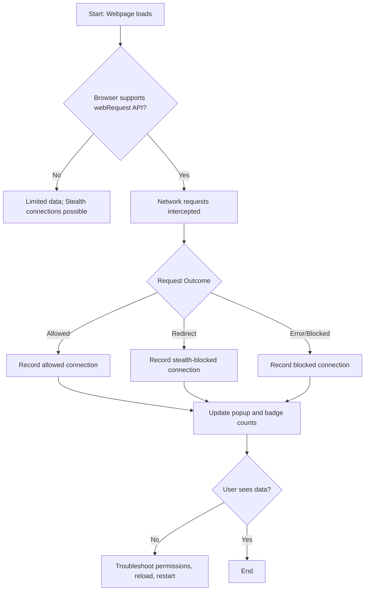

# Troubleshooting & Performance Optimization

## Overview
This guide helps you ensure the accuracy and reliability of uBO Scope's reporting, understand the causes of data discrepancies such as stealth connections and API limitations, and optimize extension performance across supported browsers. By following these best practices and troubleshooting tips, you can confidently interpret uBO Scope’s data and maintain smooth operation.

---

## 1. Understanding Reporting Accuracy

### What Reporting Measures
uBO Scope reports all network connections attempted or successfully made to third-party remote servers during your browsing activity. The main indicator on the extension's toolbar badge reflects the number of distinct third-party domains with allowed (non-blocked) connections per tab.

### Common Causes of Discrepancies
- **Stealth Connections**: Some network requests may be stealth-blocked or redirected in ways that browsers or content blockers obscure from web pages. uBO Scope categorizes these as "stealth-blocked".
- **Browser API Limitations**: Network requests outside the scope of the browser's `webRequest` API (e.g., some WebSocket connections on Safari or service workers) may not be captured.
- **DNS-Level Blocking**: Network requests blocked on the DNS or network layer but not exposed via `webRequest` listeners can lead to underreported blocked connections.

### Key Implication
A lower badge count indicates fewer distinct third-party remote connections made, which is generally desirable. However, remember that blocked and stealth-blocked outcomes are also meaningful and presented in the popup for comprehensive visibility.

---

## 2. Diagnosing and Resolving Common Issues

### Issue: Badge Not Updating or Showing Incorrect Count
**Steps to Resolve:**
1. Verify that uBO Scope has the required permissions (`webRequest` and host permissions).
2. Check that the extension is enabled and active on your browser.
3. Reload the webpage tab to trigger a fresh network request scan.
4. Confirm the browser supports and properly exposes network requests through the `webRequest` API (see Supported Browsers).
5. Restart the browser if the badge still fails to update.

### Issue: Popup Shows No Data or 'NO DATA'
**Steps to Resolve:**
1. Ensure you have an active tab selected where network connections occurred.
2. Reload the tab and open the popup again.
3. If persistent, reload or restart the extension.
4. Check for conflicts with other content blockers or privacy tools.

### Issue: Unexpected High Number of Allowed Connections
**Explanation:**
- Multiple subdomains or service domains count separately.
- Some domains may be CDNs or required third parties.

**Action:**
- Use the popup's detailed domain list to assess legitimacy.
- Compare to other browser tools for verification.

<Note>
If you notice connections that seem suspicious, consider cross-verifying with network monitoring tools or reviewing filter list settings.
</Note>

---

## 3. Performance Optimization Tips

### Browser Compatibility
- Use recent versions of Chromium-based browsers or Firefox to ensure complete API support.
- Safari support is limited due to missing `webRequest` API support for WebSockets.

### Minimizing Overhead
- Avoid opening excessive tabs with complex network activity to reduce background processing load.
- Keep the extension updated to benefit from performance improvements.

### Session Management
- uBO Scope stores session data temporarily to maintain state across tabs.
- Closing tabs releases their stored data to optimize memory.

### Troubleshooting Performance
- If you notice slowdowns or delays in badge updates, try closing unused tabs.
- Disable other extensions that might interfere with webRequest listeners.

---

## 4. Best Practices for Accurate Data

1. **Regularly Reload Tabs**: This ensures fresh data collection avoiding stale states.
2. **Interpret All Three Outcome Categories**: Allowed, stealth-blocked, and blocked domains all provide insights.
3. **Use the Public Suffix List Feature**: Helps group hosts by domain correctly for accurate counting.
4. **Do Not Rely Solely on Block Counts**: Instead, focus on distinct third-party domains connected.
5. **Understand Browser Limitations**: Recognize that not all network activity is visible due to browser architecture.

<Tip>
The badge count reflects unique connected domains, not total requests. Lower numbers indicate fewer third-party connections, which for privacy-focused users is more desirable.
</Tip>

---

## 5. Advanced Troubleshooting

### Resetting Extension Data
If you suspect corrupted or stale session data:

1. Open your browser's extension storage settings.
2. Clear stored session data for uBO Scope.
3. Restart the browser.

### Debugging Network Request Capture
For developers or filter maintainers:

- Use browser developer tools alongside uBO Scope to cross-confirm network requests.
- Monitor webRequest event listeners in background scripts for anomalies.

### Known API Challenges
- Some WebSocket connections are not captured in Safari.
- Network requests made via browser internals or non-HTTP protocols may be invisible.

---

## 6. Summary of Key Concepts

| Category           | Meaning                                                                                       |
|--------------------|-----------------------------------------------------------------------------------------------|
| Allowed            | Network connections allowed and successful to a domain.                                      |
| Stealth-blocked    | Connections attempted but hidden or redirected stealthily by content blockers.               |
| Blocked            | Connections blocked by content blockers or network failures.                                 |

Understanding these outcomes is crucial for interpreting the popup data.

---

## 7. Additional Resources

- [What is uBO Scope?](https://example.com/overview/introduction-and-value/what-is-ubo-scope) - Understand purpose and overall functionality.
- [Installation & Browser Setup](https://example.com/guides/getting-started-core-flows/install-configure-browsers) - Confirm supported browsers and permissions.
- [Monitoring Network Requests on Any Webpage](https://example.com/guides/getting-started-core-flows/monitor-network-page) - Learn how to use the popup effectively.
- [Analyzing Blocking Outcomes Across Content Blockers](https://example.com/guides/advanced-usage-patterns/analyze-blocking-content-blockers) - Advanced interpretation guidance.
- [Filter List Maintainers Mode](https://example.com/guides/advanced-usage-patterns/filter-list-maintainers-mode) - Use uBO Scope for advanced auditing.

---

## 8. How uBO Scope Fits in Your Workflow

By understanding and leveraging the insights from uBO Scope’s reporting delivered via the popup and badge, you can:

- Quickly assess your web browsing’s privacy exposure.
- Verify content blocker effectiveness beyond superficial block counts.
- Detect stealth connections that typical tools miss.
- Optimize extension use to maintain browser performance.

Using this guide alongside the related documentation empowers you to master accurate reporting and maximize uBO Scope’s value.

---

## Appendix: Browser Support Highlights

| Browser        | Notes on Support                                     |
|----------------|-----------------------------------------------------|
| Chromium       | Full support, including WebSocket monitoring.       |
| Firefox        | Full support, including WebSocket monitoring.       |
| Safari         | Partial support; no WebSocket monitoring.           |

---

## Appendix: Recognizing Legitimate Connections

uBO Scope distinguishes third-party connections carefully. Lower counts suggest better privacy, but legitimate services like CDNs may appear. Verify domains that appear frequently across sites before blocking.

---

# Troubleshooting Flow Diagram

---

## Source Code Reference
For the full source of the background handling logic, see: 
<Source url="https://github.com/gorhill/uBO-Scope" paths={[{"path": "js/background.js", "range": "1-145"}]} />

---

## Summary
By carefully noticing the different outcome types, understanding browser API limitations, and following performance recommendations, you ensure accurate, clear reports and optimal operation of uBO Scope.

---

End of Guide.
