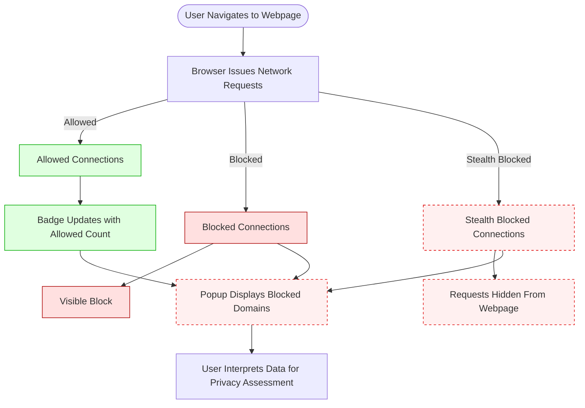

# Troubleshooting: Understanding and Investigating Stealth-Blocked Requests

## Workflow Overview

### What This Guide Helps You Accomplish
This guide empowers you to confidently identify, interpret, and troubleshoot "stealth blocking" cases reported by uBO Scope. You will learn what stealth blocking means in real-world browsing, how to verify these cases using the extension's popup and badge, and strategic steps to investigate discrepancies or unexpected reports.

### Prerequisites
- uBO Scope extension installed and enabled in your supported browser.
- Basic familiarity with uBO Scope's popup UI and badge count (refer to [Understanding the Popup](../../guides/core-workflows/understanding-the-popup) and [Badge Counts and What They Mean](../../guides/core-workflows/badge-counts-and-what-they-mean)).
- Access to actively browsing web pages and opening the extension popup to inspect data.

### Expected Outcome
- Distinguish between allowed, blocked, and stealth-blocked network connections.
- Understand scenarios where stealth blocking occurs.
- Use diagnostic strategies to confirm if stealth blocking is effective or if troubleshooting is needed.
- Gain confidence in interpreting stealth-blocked data to accurately assess your browsing protection.

### Time Estimate
15–25 minutes for complete walkthrough and initial troubleshooting.

### Difficulty Level
Intermediate — suitable for users comfortable with network monitoring concepts and extension usage.

---

## Step-by-Step Instructions

### 1. Recognize What Stealth Blocking Means
- Stealth blocking represents network requests that content blockers have prevented in ways that web pages (and some blockers) cannot easily detect.
- Unlike standard blocking (clearly shown as "blocked"), stealth blocking hides the existence of requests to avoid webpage breakage or anti-blocker detection techniques.

<Tip>
Stealth blocking is a sophisticated blocking style that keeps blocked requests "invisible" to webpages, improving privacy and reducing trigger points for anti-adblock mechanisms.
</Tip>

### 2. Open uBO Scope Popup to View Connection Outcomes
- Click the uBO Scope toolbar icon on the active tab.
- The popup lists three sections: **not blocked**, **stealth-blocked**, and **blocked** — each showing domains and request counts.

<Note>
If the popup shows "NO DATA" or empty sections for stealth and blocked domains, wait a few seconds or reload the page to collect fresh data.
</Note>

### 3. Use Badge Count as a Quick Summary
- The toolbar badge shows the count of distinct allowed third-party domains connected.
- Stealth blocked requests do not add to the badge count because these connections do not complete.

<Check>
If you see a high badge count but many stealth-blocked domains listed, your content blocker is effectively blocking requests without exposing them.
</Check>

### 4. Investigate Unexpected or High Stealth Blocking Counts
- Consider whether known filter lists or blocking features are configured for stealth blocking.
- Confirm that your content blocker supports stealth blocking modes.
- Reload pages to see if stealth domains consistently appear or fluctuate.

### 5. Validate Stealth Blocking Effectiveness
- Visit well-known websites with many third-party resources (e.g., news or social media sites).
- Observe stealth-blocked domains in the popup popup. These represent effectively blocked remote connections.
- Compare the stealth list with expected tracker or ad domains you trust are being blocked.

<Tip>
Use the domain names shown in the stealth section to verify with your filter lists or blocking rules if these are intended targets.
</Tip>

### 6. Troubleshoot Common Stealth Blocking Issues

<AccordionGroup title="Troubleshooting Common Stealth Blocking Issues">
<Accordion title="No Stealth-blocked Domains Appear" >
- Confirm your content blocker is active and set to a stealth blocking mode.
- Confirm uBO Scope permissions include webRequest tracking.
- Reload the page and re-open uBO Scope popup.
- Check if the badge count updates — if it remains zero, no third-party connections are made.
</Accordion>

<Accordion title="Stealth-blocked Domains Show but Elephants Seem to Leak" >
- Some network requests may be allowed or retried outside the blocker’s control.
- Check logs in your blocker or network tools for exceptions or allow lists.
- Revisit filter lists to confirm active stealth blocking rules.
</Accordion>

<Accordion title="Stealth Blocking Not Matching Expectations" >
- Stealth blocking may appear under 'redirect' event outcomes, representing subtle network handling.
- Confirm uBO Scope is up-to-date and has not lost session data.
- Reload browser, clear extension storage if suspect corruption.
</Accordion>
</AccordionGroup>

### 7. Interpret and Use Stealth Blocking Data
- Use stealth-blocked domain lists to confirm protection layers in place without page disruptions.
- Use domain counts to measure comparative stealth blocking effectiveness before and after filter adjustments.

### 8. When to Escalate Investigation
- Persistent mismatches between stealth blocking reports and your blocker’s feedback.
- Suspicion that a stealth blocking attempt silently failed.
- Investigate browser extension conflicts or permissions for advanced diagnostics.

---

## Examples & Scenarios

### Example Scenario: Verify Stealth Blocking on a Social News Site
1. Navigate to a major news page.
2. Click uBO Scope icon.
3. In the popup, observe domains under stealth-blocked; these usually include known ad and tracking domains.
4. Compare stealth-blocked domains with your filter list domains for validation.
5. Badge count reflects allowed third-party connections.

### Example Scenario: No Stealth Blocking Reported on a Privacy-Focused Site
- On a privacy-first site with minimal third-party content, stealth block may be empty.
- The badge count is low or zero.
- This confirms the site inherently avoids such network requests.

---

## Troubleshooting & Tips

### Common Issues
- **Stale Data:** Popup sometimes shows no data; simply reload the page and reopen.
- **Permission Denied:** Make sure uBO Scope has required host permissions (`webRequest` and activeTab).
- **Extension Conflicts:** Running multiple blockers may obscure stealth detection.

### Best Practices
- Use uBO Scope alongside your main blocker to cross-verify stealth effectiveness.
- Regularly update filters and uBO Scope extension.
- Check stealth-blocked domains periodically to detect irregularities or new trackers.

### Performance Considerations
- uBO Scope operates with minimal overhead but relies on browser APIs; response times vary by browser.
- Avoid excessive navigation and popup openings to reduce performance impact.

### Alternative Approaches
- Use browser devtools network panel to inspect request failures for an additional layer of validation.
- Engage with filter list communities if stealth blocking doesn’t behave as expected.

---

## Next Steps & Related Content

- Explore [Understanding the Popup: Domains and Connection Types](../../guides/core-workflows/understanding-the-popup) to deepen UI comprehension.
- Review [Badge Counts and What They Mean](../../guides/core-workflows/badge-counts-and-what-they-mean) for interpreting badge data.
- Visit [Configuring uBO Scope](../../getting-started/configuration-and-troubleshooting/extension-configuration) for setup and permission checks.
- Consult [Troubleshooting Common Issues](../../getting-started/configuration-and-troubleshooting/common-issues-troubleshooting) for broader problem-solving.

---

## Summary
Stealth blocking is a powerful privacy mechanism to silently block network requests without tipping off web pages. With uBO Scope, you have a transparent window into stealth-blocked connections alongside allowed and outright blocked requests. This guide ensures you understand stealth blocking’s meaning, verify its operation through popup and badge analysis, and troubleshoot common concerns — helping you trust the effectiveness of your content blocking setup.

---

## Additional Tools
- Visit the [uBO Scope GitHub Repository](https://github.com/gorhill/uBO-Scope) for source code and development updates.
- Use browser developer tools in combination with uBO Scope for deeper network analysis.

---

# Visual Overview of Request Outcomes

