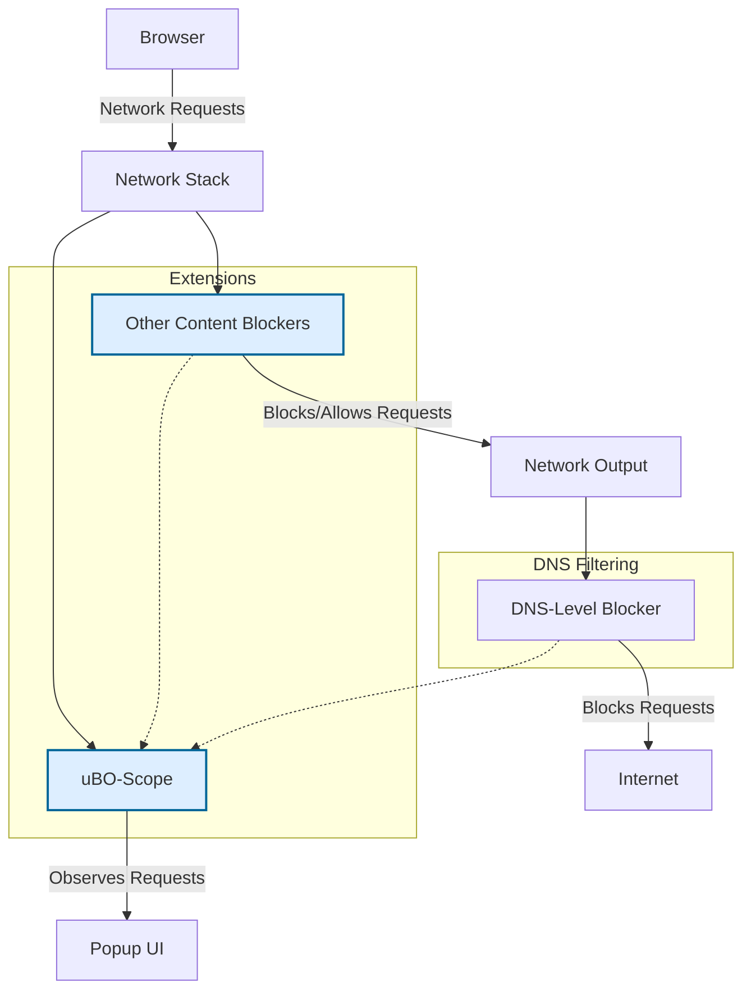

# Integrating uBO-Scope with Other Blockers and Browsing Setups

## Overview

This guide equips you to use uBO-Scope effectively alongside other content blockers and disparate browsing configurations. uBO-Scope’s unique role is to transparently reveal network connections regardless of how they are blocked or allowed, including requests filtered at DNS level or stealth-blocked by extensions.

Understanding how uBO-Scope interacts with other blockers and network environments ensures you unlock its full potential for privacy monitoring, troubleshooting, and filter list validation.

---

## 1. Purpose of Integration

uBO-Scope is designed as an independent network connection observer. It leverages browser `webRequest` APIs to monitor requests in real-time without interfering with or altering network traffic. Its reporting is comprehensive across various blocking methods, making it invaluable to:

- Privacy enthusiasts wanting to verify actual network exposure amidst multiple blockers.
- Filter list maintainers validating the impact of filters in realistic multi-blocker environments.
- Users seeking to troubleshoot complex setups involving DNS filtering and stealth blocking.


## 2. How uBO-Scope Works with Other Content Blockers

### Behavior Summary

- **Passive Monitoring:** uBO-Scope tracks all requests reported by browser APIs regardless of which extensions or services block or allow them.
- **Inclusive Reporting:** It categorizes connection outcomes into allowed, blocked, and stealth-blocked, reflecting the actual network behavior.
- **DNS-Level Blocking:** Requests blocked by DNS filtering (e.g., via Pi-hole or custom DNS resolvers) are visible as blocked or stealth depending on the browser’s reporting.
- **Stealth Blocking:** Some blockers intercept requests silently; uBO-Scope flags these under the stealth category.

### User Impact

This interoperability means you can have uBO-Scope installed alongside blockers like uBlock Origin, AdGuard, or DNS-based blockers. uBO-Scope will report the **true network results** you experience.


## 3. Setting Up uBO-Scope with Other Blockers

### Step 1: Install uBO-Scope and Your Preferred Blocker(s)
- Follow platform-specific instructions for each extension (refer to [Installing uBO Scope](../../getting-started/installation-and-setup/installing-ubo-scope)).

### Step 2: Verify Permissions and Active Status
- Ensure both uBO-Scope and your other blocker have necessary permissions, especially `webRequest` access (see [Extension Configuration](../../getting-started/configuration-and-troubleshooting/extension-configuration)).

### Step 3: Open uBO-Scope Popup and Monitor Activity
- Use the popup UI to observe domains categorized as allowed, blocked, and stealth (refer to [Understanding the Popup](../../guides/core-workflows/understanding-the-popup)).
- Confirm real-time updates as you browse with your blockers enabled.

### Step 4: Review Badge Count
- The badge reflects the number of unique third-party domains successfully connected to. This provides a reliable privacy exposure metric even when using multiple blockers.


## 4. Understanding Outcome Categories in Multi-Blocker Environments

| Outcome          | What It Means                                               | When It Occurs With Other Blockers                    |
|------------------|-------------------------------------------------------------|-------------------------------------------------------|
| **Allowed**      | Request proceeded without blocking                           | Request allowed by all blockers                         |
| **Blocked**      | Request is actively blocked and reported by browser         | Blocked by extension or DNS-level filtering            |
| **Stealth**      | Request silently blocked or redirected; no standard error   | Stealth blocking by advanced blockers or network-level |


## 5. Practical Use Cases

### Use Case 1: Validate Privacy Exposure Across Multiple Blockers
1. Enable uBO-Scope alongside uBlock Origin and a DNS blocker.
2. Browse typical websites.
3. Open the uBO-Scope popup to analyze which third-party domains successfully connect.
4. Use data to adjust or tune blocklists to minimize exposure.

### Use Case 2: Diagnose Discrepancies Caused by Overlapping Filters
- If a site loads resources unexpectedly, uBO-Scope’s stealth and blocked lists help pinpoint which blocker allowed or blocked them.

### Use Case 3: Assist Filter List Maintenance
- Filter list maintainers can leverage accurate real-world connection data collected by uBO-Scope alongside other blockers to refine filter rules.


## 6. Tips for Effective Integration

- **Do not disable uBO-Scope when running other blockers.** It requires active monitoring access to report accurate data.
- **Periodically review all categories in the popup UI.** The 'stealth' blocked domain count is especially insightful for hidden filters.
- **Consider browser-specific idiosyncrasies.** Some browsers report stealth-blocked requests differently; uBO-Scope normalizes this best it can.
- **Sync your blocker filter updates thoughtfully.** Changes in one filter can affect observed outcomes in uBO-Scope.


## 7. Common Pitfalls and Troubleshooting

<AccordionGroup title="Troubleshooting Integration Issues">
<Accordion title="uBO-Scope Shows No Network Data">
- Ensure uBO-Scope has `webRequest` permissions.
- Confirm other blockers do not interfere or disable extension APIs.
- Restart browser if necessary.
</Accordion>

<Accordion title="Badge Count Surprisingly High or Low Compared to Other Blockers">
- Understand uBO-Scope reports allowed unique domains, not block counts.
- High block counts in other blockers can co-exist with many allowed connections.
- Trust uBO-Scope for actual network exposure over block counters.
</Accordion>

<Accordion title="Stealth Blocked Requests Are Missing or Misclassified">
- This depends on the browser's reporting capabilities.
- Ensure latest browser version.
- Review extension and browser privacy settings.
</Accordion>
</AccordionGroup>


## 8. Advanced: Using uBO-Scope in DNS and Network-Level Filtering Setups

uBO-Scope can still report blocked requests caused by DNS filters because it monitors network requests at the browser level.

- DNS-blocked requests appear as 'blocked' or sometimes 'stealth.'
- This makes uBO-Scope uniquely valuable to users in environments where DNS-level filtering occurs (e.g., Pi-hole, router-filtered setups).


## 9. Example User Flow

```markdown
1. Install uBO-Scope and uBlock Origin.
2. Visit a privacy-focused news site.
3. Open uBO-Scope’s popup:
   - See ‘allowed’ shows CDN providers.
   - ‘blocked’ and ‘stealth’ lists notify of tracker domains blocked.
4. Adjust uBlock Origin filter lists based on findings.
5. Observe badge count decrease indicating improved privacy post tuning.
```


## 10. Next Steps

- Explore [Understanding the Popup](../../guides/core-workflows/understanding-the-popup) to interpret connection categorizations in detail.
- Visit [Badge Counts and What They Mean](../../guides/core-workflows/badge-counts-and-what-they-mean) for deeper insight.
- Refer to [Troubleshooting Stealth-Blocked Requests](../../guides/advanced-usage-patterns/troubleshooting-and-understanding-stealth) for advanced diagnosis.
- Learn more about [Extension Configuration](../../getting-started/configuration-and-troubleshooting/extension-configuration) to optimize permissions and settings.


---

## References

- uBO-Scope GitHub Repository: [https://github.com/gorhill/uBO-Scope](https://github.com/gorhill/uBO-Scope)
- Public Suffix List Technology (used internally by uBO-Scope): [http://publicsuffix.org/](http://publicsuffix.org/)

---

## Summary
Integrate uBO-Scope alongside your preferred content blockers and DNS filters to get a transparent, real-world view of network connections. uBO-Scope’s passive monitoring enables you to validate privacy exposure, analyze stealth blocking, and tune filters effectively regardless of your complex browsing setup.

---

# Appendix: Conceptual Diagram of uBO-Scope Integration



This diagram visually represents how uBO-Scope operates passively alongside other blockers and DNS filtering, observing all request outcomes and reporting them through its interface without interfering.
