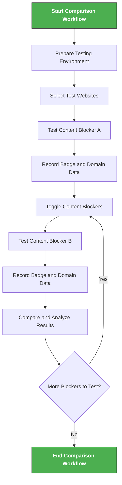

# Comparing Content Blockers with uBO-Scope

## Introduction

Understanding how different content blockers influence your browser's connections to third-party servers is essential for assessing their effectiveness and impact on privacy. This guide walks you through practical workflows using uBO-Scope to compare content blockers side-by-side. You will learn how to run controlled tests, interpret connection data, and discern meaningful insights beyond simplistic block counts.

---

## 1. Workflow Overview

### Task Description
This guide helps you compare multiple content blockers by measuring the number of unique third-party remote server connections on the same websites or browsing sessions. It focuses on using uBO-Scope's distinct domain counts and categorized connection outcomes to critically assess claims about blocker effectiveness.

### Prerequisites
- uBO-Scope installed and active in your browser.
- Two or more content blockers installed and enabled/disabled as needed.
- Familiarity with launching uBO-Scope's popup and reading the toolbar badge (see [Launching the Extension](../getting-started/first-run-usage/launch-extension) and [Understanding Badge Counts & Domain Data](../getting-started/first-run-usage/interpreting-badge)).
- Browser versions supported by uBO-Scope (Chrome 122+, Firefox 128+, Safari 18.5+).

### Expected Outcome
By the end, you will:
- Confidently observe how different blockers affect the number of allowed, stealth-blocked, and fully blocked third-party connections.
- Identify cases where higher block counts may actually correspond to more third-party domains being contacted.
- Understand how to interpret uBO-Scope's domain reports to make informed decisions about content blocker choice and configuration.

### Time Estimate
Approximately 15–30 minutes to perform side-by-side tests and analyze results depending on user familiarity.

### Difficulty Level
Intermediate — requires toggling content blockers and interpreting recorded network outcomes.

---

## 2. Step-by-Step Instructions

### Step 1: Prepare Testing Environment
1. Ensure uBO-Scope is installed and working (see the [Installing uBO-Scope](../getting-started/setup-install/install-browser) guide).
2. Select the content blockers you want to compare.
3. Make sure you can easily enable/disable or switch between these blockers (e.g., via browser extension menus).

### Step 2: Select Test Websites
Choose a set of websites you commonly visit or that represent typical browsing. It’s best to pick sites that load multiple third-party resources (images, scripts, ads, analytics).

### Step 3: Run First Blocker Test
1. Enable Content Blocker A and disable others.
2. Open a test website in a new tab.
3. Click the uBO-Scope toolbar icon to open the popup.
4. Observe the badge number and examine the popup’s three sections:
   - **Not Blocked:** third-party domains connected successfully.
   - **Stealth-blocked:** connections blocked silently.
   - **Blocked:** connections explicitly blocked.
5. Record or screenshot the domain counts and domain names listed.

### Step 4: Run Second Blocker Test
1. Disable Content Blocker A and enable Content Blocker B.
2. Reload the same website or open it in a new tab.
3. Repeat the observation and recording process as in Step 3.

### Step 5: Compare Results
Analyze differences in:
- Total distinct third-party domains connected (badge count).
- Distribution of allowed vs stealth-blocked vs blocked domains.
- Presence or absence of domains that may indicate tracking or advertising.

### Step 6: Extended Testing
Repeat steps 3–5 for additional sites or blockers as needed to build a comprehensive comparison.

### Verification Steps
- Confirm that the toolbar badge updates correctly when switching blockers.
- Verify the popup lists update and correspond to expected blocker policies.
- If counts do not change after toggling blockers, ensure blockers are active and uBO-Scope has necessary permissions.

<Check>
If the badge count remains unchanged across blocker toggles, clear your browser cache and reload tabs, or consult the [Troubleshooting](../getting-started/troubleshooting/common-issues) guide.
</Check>

---

## 3. Real-World Examples

### Example Comparison Scenario
You want to compare Blocker X and Blocker Y on example.com:

| Step                       | Blocker X        | Blocker Y        |
|----------------------------|------------------|------------------|
| Toolbar badge count         | 5                | 12               |
| Not Blocked domains         | cdn.example.net, fonts.example.com | cdn.example.net, ads.trackingad.com, analytics.data.com |
| Stealth-blocked domains     | ads.trackingad.com | None             |
| Blocked domains            | analytics.data.com | analytics.data.com, ads.trackingad.com |

#### Insight
- Blocker X lets fewer distinct third-party connections through (badge: 5 vs 12).
- Blocker Y’s higher block count doesn’t equate to fewer total third-party domains; in fact, it contacts more domains in 'Not Blocked' category.
- This demonstrates how raw block count can be misleading without distinct domain counts.

---

## 4. Troubleshooting & Tips

### Common Issues
- **Badge count does not update after toggling blockers:**
  - Ensure uBO-Scope permissions are intact.
  - Reload the webpage/tab.
  - Restart the browser if necessary.

- **Popup shows 'NO DATA' or empty lists:**
  - Confirm the tab is active and fully loaded.
  - Check that uBO-Scope is enabled and monitoring network traffic.

### Best Practices
- Use private or clean profiles to avoid interference from other extensions.
- Test on multiple websites for broader assessment.
- Use screenshots or notes to document your comparisons systematically.

### Performance Considerations
- uBO-Scope processes data asynchronously; allow a moment after page load for data to populate.

### Alternative Approaches
- Use browser profiles or containers to quickly switch between blockers.
- Run sequential tests rather than simultaneous blocking to avoid confounding effects.

---

## 5. Next Steps & Related Content

- **Explore the Popup Interface:** Learn more about interpreting domain data in the popup UI in [Understanding the Popup and Toolbar Badge](../guides/getting-started/understanding-the-popup).
- **Deepen Privacy Analysis:** Understand domain reports and blocking outcomes in [Interpreting Domain Reports and Connection Outcomes](../guides/getting-started/interpreting-domain-reports).
- **Installation and Setup:** Confirm your setup is correct via [Installing uBO-Scope on Your Browser](../guides/getting-started/installing-ubo-scope).
- **Troubleshooting:** Resolve common first-run issues in [Solving First-Run Problems](../getting-started/troubleshooting/common-issues).

---

## Summary
This guide equips you with practical methods to compare content blockers using uBO-Scope’s unique insight into third-party connection counts. It emphasizes critical evaluation to avoid common misconceptions stemming from block count comparisons, empowering you to make informed privacy decisions.

---

# Visualizing the Comparison Workflow

---

<Tip>
Remember: A lower distinct third-party connection count (badge number) generally indicates better privacy protection. However, always consider the actual domains connected, not just the numeric counts.
</Tip>

<Warning>
Relying solely on block counts visible in other content blockers or using ad blocker test sites as benchmarks is misleading. uBO-Scope reveals the true nature of third-party remote server connections.
</Warning>

---