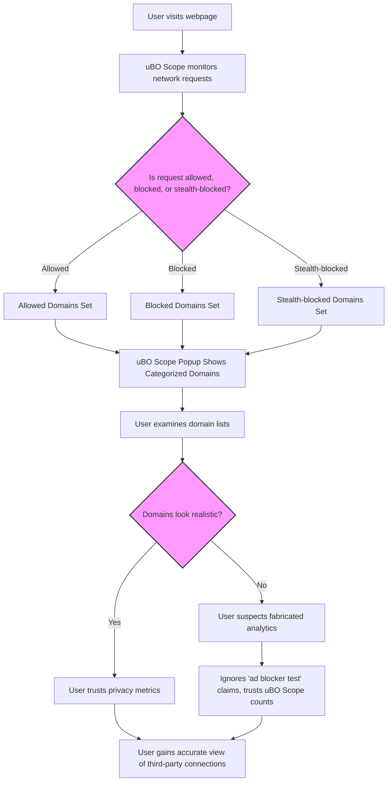

# Debunking Misleading Analytics and 'Ad Blocker Test' Pages

## Overview

This guide empowers you to avoid common pitfalls when evaluating browser privacy using third-party analytic pages and so-called 'ad blocker test' websites. Learn how to use uBO Scope to uncover fabricated scenarios and see beyond unreliable metrics, gaining a clearer, more accurate picture of your browsing privacy.

uBO Scope's detailed network connection reporting sheds light on real-world third-party connections, cutting through misleading claims and providing practical insights into web privacy.

---

## 1. Understanding the Landscape: Why Misleading Pages Exist

Many websites and online tools claim to measure how effective your ad blocker or privacy tools are. However, these pages often present deceptive or oversimplified scenarios:

- They generate artificial network requests to domains that real websites never use.
- They contain scripts purposely designed to detect and provoke specific behaviors in blockers.
- Their metrics prioritize block counts rather than the true number of distinct third-party connections.

This leads to misunderstandings about your content blocker's real effectiveness and can falsely suggest that blocking more is inherently better.

---

## 2. Use uBO Scope to See Beyond the Noise

### Task Description
Use uBO Scope to examine actual network connection attempts made from your active browser tab and distinguish legitimate third-party connections from artificially triggered or meaningless ones.

### Prerequisites
- Install and enable uBO Scope in your browser ([Installation Guide](https://github.com/gorhill/uBO-Scope#getting-started/installation-basics/install-extension)).
- Have an active tab with the webpage you want to analyze.

### Expected Outcome
- See an accurate summary of third-party domains contacted by the active page.
- Understand which connections were allowed, blocked, or stealth-blocked.
- Identify suspicious or fabricated test domains that don't represent real-world usage.

### Time Estimate
Approximately 5 minutes.

### Difficulty Level
Beginner to Intermediate.

---

## 3. Step-by-Step Workflow to Spot Misleading Analytics

<Steps>
<Step title="Open the uBO Scope popup panel on the page you want to analyze">
Click the uBO Scope icon in your browser toolbar to open the popup. Confirm you see the domain and connection summaries for the active tab.

<Check>
You should see counts of connected domains under "domains connected" and three categories: not blocked, stealth-blocked, and blocked.
</Check>
</Step>

<Step title="Compare domain listings with known real domains">
Examine the domain lists under each category.

- Legitimate sites usually have commonly known domains or recognized CDNs.
- Suspicious entries often have random or fabricated-looking names.

<Tip>
Remember that a low number of distinct allowed third-party domains generally indicates better privacy.
</Tip>
</Step>

<Step title="Recognize stealth-blocked domains">
Stealth-blocked domains indicate connections your content blocker prevented without making it obvious to the webpage.

- These are neither fully blocked nor allowed.
- A high stealth-block count might reflect more subtle content blocking.
</Step>

<Step title="Beware of ad blocker test pages">
If analyzing an 'ad blocker test' page:

- Notice if many domains are unfamiliar or specifically made to trigger blocking.
- Trust uBO Scope's count of distinct allowed domains more than the block count shown on these test pages.

<Warning>
Do not rely on 'ad blocker test' pages as definitive proof of your content blocker's reliability.
They often manipulate or misrepresent blocking to create false impressions.
</Warning>
</Step>

<Step title="Make privacy decisions based on allowed domain count">
Use the badge count on the toolbar icon (the number over the uBO Scope icon) as a quick indication of how many distinct third-party domains your content blocker is allowing.

- Lower badge counts correlate with better privacy.
- High block counts sometimes mean more connections remain allowed.

<Note>
uBO Scope purposely counts distinct domains contacted by the page, rather than simply tallying blocked requests.
</Note>
</Step>

<Step title="Repeat the process on various websites to build your understanding">
Test popular sites vs. test pages to see real practical differences in third-party connections.
This helps build intuition on what normal vs. fabricated metrics look like.
</Step>
</Steps>

---

## 4. Practical Tips and Best Practices

- **Focus on allowed domains, not just blocked counts.**
  Allowed connections reveal what resources the page actually fetched, which impacts your privacy.

- **Use uBO Scope's output as an objective measure, independent of other blockers' claims.**

- **Question results from 'ad blocker test' pages.** Real websites have different network behavior.

- **Remember stealth blocking is a feature, not a bug.** It reduces page breakage and blocker detectability.

---

## 5. Troubleshooting Common Misinterpretations

<AccordionGroup title="Common pitfalls and solutions">
<Accordion title="Why does the test page report a higher block count than uBO Scope's badge?">
This can happen because test pages often generate many artificial blocking triggers, inflating block statistics without reducing allowed third-party domains.
Trust uBO Scope's badge, which counts distinct allowed domains, as a better indicator.
</Accordion>

<Accordion title="Why do I see unfamiliar domain names in the popup?">
Some domains may be obscure CDNs, advertising networks, or even test domains used by the site.
Cross-check suspicious domains with reputable domain lookup tools if unsure.
</Accordion>

<Accordion title="My popup shows too many stealth-blocked domains; is this normal?">
Stealth blocking is a technique to silently prevent page breakage while blocking resources.
A higher stealth-block count indicates active blocker stealth mode, generally positive for usability.
</Accordion>

</AccordionGroup>

---

## 6. Next Steps and Related Resources

- Explore [Reading the Popup Panel](../core-workflows/reading-popup) to deepen your understanding of connection summaries.
- Review [Network Request Visibility](../core-workflows/network-request-visibility) for detailed insights on how network requests are tracked and classified.
- Use [Comparing Content Blockers Objectively](../advanced-usage/comparing-content-blockers) to evaluate blockers beyond misleading metrics.
- Consult [Troubleshooting Installation & Setup](../../getting-started/first-use-and-validation/troubleshooting-setup) if uBO Scope does not behave as expected.

By mastering these workflows, you will confidently discern reliable privacy insights from contrived analytics and improve your browsing security.

---

## References

- uBO Scope GitHub Repository: [https://github.com/gorhill/uBO-Scope](https://github.com/gorhill/uBO-Scope)
- The Public Suffix List (used by uBO Scope to parse domains): [https://publicsuffix.org/list/](https://publicsuffix.org/list/)

---

## Summary Diagram: How uBO Scope Helps Spot Misleading Analytics

---

# End of Guide