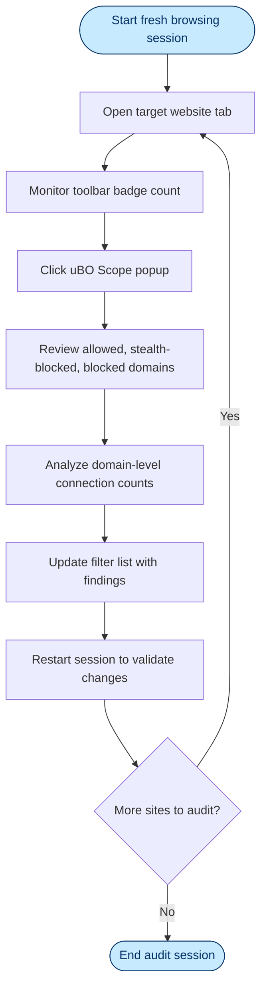

# Best Practices for Filter List Maintainers Using uBO Scope

## Overview
This guide provides filter list maintainers with practical, step-by-step recommendations for leveraging uBO Scope to effectively audit real-world browsing activity. It focuses on maintaining session persistence, performing domain-level tracking, and gathering actionable insights even when browser tooling is limited or unavailable. By following these practices, maintainers can make informed decisions to fine-tune filter lists based on authentic network request data.

---

## 1. Preparation and Prerequisites

Before starting your analysis workflow, ensure the following prerequisites are met:

- **Install uBO Scope:** Have the latest stable version of the uBO Scope extension installed on your preferred supported browser (Chromium, Firefox, or Safari). See [Install uBO Scope](/guides/getting-started/install-configure) for detailed steps.
- **Understanding of Core Concepts:** Familiarize yourself with core terminology such as domains, public suffixes, and connection outcomes (allowed, blocked, stealth-blocked). Reference the [Core Concepts & Terminology](/overview/core-concepts-architecture/core-terminology) page.
- **Browsing Environment:** Use standard browsing sessions where you can reproduce realistic browsing behavior for accurate capture of network requests.
- **Persistence Setup:** Know that uBO Scope uses session storage to retain tab-level domain information and outcomes. Plan for workflows that accommodate session persistence for comprehensive audits.

## 2. Workflow for Auditing with uBO Scope

The following step-by-step instructions will guide you through using uBO Scope for filter list maintenance audits.

### Step 1: Start a Fresh Browsing Session
- Close existing tabs or browser instances to clear previous session data.
- Open a new browser window and navigate to the target website(s) you want to audit.

### Step 2: Monitor the Toolbar Badge
- Observe the badge count on the uBO Scope toolbar icon. This count reflects the number of distinct third-party domains connected to during the session.
- NOTE: A lower badge count typically indicates fewer third-party requests allowed, which is beneficial for privacy and performance.

### Step 3: Open the uBO Scope Popup
- Click the toolbar icon to open the popup interface.
- Review the summary section showing the total number of connected domains.
- Examine the three categorized sections:
  - **Not Blocked:** Domains where connections succeeded without interference.
  - **Stealth-Blocked:** Domains that were redirected or stealthily blocked.
  - **Blocked:** Domains where requests were explicitly blocked.

### Step 4: Analyze Domain-Level Data
- Use the popup lists to identify high-frequency domains appearing in the 'allowed' or 'stealth-blocked' sections.
- Focus on domains with unusually high connection counts as potential targets for new filter rules.
- Cross-reference each domain with the [Public Suffix List](https://publicsuffix.org/list/) integrated by uBO Scope to verify domain boundaries accurately.

### Step 5: Persist Important Data
- Recognize that uBO Scope automatically stores session and domain data in session storage, preserving audit data within a browsing session.
- For longer analysis periods or offline reviews, export or document domains manually as uBO Scope currently does not provide built-in export features.

### Step 6: Apply Filter List Updates
- Based on your analysis, update your filter list rules with domains that require blocking.
- Validate modifications by restarting the browsing session and observing reductions in the uBO Scope badge count and allowed domains.

### Step 7: Repeat Testing Across Multiple Sites
- Conduct similar audits on various websites, especially those known for third-party tracking or advertisement networks.
- Look for patterns in repeated allowed or stealth-blocked domains to justify the creation of broader filtering rules.

## 3. Techniques for Restricted Browser Tool Access

When access to full browser developer tools or advanced network inspection is unavailable, uBO Scope offers valuable data as a standalone audit tool.

### Tips for Limited Environments
- **Use uBO Scope Popup as Primary Insight:** The popup page provides a concise domain breakdown without requiring deeper browser access.
- **Session Persistence Benefits:** Because uBO Scope retains domain data per tab, ensure to leave tabs open to accumulate sufficient connection data.
- **Leverage Badge Counts:** The badge count serves as a quick indicator of filtering effectiveness and session third-party connections.
- **Manual Recording:** Consider capturing screenshots or notes from the popup UI regularly for offline analysis.

## 4. Best Practices

- **Start with a Clean Slate:** Always reset your browsing session when auditing changes to avoid residual data skewing insights.
- **Focus on Domain, Not Hostname:** uBO Scope uses the Public Suffix List to correctly identify registrable domains, which is crucial to avoid overblocking third-level or subdomains.
- **Look Beyond Blocked:** Domains in 'stealth-blocked' or 'allowed' sections are often more critical than blocked ones for filter tuning because they represent traffic that evaded blocking.
- **Monitor Across Multiple Browsers:** Since uBO Scope supports Chromium, Firefox, and Safari, compare results across browsers for comprehensive coverage.
- **Avoid Over-Blocking:** Keep in mind some third-party domains are legitimate (e.g., CDNs). Use connection counts and domain reputation to guide rule creation.
- **Iterate Regularly:** Network landscapes evolve; conduct repeated audits to keep your filter list current and maintain optimal user privacy.

## 5. Common Pitfalls & Troubleshooting

### Problem: No or Incomplete Data in Popup
- Verify that uBO Scope has the required permissions granted (webRequest and storage).
- Ensure you are browsing active tabs and not background or system pages.
- Close and reopen the popup to refresh the data.

### Problem: Unexpectedly High Allowed Domain Counts
- Confirm that stealth-blocked and blocked categories are reviewed for missed detections.
- Review if any content blockers or DNS filters interfere and impact uBO Scope’s observations.

### Problem: Session Data Not Persisting Across Tabs
- Understand session storage is scoped per browser session; closing the browser will clear stored data.
- Keep tabs open during audits and avoid manual session clearing.

## 6. Additional Resources & Next Steps

- Explore the [Exploring the uBO Scope Popup Interface](/guides/getting-started/exploring-popup-ui) guide to deepen your understanding of the visual data presentation.
- Review [Understanding Badge Counts and Connection Outcomes](/guides/core-workflows/understanding-badge-and-outcomes) for interpreting key metrics.
- Consult [Using uBO Scope for Privacy Diagnostics](/guides/core-workflows/using-for-diagnostics) for integrated diagnostic workflows.
- Report feature requests or contribute to the project at the [uBO-Scope GitHub repository](https://github.com/gorhill/uBO-Scope).

---

## Summary Diagram: Auditing Workflow Using uBO Scope

---

# Conclusion
This guide empowers filter list maintainers to harness uBO Scope effectively for real-world auditing, even under constraints. By systematically monitoring domain connection outcomes, persistently tracking sessions, and applying refined filter rules, maintainers will enhance filter accuracy and user privacy protections.
