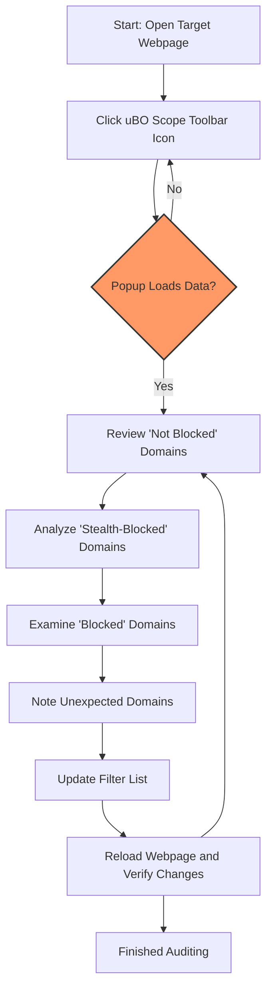

# uBO Scope for Filter List Maintainers

Explore how filter list maintainers can leverage uBO Scope for auditing allowed and blocked domains, especially on mobile devices or restricted browsers. This guide details workflow recommendations and efficiency tips for analyzing network requests effectively in constrained environments.

---

## 1. Purpose and Workflow Overview

### What This Guide Helps You Accomplish

This guide shows filter list maintainers how to use uBO Scope to audit network requests categorized as allowed, blocked, and stealth-blocked domains. It focuses on workflows that enable efficient domain auditing and refinement of filter lists—particularly where access to traditional browser developer tools is limited, such as on mobile devices or privacy-restricting browsers.

### Prerequisites

- uBO Scope installed on a supported browser (Chrome 122+, Firefox 128+, or Safari 18.5+).
- Basic familiarity with filter lists and domain blocking principles.
- Access to a device where you can activate and observe the uBO Scope popup interface.

### Expected Outcome

- You will be able to identify domains permitted or blocked on any given webpage.
- Understand how to leverage the extension to refine and validate filter list rules against practical web scenarios.
- Gain insights into network request classification useful for filter maintenance.

### Time Estimate

- Initial familiarization: 10–15 minutes.
- Practical domain audits: 30+ minutes depending on complexity.

### Difficulty Level

Intermediate—requires understanding of domain blocking and filter lists but no programming expertise.

---

## 2. Step-by-Step Instructions for Filter List Auditing

<Steps>
<Step title="Open uBO Scope on the Target Webpage">
Launch the browser where uBO Scope is installed. Navigate to the webpage you want to audit. Click the uBO Scope toolbar icon to open the popup panel.

**Expected Result:** The popup loads showing the hostname of the current page and three sections: "not blocked", "stealth-blocked", and "blocked" domains.
</Step>

<Step title="Review Allowed ('Not Blocked') Domains">
Examine the "not blocked" section listing domains contacted successfully without being blocked.

- Note domains you consider acceptable or that should be blocked.
- Pay special attention to domains unexpectedly allowed, which may represent gaps in your filter list.

**Decision Point:** Decide which domains require adding or updating blocking rules.

**Verification:** Cross-check domains against your filter list entries.
</Step>

<Step title="Analyze Stealth-Blocked Domains">
Review the "stealth-blocked" domains. These requests are blocked but potentially using techniques to evade detection.

- Consider whether stealth blocking aligns with your filter list objectives.
- Note domains that may require special rules (e.g., dynamic or third-party trackers).

**Tip:** Stealth blocking typically means the request was redirected or silently blocked.
</Step>

<Step title="Check Blocked Domains">
Look at the "blocked" section showing requests explicitly blocked.

- Confirm that your filter list is effectively blocking intended trackers or ads.
- Identify any domains that should not be blocked to avoid overblocking or site breakage.

**Outcome:** Use this information to fine-tune blocking rules.
</Step>

<Step title="Record Findings and Update Filter List">
Note your findings—domains allowed/blocked unexpectedly—and edit your filter list accordingly.

- For mobile or restricted browsers where developer tools are unavailable, rely on uBO Scope's popup details.
- Export or manually input domain data to your filter list management workflow.

**Verification:** After updates, revisit the page and verify changes in uBO Scope's popup.
</Step>
</Steps>

---

## 3. Practical Tips for Efficient Analysis

- **Use the Toolbar Badge as a Quick Indicator:** The badge number shows distinct allowed third-party domains on the current page. Lower counts often signal better blocking.

- **Focus on Domain-Level Data:** uBO Scope aggregates hostnames into domains using the Public Suffix List to avoid confusion between subdomains.

- **Leverage Unicode Support:** Domains displayed use punycode decoding for readability, useful for internationalized domain names.

- **Perform Analysis on Real-World Websites:** Avoid relying on synthetic ad-block test pages; they do not reflect realistic network traffic.

- **Use Sessions Persisting Data:** uBO Scope saves session data, allowing analysis over time even if browser tabs close and reopen.

- **Use Mobile Devices:** uBO Scope works on Firefox for Android and Chromium-based browsers, facilitating auditing where desktop tools do not apply.

---

## 4. Common Pitfalls and Troubleshooting

<AccordionGroup title="Troubleshooting Common Issues">
<Accordion title="Popup Shows 'NO DATA' or Empty Sections">
- Ensure you have an active tab with a loaded webpage.
- Verify that uBO Scope is enabled with necessary permissions.
- Check for conflicts with other extensions that may block network monitoring.
- Refresh the page and reopen the popup.
</Accordion>
<Accordion title="Badge Count Does Not Update">
- Badge updates when allowed third-party domains change; if static, try reloading the tab.
- Confirm uBO Scope's background processing is active.
- Verify the browser version meets minimum requirements.
</Accordion>
<Accordion title="Stealth-Blocked Section Seems Empty or Unclear">
- Not all stealth-blocked requests are easily visible; this depends on request redirection or blocking techniques.
- Do not confuse this with allowed or blocked sections; it shows subtle distinctions.
</Accordion>
</AccordionGroup>

<Tip>
For filter maintainers, relying solely on block counts or badges is misleading. Always analyze allowed connections carefully to ensure comprehensive blocking.
</Tip>

---

## 5. Next Steps and Related Resources

- **Deepen Understanding:** Review "Diagnosing Allowed, Blocked, and Stealth Requests" guide for advanced network request analysis.
- **Debunk Blocker Myths:** Consult the "Debunking Content Blocker Myths with uBO Scope" guide to avoid common misconceptions.
- **Integrate with Filter List Maintenance:** Use auditing results from uBO Scope to iteratively refine your filter lists.
- **Explore Popup Interface Usage:** Learn nuanced popup interactions in the "Understanding the Popup Interface" guide.
- **Stay Informed on Extension Updates:** Monitor the [GitHub repository](https://github.com/gorhill/uBO-Scope) for new features helpful for maintainers.

---

## Appendix: Example Use Case

Suppose you maintain a filter list targeting mobile ads. When testing your list on a news website using Firefox for Android, you launch uBO Scope and notice several unexpected allowed domains loading resources. You:

- Note these domains under "not blocked."
- Confirm none are necessary for site functionality.
- Add precise blocking rules targeting these domains.
- Reload page and verify the domains appear under "blocked" or "stealth-blocked." 

This efficient loop, supported by uBO Scope, helps you audit and close gaps in your list without desktop debugging tools.

---

## Visual Overview of uBO Scope for Filter List Maintainers

---

## Useful Links

- [uBO Scope GitHub Repository](https://github.com/gorhill/uBO-Scope)
- [Understanding the Popup Interface](../../guides/core-usage/understanding-the-popup)
- [Diagnosing Allowed, Blocked, and Stealth Requests](../../guides/advanced-usage/diagnosing-network-requests)
- [Debunking Content Blocker Myths](../../guides/advanced-usage/myth-busting-content-blockers)
- [System Requirements](../../getting-started/install-launch-validate/system-requirements)
- [Installation Guide](../../getting-started/install-launch-validate/installation)

---

For comprehensive onboarding, combine this guide with core usage and troubleshooting documentation to maximize your efficiency as a filter list maintainer using uBO Scope.