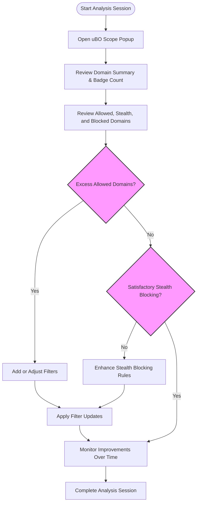

# Best Practices for Filter List Maintainers

This guide is designed specifically for filter list maintainers using uBO Scope, especially on restricted devices or environments where browser development tools are unavailable. Leveraging uBO Scope's specialized reporting on network connections, you will learn workflows and tips to identify unnecessary third-party connections, verify stealth blocking by content blockers, and track improvements in blocking efficacy over time.

---

## 1. Understanding Your Workflow

### Purpose
As a filter list maintainer, your goal is to optimize content blocking filters by minimizing unwanted third-party connections while ensuring essential resources remain accessible. uBO Scope helps by exposing all network connections, including those silently redirected (stealth blocked) or completely blocked, allowing you to verify the effectiveness and stealth of your filter rules.

### Prerequisites
- uBO Scope installed and running in your preferred browser
- Basic familiarity with network connections, domains, and filter list concepts
- Access to the uBO Scope popup interface (browser extension icon)

### Expected Outcome
By following this guide, you will be able to:
- Identify and isolate excess or unnecessary third-party connections
- Verify stealth blocking behavior without relying on browser devtools
- Monitor improvements in blocking over multiple sessions or changes

### Time Estimate
Approximately 15-30 minutes per analysis session, depending on browsing activity and complexity of sites tested

### Difficulty Level
Intermediate — assumes knowledge of privacy tools and domains

---

## 2. Step-by-Step Workflow

### Step 1: Access the uBO Scope Popup
- Click the uBO Scope toolbar icon to open the popup.
- Observe the summary at the top showing the current page’s main hostname and domain.
- Note the total count of distinct third-party connected domains.

  <Check>
  Ensure uBO Scope has collected data for the active tab; if the popup shows "NO DATA," reload the page or verify the extension is enabled.
  </Check>

### Step 2: Review Domain Categories
- The popup displays three domain outcome categories:
  - **Allowed (Not Blocked):** Connections that successfully completed.
  - **Stealth-blocked:** Requests silently redirected by the content blocker.
  - **Blocked:** Requests that failed due to blocking rules.
- Each category lists domains along with the number of connection attempts.

### Step 3: Identify Excess Connections
- Focus on the **Allowed** category:
  - Review listed third-party domains.
  - Identify domains that appear frequently but are not essential or expected.
  - Consider cross-referencing with your filter list to check if these should be blocked or filtered better.

### Step 4: Verify Stealth Blocking
- Look at the **Stealth-blocked** section:
  - Domains here represent requests redirected by the content blocker without a failure or visible blocking.
  - Confirm that stealth blocking effectively prevents network connections while minimizing site breakage.
  - If stealth-blocked domains seem excessive or unwanted, consider refining filter rules.

### Step 5: Analyze Blocked Domains
- Review which domains appear in the **Blocked** category:
  - These are failed network requests, potentially blocked by filters.
  - Frequent or unexpected blocked domains may indicate broken functionality or overly aggressive rules.

### Step 6: Track Improvements Over Time
- Use uBO Scope over multiple browsing sessions or after updating filter lists.
- Compare the number and type of connected domains each time.
- Aim for a lower count of allowed third-party domains and more effective stealth blocking.

  <Tip>
  To maintain a history, consider manually recording uBO Scope popup counts or taking screenshots after critical changes.
  </Tip>

### Step 7: Use uBO Scope on Restricted Devices
- When browser developer tools are not accessible:
  - uBO Scope's popup provides a standalone overview of network connections.
  - Use it as the primary means to validate filter list behavior and stealth blocking.

  <Warning>
  Remember that uBO Scope relies on the browser's webRequest API; some platforms or browsers might have limitations that affect data collection.
  </Warning>

---

## 3. Practical Examples

### Example: Identifying a Persistent Third-Party
Suppose you observe a domain like `tracker.example.net` appearing frequently in the Allowed section despite your filters.
- Action: Add or refine filter list rules targeting `tracker.example.net`.
- Result: On the next browsing session, that domain should move to Blocked or Stealth-blocked if filters allow stealth blocking.

### Example: Confirming Stealth Blocking
You notice `ads.example.com` listed under Stealth-blocked.
- This means requests to this domain are redirected rather than outright failed, preserving browsing experience.
- If you prefer this approach, ensure your filters use stealth blocking syntax.

---

## 4. Troubleshooting & Tips

### Common Issues
- **No data available in popup:** Reload the page or confirm uBO Scope permissions and that the extension is enabled.
- **Unexpected high allowed count:** Verify no filters are missing or overridden by other extensions.
- **Stealth blocking not working:** Check that your filters support redirect actions and that the browser allows such behavior.

### Best Practices
- Regularly update your filter lists and monitor effects with uBO Scope.
- Use the badge count complementarily, but always confirm with popup details.
- When refining filters, prefer stealth blocking when possible to avoid site breakage.

### Performance Considerations
- uBO Scope processes network requests asynchronously with brief batching, so occasional mild delays in data display are normal.
- Heavy browsing with many tabs may increase popup data size; focus your analysis on critical tabs.

### Alternative Approaches
- Use external tools and logs for deep network analysis in complex scenarios.
- Combine uBO Scope insights with documentation and community forums for filter list improvement.

---

## 5. Next Steps & Related Resources

- Explore the [Using uBO Scope with Other Content Blockers](https://yourdomain/guides/advanced-usage/integration-content-blocker) guide to understand filter interactions.
- Review the [Understanding the Badge Count and What It Means](https://yourdomain/guides/interpreting-results/reading-badge) to contextualize network connection numbers.
- Visit the [Core Concepts & Terminology](https://yourdomain/overview/core-concepts-architecture/concepts-terminology) for foundational knowledge on domains and request outcomes.
- For troubleshooting installation and setup, see [Troubleshooting Common Installation & Setup Issues](https://yourdomain/getting-started/troubleshooting-and-faq/common-issues).

---

<u>Leverage these best practices to sharpen your filter lists' precision and effectiveness, ensuring privacy-conscious users experience a smooth, secure web browsing journey.</u>

---

### Mermaid Diagram: Filter List Maintainer Workflow with uBO Scope

---