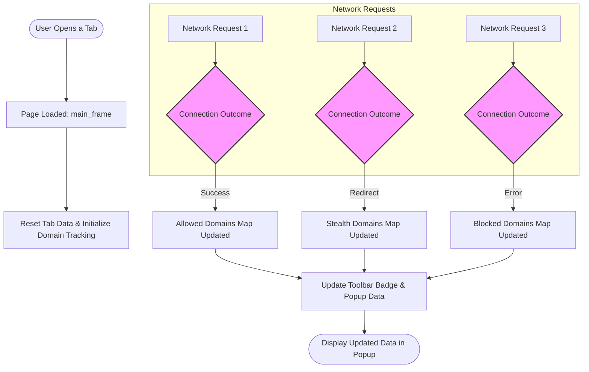

# Inspecting Network Requests for Specific Tabs

This guide provides you with practical, step-by-step instructions and best practices for monitoring network requests at the tab level using uBO Scope. You will learn how to interpret connection outcomes, debug unwanted third-party connections, and track unexpected domains fetched by websites during your browsing session.

---

## Workflow Overview

- **Task Description**: Understand how to monitor and analyze network requests and their connection outcomes for individual browser tabs using uBO Scope.
- **Prerequisites**:
  - uBO Scope installed on a supported browser (Chrome 122+, Firefox 128+, Safari 18.5+).
  - Basic familiarity with the extension’s popup interface and toolbar badge (recommended to review "Understanding the Popup and Toolbar Badge").
  - The extension actively running and monitoring network requests.
- **Expected Outcome**: You will be able to inspect the allowed, stealth-blocked, and blocked network connections per tab, identify unwanted or suspicious domains, and effectively use this insight to troubleshoot or analyze network behaviors.
- **Time Estimate**: 10–15 minutes for initial exploration and familiarization with tab-level data.
- **Difficulty Level**: Intermediate (basic understanding of browser tabs, network requests, and privacy concepts assumed).

---

## Step-by-Step Instructions

### 1. Open uBO Scope for the Active Tab

1. Click the uBO Scope toolbar icon to display the popup window.
2. The popup automatically fetches the network connection data for the currently active tab.
3. Confirm the hostname and domain shown at the top reflect your active webpage.

**Expected Result:** The popup will list domains connected to by the active tab, categorized by connection outcome.

---

### 2. Review Connection Outcomes by Category

- **Allowed (Not Blocked)**: These are third-party remote servers your browser connected to successfully.
- **Stealth-Blocked**: These are connections that were redirected or blocked stealthily by content blockers or other mechanisms.
- **Blocked**: These connections failed due to errors or explicit blocking.

**Action:** Review each category’s domain list to understand which remote servers are contacted by the tab.

---

### 3. Identify Unexpected or Unwanted Connections

- Look for unfamiliar or irrelevant domains in the **Allowed** or **Stealth-Blocked** lists.
- Note domain counts indicating frequent connections.
- Use the domain names to research if you suspect tracking, ads, or other unwanted content.

**Tip:** Domains originating outside the main website domain indicate third-party connections.

---

### 4. Use the Badge Count to Gauge Third-Party Connections

- The badge on the toolbar icon shows the count of distinct third-party domains allowed by the current tab.
- A high badge count may indicate extensive third-party resource loading.

**Note:** The badge count updates in near real-time, reflecting the tab’s current network state.

---

### 5. Debug Connection Outcomes by Investigating Events

- Network requests can result in events like `success` (allowed), `redirect` (stealth), or `error` (blocked).
- These events are captured and recorded per tab and can inform why a domain appears in a specific category.

**Action:** If certain connections are unexpectedly allowed or blocked, consider what content blockers, browser settings, or site policies may be influencing these outcomes.

---

### 6. Analyze Tab-Specific Data Programmatically (Advanced)

If you are comfortable with developer tools or debugging:

- uBO Scope’s background script records per-tab network request details.
- You can use browser debugging consoles or extension APIs to query this data.

Example (conceptual):
```javascript
browser.runtime.sendMessage({ what: 'getTabData', tabId: YOUR_TAB_ID }).then(response => {
  const tabData = deserialize(response);
  console.log(tabData);
});
```

> This lets you programmatically inspect the maps of allowed, stealth, and blocked domains for a specific tab.

---

### 7. Reset or Refresh Tab Data

- Reloading the webpage (main frame) resets tab connection data.
- Opening a new tab starts fresh monitoring.
- Closing tabs clears associated data automatically.

**Best Practice:** To analyze fresh network data, reload the page and watch the popup and badge for updated information.

---

## Examples & Practical Scenarios

### Example 1: Spotting Unexpected Trackers

1. Visit a news website.
2. Open uBO Scope popup.
3. Notice allowed connections to many third-party ad servers.
4. Identify domains you do not recognize.
5. Use domain lookup online to verify if these are trackers.

### Example 2: Confirming Content Blocker Effectiveness

1. Enable a new content blocker or filter list.
2. Refresh the tab.
3. Open uBO Scope popup.
4. Observe decrease in allowed domain counts and increase in stealth or blocked domains.

### Example 3: Troubleshooting Missing Data

- Ensure uBO Scope is enabled and permissions are granted.
- Check that the webpage is using network protocols supported (`http`, `https`, `ws`, `wss`).
- Verify that the tab is not a browser internal page (extensions cannot monitor these).


## Troubleshooting & Tips

<AccordionGroup title="Common Issues and Solutions">
<Accordion title="No Data Shown in Popup for Active Tab">
- Verify uBO Scope is installed and enabled.
- Confirm browser permissions for `webRequest` and `activeTab` are granted.
- Reload the active tab to trigger new monitoring.
- Ensure the tab is a standard web page, not in a private or incognito window without extension permission.
</Accordion>
<Accordion title="Badge Count Not Updating">
- Wait for up to a few seconds for background processing.
- Reload the active tab.
- Check for conflicting extensions that may interfere with webRequest listeners.
</Accordion>
<Accordion title="Unexpected Domains in Allowed List">
- Investigate whether these domains are necessary third-party content (e.g., CDNs).
- Use trusted domain reputation tools to assess threat level.
- Adjust your content blocker settings or filter lists accordingly.
</Accordion>
</AccordionGroup>

<Tip>
Keep in mind that the badge count and popup data reflect unique third-party domain connections, not raw request counts. This metric offers clearer privacy insights by focusing on distinct remote servers.
</Tip>

---

## Next Steps & Related Content

- Explore the [Understanding the Popup and Toolbar Badge](/guides/getting-started/understanding-the-popup) guide to deepen your grasp of the interface.
- Review [Interpreting Domain Reports and Connection Outcomes](/guides/getting-started/interpreting-domain-reports) for context on allowed, stealth-blocked, and blocked connections.
- For comprehensive blocker analysis, visit [Comparing Content Blockers with uBO-Scope](/guides/advanced-usage/analyzing-content-blockers).
- For troubleshooting, consult [Solving First-Run Problems](/getting-started/troubleshooting/common-issues).

These guides together empower you to leverage uBO Scope effectively for privacy-focused browsing and advanced network analysis.

---

## Diagram: Network Request Flow per Tab



---

## Resources

- Repository: [uBO-Scope on GitHub](https://github.com/gorhill/uBO-Scope)
- Popup source code: `popup.html` and `js/popup.js` for UI reference
- Background process: `js/background.js` for understanding data collection


---