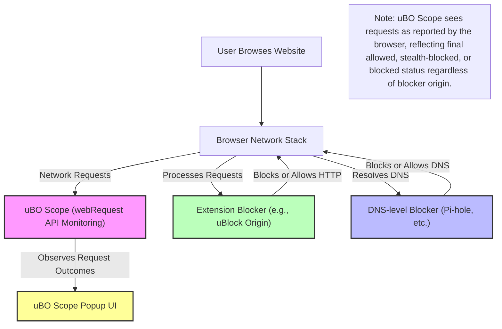

# Using uBO Scope with Other Content Blockers

uBO Scope uniquely empowers you to monitor your browser's network activity by revealing all attempted and successful connections to remote servers. This page explains how to effectively use uBO Scope alongside other content blockers and DNS-level blocking tools, interpret connection results regardless of the blocking source, and investigate discrepancies in reported network connections.

---

## Why Use uBO Scope Together with Other Blockers?

Many users deploy multiple layers of content blocking such as extension-based blockers (e.g., uBlock Origin, AdGuard) and DNS-level filtering services (e.g., Pi-hole). These tools operate independently but collectively influence network requests.

uBO Scope serves as an impartial observer, reporting what your browser actually attempts and achieves at the network level, _independent_ of which tool blocked or allowed the request. This visibility helps you understand the efficacy of all blockers working in tandem.

**Scenario:** You might see a request listed as blocked in your DNS-level filtering tool but absent or differently categorized in uBO Scope. This is because uBO Scope relies on the browser's `webRequest` API, which captures requests _as seen by the browser_. DNS blocking outside this path or stealth blocking techniques may cause differences.

---

## How uBO Scope Interprets Network Requests With Other Blockers

uBO Scope classifies connections into three categories:

- **Allowed**: Requests that successfully connected to a remote server.
- **Stealth-blocked**: Requests redirected or silently blocked (e.g., by stealth blocking techniques).
- **Blocked**: Requests that failed or were overtly blocked.

Regardless of which content blocker is responsible, uBO Scope reflects the _end result_ of the network attempt as reported by the browser.

### What to Expect When Using uBO Scope with Other Blockers

- **Requests blocked by DNS-level blockers** generally appear as _Blocked_ if the browser sees the failure or error.
  
- **Requests blocked stealthily at the extension level** often register as _Stealth-blocked_, meaning the request was redirected or canceled without visible errors.
  
- **Requests allowed by blockers** appear as _Allowed_, indicating your browser connected to that third-party server.

---

## Step-by-Step Workflow to Investigate Connections When Using uBO Scope with Other Blockers

### Step 1: Open uBO Scope's Popup to Analyze Your Current Tab

1. Click the uBO Scope icon in your browser toolbar.
2. View the summary of third-party domains categorized by Allowed, Stealth-blocked, and Blocked.
3. Note the badge count reflecting distinct allowed third-party domains.

### Step 2: Cross-Reference with Other Blockers

- Open your other content blocker's dashboard or logs for the same browsing session/tab.
- Identify which requests were blocked or allowed in that tool.

### Step 3: Compare and Interpret Differences

- If a request appears **blocked in DNS-blocking but Allowed in uBO Scope**, it may indicate a delay or cache in DNS blocking or blocking only certain types of requests (e.g., DNS, not HTTP).
- If a request is **blocked in the extension but not seen as blocked by uBO Scope**, it may be outside the scope of the browser's `webRequest` API or using stealth blocking techniques.
- Requests consistently allowed across tools reveal permitted or trusted third parties.

### Step 4: Use uBO Scope Data to Investigate Unexpected Connections

If you notice unexpected Allowed domains:

1. Click their domain names in the popup for detailed info if available (future versions).
2. Review the request origin, type, and whether stealth or blocked domains correlate.
3. Consider blocking the domain in your additional blocker if undesired.

### Step 5: Refresh the Page and Validate Changes

After adjustments:

- Reload the browser tab.
- Check uBO Scope popup for updated domain categorizations.
- Verify the badge count decreases or changes as expected.

---

## Practical Tips & Best Practices

- Remember that uBO Scope reports connections _from the browser's viewpoint_. Network requests made outside this context (e.g., non-browser apps, sandboxed environments) are not visible.
- Pairing uBO Scope with a strong content blocker like uBlock Origin helps you validate the actual connections that slip through.
- Use the domain categorizations to detect stealthy redirects that your primary blocker might not reveal explicitly.
- Be aware of the timing: some blockers operate on DNS resolution, cache layers, or asynchronous blocking that can cause transient discrepancies.

## Common Pitfalls & Troubleshooting

<AccordionGroup title="Troubleshooting Common Discrepancies When Using Multiple Blockers">
<Accordion title="Discrepancy: DNS Blocker Shows Block, uBO Scope Shows Allowed">
This usually occurs because DNS-level blocking happens before the browser attempts to connect, but sometimes DNS caches or fallback mechanisms (like DoH) allow actual connections. This makes uBO Scope report the connection as Allowed even though DNS logs show blocking.

<b>Solution:</b> Clear your DNS cache or flush any DNS-over-HTTPS (DoH) client caches, then re-test.
</Accordion>

<Accordion title="Discrepancy: Extension Blocker Shows Block, but uBO Scope Shows 'Allowed' or No Block">
Some extension blockers use stealth blocking techniques that suppress network errors to avoid detection or breakage. These may register as stealth-blocked or even succeed in some rare cases, confusing expectations.

<b>Solution:</b> Cross-check with the blocker's log and confirm the blocking behavior. uBO Scope reflects the browser's network API perspective, which might not see stealth blocking as errors.
</Accordion>

<Accordion title="uBO Scope Shows No Data / Empty Popup">
If uBO Scope's popup shows no connection data:
- Ensure you have granted the necessary browser permissions (activeTab, webRequest).
- Confirm you're viewing the popup on an active browsing tab.
- Refresh the page and wait a few seconds for data to collect.

<b>Further troubleshooting:</b> See the troubleshooting documentation for detailed steps.
</Accordion>
</AccordionGroup>

---

## Understanding Blocking Relationships Through the Browser

This diagram shows how uBO Scope fits within your browser environment alongside other blockers:

---

## Next Steps

- Explore reading and understanding the badge count fully in the [Understanding the Badge Count and What It Means](https://your-docs-domain/guides/interpreting-results/reading-badge) guide.
- Deepen your knowledge on interpreting the popup domain categories in [What Are Allowed, Stealth, and Blocked Domains?](https://your-docs-domain/guides/interpreting-results/popup-domain-categories).
- Review common myths in blocker effectiveness addressed in [Common Myths about Ad Blockers and Test Pages](https://your-docs-domain/guides/interpreting-results/debunking-myths).
- For maintaining blocklists, see [Best Practices for Filter List Maintainers](https://your-docs-domain/guides/advanced-usage/filter-maintenance-guide).

---

For more detailed troubleshooting or community support, refer to the [Common Issues](https://your-docs-domain/getting-started/troubleshooting-and-faq/common-issues) and [Where to Get Help](https://your-docs-domain/getting-started/troubleshooting-and-faq/where-to-get-help) pages.

---

_This document is part of the uBO Scope Guides and fits into the advanced usage section to help users maximize their privacy monitoring by integrating with other network protection tools._