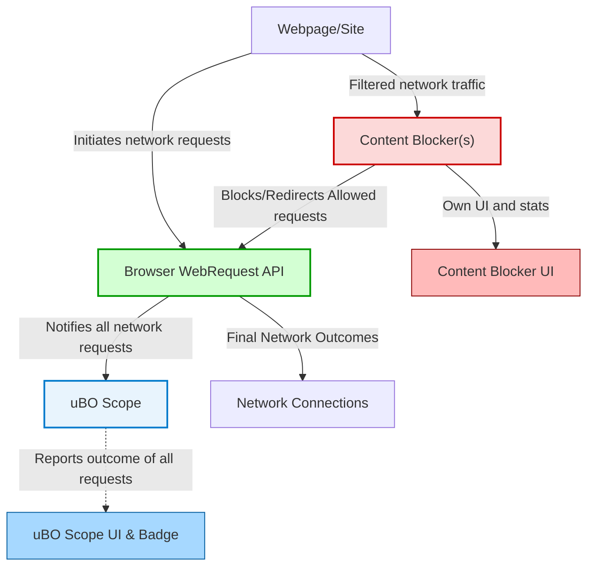

# Using uBO Scope Alongside Content Blockers

Discover how uBO Scope operates independently of your browser's content blockers and how to effectively combine its detailed network connection reporting with other privacy and filtering extensions. Understand the fundamental boundaries posed by the browser's webRequest API and gain practical workflows for insightful privacy and security diagnostics when multiple tools are used together.

---

## 1. Purpose and Context

uBO Scope is designed to reveal **all network connections** initiated by web pages, regardless of other content blockers or filtering mechanisms installed in your browser. This independence ensures that you receive a **transparent, unbiased view** of third-party remote server connections, which is crucial for understanding true network activity and privacy exposure.

While content blockers (like uBlock Origin or DNS-based blockers) may prevent or alter network requests, uBO Scope monitors the browser's `webRequest` API events directly, reporting outcomes such as:

- **Allowed**: Network requests successfully completed.
- **Blocked**: Requests that encountered errors or were prevented.
- **Stealth-blocked**: Redirected requests that were intercepted quietly.

This page specifically demonstrates how to **use uBO Scope alongside content blockers** to complement your privacy workflow without interference or duplication of functionality.

---

## 2. Prerequisites

Before following the guidance here, ensure the following:

- You have uBO Scope installed and active in a supported browser (Chromium 122+, Firefox 128+, or Safari 18.5+).
- You have one or more content blockers or privacy extensions installed for blocking unwanted connections (e.g., uBlock Origin, privacy-focused DNS services).
- You understand basic uBO Scope terminology and how to interpret its toolbar badge and popup interface.

For foundational knowledge, see:

- [What is uBO Scope?](https://docs.ubos.com/overview/introduction-values/what-is-ubo-scope)
- [Understanding Badge Counts and Connection Outcomes](https://docs.ubos.com/guides/core-workflows/understanding-badge-and-outcomes)
- [Integrating with Content Blockers](https://docs.ubos.com/overview/getting-started-users/integration-ecosystem)

---

## 3. How uBO Scope Works Independently

### Key Principles

- uBO Scope listens to **all network requests** reported by the browser via the `webRequest` API, gathering connection outcomes regardless of whether other extensions block or allow them.
- Content blockers operate on filtering or blocking logic, while uBO Scope merely **observes and reports** the resulting network activity.
- This separation allows uBO Scope to **reflect the final reality** of network connections post-blocking, providing users with accurate visibility.

### What This Means in Practice

When content blockers are preventing connections, uBO Scope detects the blocked requests as having encountered errors (classified as **blocked**) or as being redirected quietly (**stealth-blocked**). Allowed network connections are those that successfully completed and were not impeded.

Because uBO Scope does not perform any blocking, its reported data can be seen as an **audit trail or a transparency layer** on your browsing network activity.

---

## 4. Combining uBO Scope with Content Blockers: Workflow Examples

### Example 1: Validating Content Blocker Effectiveness

1. **Enable a content blocker** such as uBlock Origin on your browser.
2. **Open uBO Scope** by clicking its toolbar icon to open the popup.
3. **Browse to a website** you want to analyze.
4. Observe the **badge count** and the popup's categorization of third-party domains:
   - Domains under **Allowed:** third-party connections that passed through.
   - Domains under **Blocked:** connections prevented by any blocker.
   - Domains under **Stealth:** redirected connections often blocked silently.
5. Compare the **number and identity of domains** to what your content blocker reports, if available.
6. Use these insights to:
   - Confirm your content blocker is effectively blocking known trackers or ads.
   - Detect unexpected allowed connections that might warrant custom filtering.

### Example 2: Diagnosing Privacy Blind Spots

1. Use your **regular browsing habits with content blockers enabled**.
2. Monitor uBO Scope's popup to detect any **third-party domains allowed through**.
3. Investigate allowed domains to understand if any unexpected or questionable connections occur.
4. Adjust your content blocker’s filters or whitelist as necessary.

### Example 3: Filter List Maintenance and Tuning

Filter list maintainers can use uBO Scope to:

- Continuously audit which domains are requested when their filters are active.
- Identify stealth-blocked domains that may evade explicit logging.
- Detect inadvertent allowed third parties.

uBO Scope provides independent validation outside the content blocker’s internal statistics.

---

## 5. Understanding the Browser API Boundaries

uBO Scope depends on the **browser's webRequest API**, which has inherent limitations:

- It can monitor **HTTP and WebSocket** network requests visible to the browser.
- Some network requests initiated by browser internals or certain privileged code may be unreachable.
- Some blocking mechanisms, like DNS blocking external to the browser, still report the request at the browser API level and thus can be observed.
- Network requests fully bypassing these APIs are invisible to uBO Scope.

**Important:** uBO Scope cannot block or modify requests; it solely reports on their outcomes, giving you an audit scope constrained by browser capabilities.

---

## 6. Best Practices for Effective Use

- Always use uBO Scope **in conjunction with your preferred content blocker**; uBO Scope does not block but complements blocking tools with essential transparency.
- Regularly check the **popup interface and badge count** to track changes in third-party domains during browsing sessions.
- Use uBO Scope’s detailed domain count to **debunk misleading block count metrics** shown by various blockers.
- For privacy diagnostics, focus on the **allowed connections** as these represent third parties your browser actually connected to.
- Combine with content blocker logs or tools to perform a **comprehensive privacy audit**.

---

## 7. Troubleshooting Common Issues

<AccordionGroup title="Common Issues When Using uBO Scope with Content Blockers">
<Accordion title="No Data or Empty Popup Despite Browsing">
This may arise due to:
- Insufficient permissions in uBO Scope or browser limitations.
- Content blocker aggressively hiding network requests from the webRequest API.
- Temporarily inactive service worker in manifest v3 extension.

**Solution:** Verify uBO Scope installation and permissions; restart the browser if necessary; consult [Troubleshooting: No Data or Empty Popup](https://docs.ubos.com/getting-started/troubleshooting/troubleshooting-no-data).
</Accordion>

<Accordion title="Badge Counts Not Matching Expectations">
Keep in mind:
- uBO Scope badge shows **distinct allowed third-party domains**, not raw connection counts.
- Content blockers may report block counts differently, sometimes inflated.
- Network activity can be dynamic; counts may vary.

**Solution:** Refer to [Understanding Badge Counts and Connection Outcomes](https://docs.ubos.com/guides/core-workflows/understanding-badge-and-outcomes) for correct interpretation.
</Accordion>

<Accordion title="Confusion Over Connection Outcomes vs Blocking">
uBO Scope distinguishes between allowed, stealth-blocked, and blocked outcomes but does not influence connection blocking.

**Solution:** Understand that stealth-blocked connections indicate silent redirects usually initiated by blockers and investigate these when auditing privacy risks.
</Accordion>
</AccordionGroup>

---

## 8. Additional Tips

- To deepen privacy auditing, routinely review allowed domains and investigate unknown or suspicious third parties.
- Combine uBO Scope with content blocker **logger modes** for enhanced visibility.
- Use uBO Scope on browsers supporting full `webRequest` APIs (currently best in Chromium-based and Firefox browsers).
- Stay informed on new uBO Scope features geared toward filter list maintainers via official channels.

---

## 9. Next Steps & Related Documentation

- Explore the [Exploring the uBO Scope Popup Interface](https://docs.ubos.com/guides/getting-started/exploring-popup-ui) guide to understand UI details.
- Use the [Using uBO Scope for Privacy Diagnostics](https://docs.ubos.com/guides/core-workflows/using-for-diagnostics) guide for workflows applying uBO Scope insights practically.
- Visit [Integration & Ecosystem Compatibility](https://docs.ubos.com/overview/getting-started-users/integration-ecosystem) to see how uBO Scope fits into a broader privacy toolkit.
- Reference [Common Installation & Startup Issues](https://docs.ubos.com/getting-started/troubleshooting/common-setup-issues) if you encounter problems during initial setup or use.

---

## 10. Illustrative Diagram: Integration Workflow with Content Blockers

This diagram highlights that uBO Scope observes the network at the browser API layer, independent of content blockers that filter network traffic before it reaches the browser’s network stack.

---

### Reference
- [uBO Scope GitHub Repository](https://github.com/gorhill/uBO-Scope)

