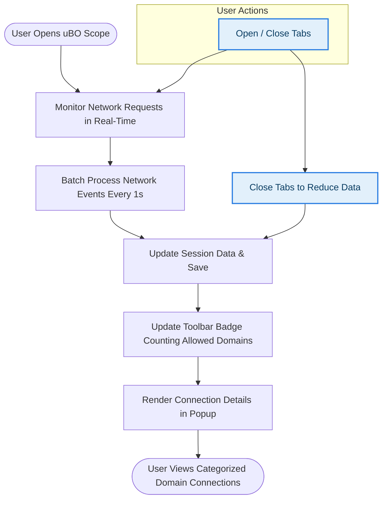

# Tips for Optimizing uBO Scope’s Performance

Unlocking the full power of uBO Scope requires understanding how to keep it running smoothly, especially when monitoring numerous sites or performing extensive audits. This guide shares practical best practices and actionable techniques to minimize the extension’s impact on your browser’s performance while preserving data accuracy.

---

## 1. Understanding How uBO Scope Processes Network Data

uBO Scope continuously listens to network requests via the browser's `webRequest` API and categorizes connections into allowed, stealth-blocked, or blocked outcomes. Each network event is queued briefly and processed in batches to update the connection data and the toolbar badge.

### Why This Matters for Performance

- **Batch processing:** Requests are collected in a short interval (approximately 1 second) before processing to reduce frequent UI updates.
- **Session data management:** Data is serialized and stored efficiently but grows with the number of tabs and sites monitored.

<Tip>
Minimizing the amount and frequency of monitored network requests directly improves uBO Scope’s responsiveness and keeps memory usage optimal.
</Tip>

---

## 2. Practical Tips to Minimize Performance Impact

Follow these simple strategies to help uBO Scope perform optimally during your browsing sessions:

### 2.1 Limit the Number of Active Tabs with Heavy Auditing

- Focus on auditing websites in fewer tabs at a time.
- Closing tabs after you finish auditing their connections frees up memory and reduces session data size.

### 2.2 Avoid Excessive Concurrent Network Traffic

- Performing multiple large-scale audits or repeatedly loading resource-heavy pages simultaneously increases workload.
- Pause or stagger these activities whenever possible.

### 2.3 Regularly Restart Your Browser

- Browser sessions can accumulate data over time, increasing extension memory footprint.
- Restarting clears temporary session data and refreshes extension state.

### 2.4 Use the Latest Browser Versions

- Newer browser versions often improve `webRequest` API efficiency and memory management.
- They can also better support uBO Scope's background processes.

### 2.5 Keep uBO Scope Updated

- Updates may include performance improvements or optimizations.
- Check the official repository or your browser's extension store for the latest version.

<Tip>
Keep active browsing and auditing focused and controlled to avoid unnecessary accumulation of network request data.
</Tip>

---

## 3. Tips for Accurate Monitoring and Data Integrity

While optimizing performance, it’s crucial to ensure data collected remains trustworthy:

### 3.1 Allow Necessary Permissions

uBO Scope requires `webRequest`, `storage`, and `activeTab` permissions. Verifying these are granted fully ensures all network requests can be monitored.

### 3.2 Minimize External Interference

- Other extensions that alter or block network requests may cause discrepancies.
- When auditing, use browsers with minimal other extensions enabled.

### 3.3 Handle Browser-Specific Considerations

- Some browsers limit background tasks or suspend extensions when inactive.
- Keep the browser active during audits to allow continuous data capture.

### 3.4 Understand Stealth-Blocked Data

The stealth-blocked category includes redirected requests that don’t trigger visible blocking. Recognize this behavior when evaluating your data to avoid misinterpretation.

<Note>
uBO Scope’s accuracy depends on the browser reporting all network requests through the `webRequest` API. Some browsers or configurations may restrict visibility.
</Note>

---

## 4. Advanced Strategies for High-Volume Auditing

If you are routinely monitoring many sites or analyzing large sets of network data, consider these methods:

### 4.1 Use Session Data Export and Analysis

- Export the session data for offline processing.
- Analyze domains and connection counts externally to reduce browser load.

### 4.2 Isolate Auditing in Dedicated Profiles

- Use separate browser profiles or containers exclusively for auditing.
- This prevents interference from daily browsing activities and keeps data isolated.

### 4.3 Automate Browser Tabs Management

- Use tab management extensions or scripts to open, monitor, and close tabs in controlled batches.
- Prevent overload by limiting simultaneous open tabs.

### 4.4 Monitor the Browser’s Performance Metrics

- Regularly check memory and CPU usage while running uBO Scope.
- Identify and close resource-heavy tabs or extensions impacting overall performance.

### 4.5 Use the Extension in Supported Browsers Optimized for WebRequest

- Chromium, Firefox, and Safari have varying implementations of the `webRequest` API.
- Choose the browser that best balances your auditing needs and extension compatibility.

---

## 5. Common Pitfalls and How to Avoid Them

<AccordionGroup title="Troubleshooting Performance Issues">
<Accordion title="Extension Appears Unresponsive or Slow">
- Verify you have a reasonable number of active tabs.
- Restart your browser to clear potential extension memory buildup.
- Limit other heavy extensions running concurrently.
</Accordion>
<Accordion title="Badge Count Does Not Update Promptly">
- Ensure your browser’s background activity is not suspended.
- Check for network requests being captured by other extensions or content blockers.
- Confirm uBO Scope has proper permissions.
</Accordion>
<Accordion title="Popup Shows No or Stale Data">
- Refresh the tab or close and reopen the extension popup.
- Clear browser temporary data and cache.
- Restart the browser if the problem persists.
</Accordion>
</AccordionGroup>

---

## 6. Summary Workflow

This flow represents how user tab management impacts uBO Scope’s performance dynamically.

---

## 7. Additional Resources

- [Installation & Setup Guide](../getting-started/installation-setup) — Ensure proper installation and permissions.
- [Interpreting Badge and Popup](../getting-started/first-use/interpreting-badge-popup) — Understand your network data.
- [Troubleshooting & FAQ](../guides/advanced-usage/troubleshooting-and-faq) — Resolve common extension issues.
- [GitHub Repository](https://github.com/gorhill/uBO-Scope) — Get the latest updates and source code.

---

Maintaining a lean browsing environment and understanding uBO Scope’s operation empowers you to get accurate, reliable network insights with minimal impact. Embrace these tips to make your connection audits effective, efficient, and hassle-free.
