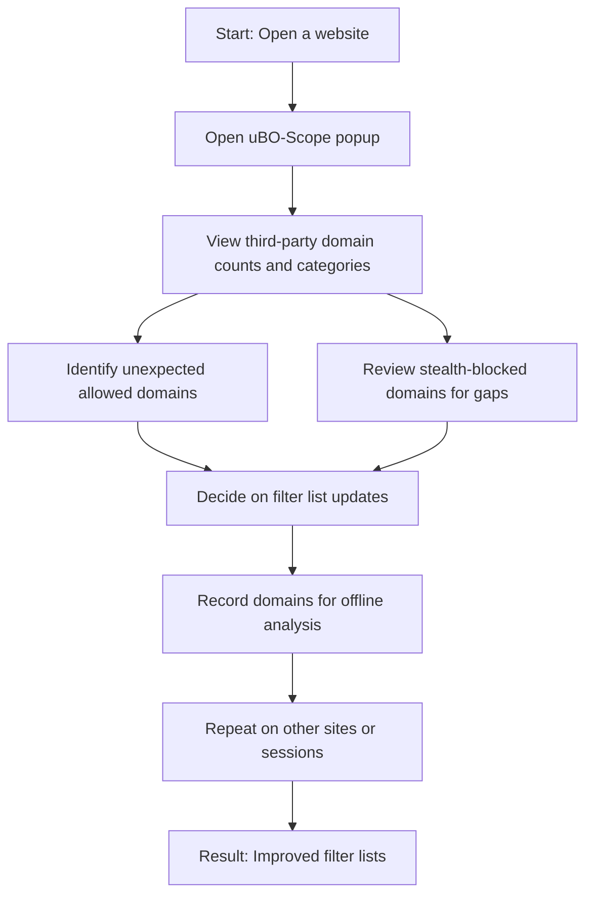

# Supporting Filter List Maintainers and Power Users

## Overview

This guide demonstrates how filter list maintainers and advanced users can leverage **uBO-Scope** to evaluate the effectiveness of blocklists, identify stubborn or hidden third-party connections on demanding websites, and gather critical data to improve filter lists. It is designed to show practical workflows for deriving actionable insights even on devices with limited browser devtools.

Understanding how third-party domains behave during browsing sessions is vital for maintaining effective, minimal, and accurate filter lists. uBO-Scope empowers maintainers and power users with clear visibility of these remote server connections, categorized by whether requests succeeded, were stealth-blocked, or outright blocked.

## Prerequisites

Before starting, ensure you have the following:

- uBO-Scope extension installed on a supported browser (Chrome 122+, Firefox 128+, Safari 18.5+).
- Permissions granted for activeTab, storage, and webRequest as required by the extension.
- Basic familiarity with using browser extensions and opening the extension popup interface.
- An active browser tab containing the website you wish to analyze.

If you have not yet installed uBO-Scope, refer to the [Installing uBO-Scope](https://github.com/gorhill/uBO-Scope#installation) guide or the grouped installation documentation.

## Expected Outcome

Following this guide, you will:

- Use uBO-Scope to assess the count and nature of third-party domains connected during browsing.
- Differentiate between domains that are allowed, stealth-blocked, or blocked.
- Identify persistent third-party connections that could evade blocking.
- Generate data sets to support filter list tuning and improvements.
- Employ these insights on devices even with limited devtools, such as mobile browsers.

## Time Estimate

This workflow generally takes 10-20 minutes depending on the complexity of the site and your familiarity with uBO-Scope.

## Difficulty Level

Intermediate to Advanced — requires understanding of network connections, privacy concepts, and filter list management.

---

## Step-by-Step Instructions

### 1. Open uBO-Scope on the Target Website

- Navigate to the website you suspect has persistent third-party connections.
- Click the uBO-Scope toolbar icon to open the popup interface.
- Observe the toolbar badge count, which shows the number of distinct third-party domains contacted by the browser.

### 2. Analyze Connection Outcomes in the Popup

The popup divides connection data into three categories:

- **Not Blocked (Allowed):** Domains from which resources have been successfully fetched.
- **Stealth-Blocked:** Domains where requests have been intercepted stealthily by your content blocker; these do not load resources but remain hidden from the page.
- **Blocked:** Domains whose requests were explicitly blocked.

Review each category’s domain list:

- Expand domain rows if available to see request counts and specific hosts.
- Pay close attention to domains that appear in the 'not blocked' category but are unexpected or known trackers.
- Identify domains in the stealth category—these might indicate areas where filter lists are active but not fully blocking or may require tuning.

### 3. Use uBO-Scope Data to Identify Persistent Connections

- Persistent connections often appear as allowed or stealth-blocked domains that reoccur frequently across visits.
- Look for domains that appear on multiple sites or requests repeatedly counted.
- Compare these domains against your blocklists to ascertain if these should be added or refined.

### 4. Export and Use Data for List Improvement

While uBO-Scope currently does not automate export, you can manually record the observed domains and request counts for offline analysis.

**Best Practices:**
- Focus on domains with high request counts in the allowed list for potential blocking.
- Investigate stealth-blocked domains to determine if more explicit blocking is feasible without breaking site functionality.

### 5. Repeat Across Sites and Sessions

- Use uBO-Scope on different websites known to challenge existing filter lists.
- Observe how your blocklists perform across these sites, noting stubborn third parties.
- Revisit frequently to monitor the impact of blocklist updates.

---

## Practical Example

Imagine you're maintaining a filter list focused on privacy. Visiting a popular news site, uBO-Scope shows:

- Badge count: 15 third-party domains connected.
- Allowed domains include analytics.example.com and cdn.examplecdn.com.
- Stealth-blocked category lists adserve.exampleads.com.
- Blocked category includes track.exampletracker.com.

Your analysis might reveal:

- analytics.example.com is not blocked despite being a tracker.
- adserve.exampleads.com is stealth-blocked but still initiates some requests.

You may decide to enhance your filter rules to target analytics.example.com more effectively and monitor stealth-blocked domains to ensure blocking completeness.

---

## Troubleshooting & Tips

### Common Issues

- **No data appears in the popup:** Verify the extension is enabled and has the necessary permissions to monitor requests.
- **Badge count is zero despite active browsing:** Confirm that your browser supports the `webRequest` API and that the extension is running.
- **Domains not categorized as expected:** Understand that some domains serve multiple roles (CDNs, trackers); verify using external tools if unsure.

### Tips for Success

- Use uBO-Scope regularly to identify false negatives — domains missed by your filter lists.
- Prioritize blocks on domains with many connections but low necessity (trackers, ads).
- Take advantage of the extension on minimal setups where standard devtools are missing or limited.

### Performance Considerations

- uBO-Scope collects summaries without overwhelming system resources, enabling its use even on low-powered devices.
- Frequent refreshing of tabs may reset data; work across a session for cumulative insights.

### Alternative Approaches

For deeper network inspection (e.g., request headers), complement uBO-Scope with browser devtools or specialized network monitoring tools.

---

## Next Steps & Related Content

- Advance your filter list maintenance by consulting the [Inspecting Network Requests for Specific Tabs](https://docs.ublock.org/guides/advanced-usage/inspecting-network-requests) guide for detailed request-level insights.
- Understand how to [Interpret Domain Reports and Connection Outcomes](https://docs.ublock.org/guides/getting-started/interpreting-domain-reports) for better decision making.
- Explore the [Comparing Content Blockers with uBO-Scope](https://docs.ublock.org/guides/advanced-usage/analyzing-content-blockers) guide to cross-validate your filter list's effectiveness in broader contexts.

Harness the full power of uBO-Scope to support finely tuned, effective content blocking tailored to real-world browsing realities.

---

## References

- [uBO-Scope GitHub Repository](https://github.com/gorhill/uBO-Scope)
- [Public Suffix List used by uBO-Scope](https://publicsuffix.org/list/public_suffix_list.dat)
- Browser Extension Permissions: activeTab, storage, webRequest

---

## Visualizing the Workflow

---

<Tip>
Always verify if a domain is genuinely third-party by checking its registered domain via the public suffix list logic integrated within uBO-Scope.
</Tip>

<Note>
The 'stealth-blocked' category indicates requests blocked invisibly by content blockers, offering insights to improve filter stealth and efficacy.
</Note>

<Warning>
Do not rely exclusively on block counts alone to assess filter list effectiveness; focus on distinct third-party domains allowed.
</Warning>
