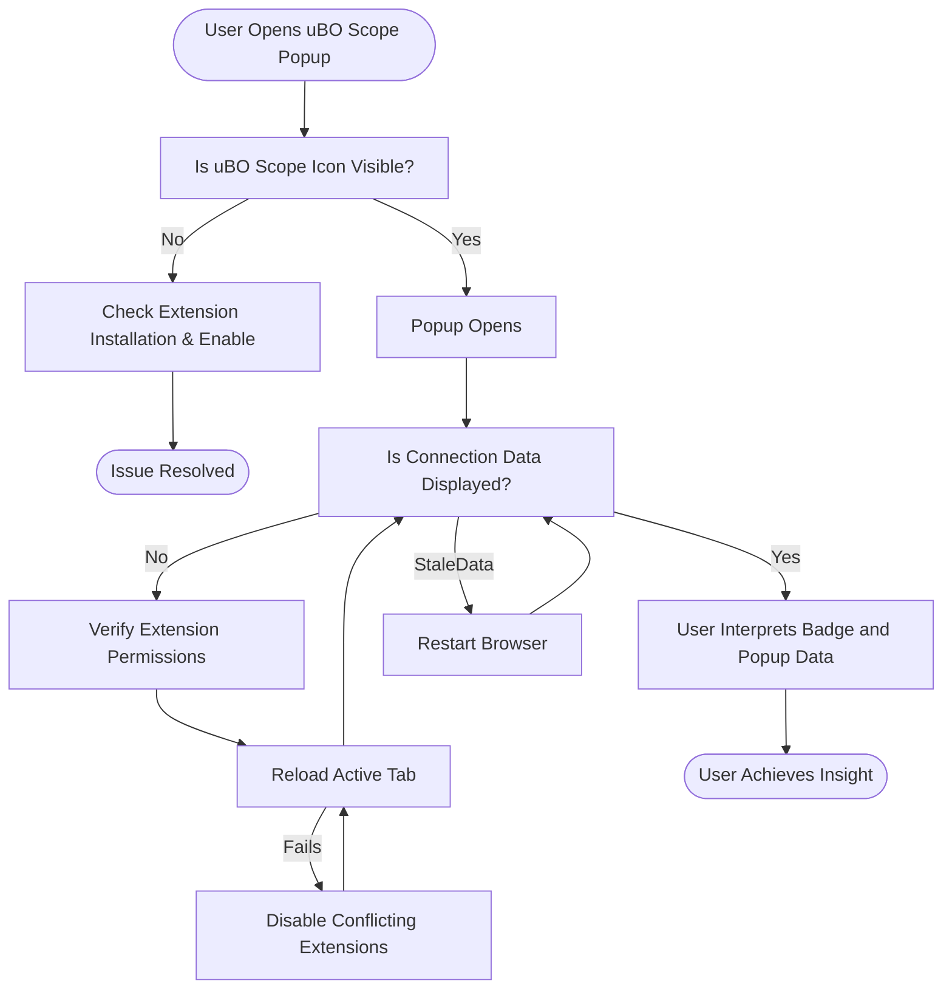

# Troubleshooting and Frequently Asked Questions

This guide is your go-to resource for resolving common issues with uBO Scope, understanding unexpected data in the popup, and navigating potential challenges with browser compatibility and data reporting. Whether you are a first-time user or experienced filter list maintainer, this page provides practical solutions and tips to keep uBO Scope working smoothly.

---

## 1. Workflow Overview

### What This Page Helps You Accomplish
- Identify and fix common problems such as missing data in the popup, incorrect badge counts, or extension icon absence.
- Understand and interpret unexpected or confusing network connection data.
- Resolve compatibility challenges across browsers and content blocking scenarios.
- Access best practices and tips for effective troubleshooting.

### Prerequisites
- uBO Scope extension installed and enabled in Chrome, Firefox, or Safari.
- Familiarity with basic extension operations such as viewing the toolbar icon and popup window.
- Internet connectivity to allow extension updates and data fetch.

### Expected Outcome
By following this guide, you will be able to:
- Quickly troubleshoot and resolve typical issues without needing advanced debugging.
- Confidently interpret connection data, including edge cases and unexpected occurrences.
- Optimize the use of uBO Scope alongside other extensions and network setups.

### Time Commitment
- Troubleshooting minor issues: 5–15 minutes.
- Investigating complex data interpretations or browser compatibility: up to 30 minutes.

### Difficulty Level
- Beginner to Intermediate.

---

## 2. Step-by-Step Troubleshooting Instructions

### Step 1: Confirm Extension Installation and Activation

1. Verify that uBO Scope is installed from an official source:
   - Chrome: [Chrome Web Store](https://chromewebstore.google.com/detail/ubo-scope/bbdpgcaljkaaigfcomhidmneffjjjfgp)
   - Firefox: [Firefox Add-ons](https://addons.mozilla.org/firefox/addon/ubo-scope/)
   - Safari: Use Safari Extensions Gallery or official distribution.

2. Check that the extension icon appears in your browser’s toolbar.

3. If the icon is missing:
   - Check browser extension settings to ensure uBO Scope is enabled.
   - Pin the extension icon to the toolbar if hidden.

**Expected Result:** You see the uBO Scope icon active in your toolbar.

---

### Step 2: Verify Permissions and Host Access

1. Ensure that required permissions are granted for uBO Scope to monitor network requests:
   - `webRequest`, `activeTab`, `storage`, and host access (`http://*/*`, `https://*/*`, plus websocket URLs on Chromium and Firefox).

2. Confirm this by visiting your browser’s extension settings and reviewing permissions.

3. For Safari, verify the minimum version (18.5+) and permissions as noted in the manifest.

**Tip:** Incorrect permissions will lead to no data being captured or displayed.

**Expected Result:** All necessary permissions are in place, allowing network monitoring.

---

### Step 3: Validate Extension Operation on Active Tab

1. Click the uBO Scope toolbar icon to open the popup.

2. Observe the displayed hostname and domain along with connection counts.

3. If you see 'NO DATA' or zero counts after navigating to a web page:

   - Refresh the page and re-open the popup.
   - Open the developer console for errors related to the extension.

4. Confirm that network requests are being captured by visiting a site with known third-party connections.

**Expected Result:** Real-time domain connection data populates the popup reflecting the active page.

---

### Step 4: Interpret Unexpected or Missing Data

- **Empty Allowed, Blocked, and Stealth Sections:**
    - This can occur if no third-party requests are detected or if the page is very minimal.

- **Unusually High Allowed Domain Count:**
    - May mean the page loads many resources from different third parties, possibly indicating tracking or CDN use.

- **Stealth Blocked Domains Appear:**
    - These are network requests that were redirected by the browser or blocked stealthily by content blockers.
    - Not all stealth blocking is visible in browser tools but is logged here for transparency.

- **Blocked Domain Count Mismatch:**
    - uBO Scope detects blocked requests regardless of your active content blocker, reflecting the real network outcomes.

**Tip:** Rely on the extension’s allowed domains count for true third-party exposure rather than block counts.

---

### Step 5: Handle Browser or Compatibility Issues

- **Extension Not Counting WebSocket Connections in Some Browsers:**
   - On Chromium and Firefox, uBO Scope monitors `ws://` and `wss://` URLs; Safari does not.

- **Extension Icon Disabled by Browser:**
   - Check for conflicts with other extensions.
   - Ensure your browser version meets minimum requirements (Chromium 122+, Firefox 128+, Safari 18.5+).

- **Unexpected Badge Numbers:**
   - Badge count shows distinct allowed third-party domains, not total requests.
   - If the count seems stale, reload the tab or restart the browser.

- **Data Not Updating:**
   - Confirm that background service worker (Chromium) or background scripts (Firefox, Safari) are running.
   - Browser may unload the extension background process unexpectedly—wait briefly and retry.

---

## 3. Examples & Real-World Scenarios

### Scenario 1: Missing Data After First Installation

- After installing uBO Scope, no data shows in the popup.
- Refresh the current tab.
- Open the popup again to see collected connection data.

### Scenario 2: Badge Count High Despite Using a Content Blocker

- You have a content blocker active but see a high allowed domain count.
- Realize uBO Scope reports actual network connections, showing all domains allowed through.
- Investigate domains in the popup to identify unexpected third parties.

### Scenario 3: Stealth Blocked Domain Appears

- The popup lists stealth-blocked domains which your content blocker does not show.
- Understand these are network requests redirected or silently blocked, offering deeper transparency.

---

## 4. Troubleshooting & Tips

<AccordionGroup title="Common Issues and Solutions">
<Accordion title="No Data Display in Popup">
If the popup shows 'NO DATA' or empty lists:

- Confirm you opened the popup on an active tab with network activity.
- Refresh the web page and retry.
- Check that permissions are granted in browser settings.
- Restart your browser if the problem persists.
- Verify no other extensions are blocking uBO Scope's access.
</Accordion>

<Accordion title="Badge Not Updating or Empty">

- Badge shows no number or outdated counts:
  - Reload the current tab.
  - Close and reopen the browser.
  - Check if network requests are still being sent.

- If issues continue, disable and re-enable the extension.

</Accordion>

<Accordion title="Extension Icon Missing">

- Check browser extension panel and pin uBO Scope.
- Ensure extension is enabled.
- Verify minimum browser version requirements.
- Look for extension conflicts and disable other network-related extensions temporarily.

</Accordion>

<Accordion title="Unexpected High Allowed Domains Count">

- Review the popup’s allowed domains for unusual or tracking domains.
- Consider applying additional content blockers to reduce allowed connections.
- Use uBO Scope data for filter list refinement and blocking strategies.

</Accordion>
</AccordionGroup>

<Tip>
Keep uBO Scope updated to benefit from improvements in data accuracy and potential new troubleshooting features.
</Tip>

<Warning>
Do not rely on block counts or 'ad blocker test' pages. Use uBO Scope’s distinct allowed domain count to gauge true content blocking effectiveness.
</Warning>

---

## 5. Next Steps & Related Content

- After resolving issues here, explore the [Interpreting the Toolbar Badge & Popup](https://your-docs-link/guides/getting-started/first-domain-scan) guide for deeper insights into connection data.
- For a comprehensive understanding of domain connection outcomes, visit [Understanding Allowed, Blocked, and Stealth Domains](https://your-docs-link/guides/practical-workflows/understanding-domain-outcomes).
- To optimize performance during reviews or audits, consult [Tips for Optimizing uBO Scope’s Performance](https://your-docs-link/guides/advanced-usage/optimizing-extension-performance).
- If you maintain filter lists, use [Using uBO Scope for Filter List Maintenance](https://your-docs-link/guides/practical-workflows/using-ubo-scope-for-filter-maintenance) for targeted workflows.

---

## Appendix: Troubleshooting Flow Diagram

This diagram guides you through the key steps to ensure uBO Scope functions and presents data accurately.

---

For persistent problems, consult the official GitHub repository [uBO Scope GitHub](https://github.com/gorhill/uBO-Scope) for issue reporting and community support.

---

## Contact and Support

For further assistance or feature requests, use the GitHub repo issues page: 

- https://github.com/gorhill/uBO-Scope/issues

---

_This documentation page is part of the uBO Scope Guides section. For full onboarding, consider starting with Installation and First-Use guides._

---