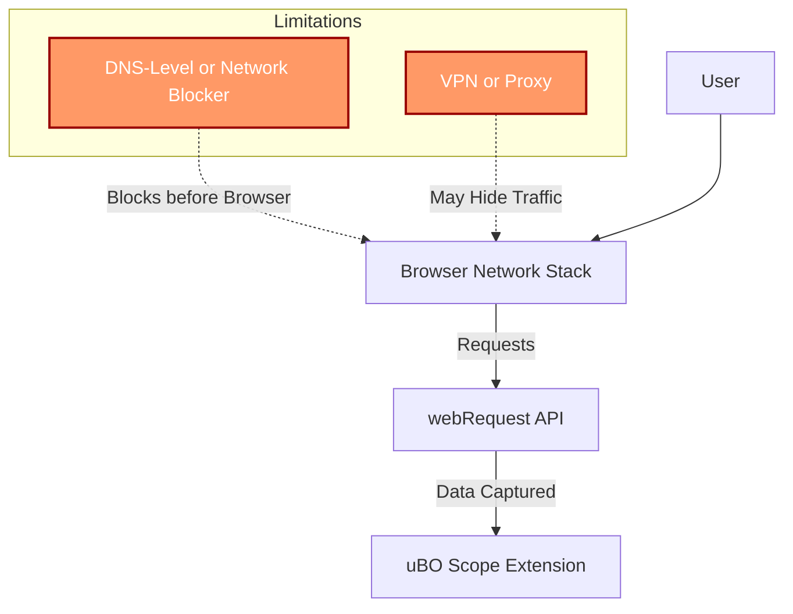

# Troubleshooting and Understanding Limitations

This guide equips you with practical advice on how to handle edge cases, understand the inherent limitations of the `webRequest` API used by uBO Scope, and what steps to take if you notice expected network data missing. It also covers scenarios where requests might not be tracked, including environments using DNS-level blocking or other network configurations.

---

## 1. Why Might Network Data Be Missing?

Even though uBO Scope aims to report all network connections made by your browser, some requests may not appear in the popup or badge count due to factors beyond the extension’s control.

### Common Reasons:

- **Requests blocked outside the browser:** If your network traffic is blocked at the DNS level by a service like system-wide DNS filtering or a VPN with ad blocking, those requests never reach the browser's networking stack and therefore are invisible to the `webRequest` API.

- **Requests made outside `webRequest` API scope:** Some browser components or extensions may load resources using methods not observable through `webRequest`. This includes some prefetching or background tasks.

- **Browser compatibility and permission issues:** uBO Scope requires specific permissions and browser versions (e.g., Chrome 122+, Firefox 128+, Safari 18.5+). If these are unmet or the extension lacks necessary permissions, network data won't be fully captured.

- **Incognito or private browsing:** Depending on browser settings and extension permissions, some requests during private sessions may not be visible.

---

## 2. Troubleshooting Missing or Incomplete Data

Follow these steps to diagnose and address missing connection data:

### Step 1: Verify Extension Permissions

- Confirm the extension has permission to monitor network requests. For example, `webRequest`, `activeTab`, and appropriate host permissions must be granted.
- Check your browser’s extension details page to confirm no permissions have been revoked.

### Step 2: Confirm Browser Version and Compatibility

- Ensure you are using a supported browser version:
  - Chromium-based browsers: v122 or later
  - Firefox: v128 or later
  - Safari: v18.5 or later

### Step 3: Check DNS or Network-Level Blocking

- Disable VPNs, system-wide DNS-based blockers, or custom DNS configurations temporarily to see if network data then appears.
- If data appears when bypassing DNS blockers, this confirms those tools mask network activity from uBO Scope.

### Step 4: Reload and Reopen uBO Scope Popup

- Sometimes the popup UI may fail to update with the latest data due to transient issues.
- Close and reopen the popup or refresh the tab to trigger fresh data collection.

### Step 5: Check for Background Script Errors

- Open your browser’s developer tools console for the extension background script to look for errors that might impair data collection.

### Step 6: Test on Common Websites

- Visit websites known to load multiple third-party resources (e.g., news portals, ecommerce sites).
- Compare the toolbar badge count with your expectations and if counts seem unrealistically low, consider Step 3.

---

## 3. Understanding the Boundaries of the `webRequest` API

uBO Scope relies on the `webRequest` browser API, which has inherent technical limitations:

- **Only observes requests passing through browser network stack:** Requests that never reach this layer, such as those blocked or hijacked by system tools, won't appear.

- **No insight into encrypted or tunneled traffic before browser interception:** For example, DNS-over-HTTPS or other encrypted DNS requests that happen outside traffic the browser can track.

- **Limited visibility on some browser behaviors and internal requests:** For example, some prefetch or speculative connections might be ignored.

- **Extension service worker lifecycle:** The background script may unload/reload, which can momentarily delay data processing.

---

## 4. Best Practices to Ensure Accurate Monitoring

- Keep your browser and uBO Scope extension updated to latest stable versions.
- Avoid system-wide network blockers when you need full visibility of network connections.
- Ensure the extension has all necessary permissions; reinstall if needed.
- Use uBO Scope’s popup and badge in tandem to cross-check data — the popup lists detailed domain connections.

---

## 5. Tips for Special Environments

### VPNs or Secure Networks

VPNs that filter or tunnel traffic may prevent uBO Scope from seeing network requests. When troubleshooting, disable VPNs temporarily.

### Incognito or Private Mode

Confirm if the extension is enabled in private windows. Some browsers disable extensions by default in these modes.

### Desktop vs Mobile

Some browser platforms limit extension capabilities; verify if your environment supports network request tracking.

---

## 6. When to Seek Further Help

If after these troubleshooting steps data is still missing or inconsistent:

- Review the [Troubleshooting Common Setup Issues](https://your-docs-domain/getting-started/first-run-validation/common-issues-solutions) guide.
- Consult the [Quick Validation Steps](https://your-docs-domain/getting-started/first-run-validation/quick-validation) guide to confirm installation and basic functioning.
- Raise issues or check discussions on the [uBO Scope GitHub repository](https://github.com/gorhill/uBO-Scope).

---

## 7. Summary of Key Points

- uBO Scope uses the browser’s `webRequest` API; some requests blocked outside the browser or made through unsupported mechanisms are not visible.
- Proper permissions, browser version, and network setup are essential for full data capture.
- Use popup UI and toolbar badge for real-time domain connection insight.
- Temporarily disabling VPNs, DNS filters, or other blockers during troubleshooting helps isolate root causes of missing data.

---

## 8. Visual Summary: Data Flow Limitation Overview

---

For detailed installation, configuration, and usage of uBO Scope, refer to the related guides in our documentation.

---

# Additional Resources
- [Installing uBO Scope](https://your-docs-domain/guides/getting-started/installing-extension)
- [Quick Validation Steps](https://your-docs-domain/getting-started/first-run-validation/quick-validation)
- [Reading Allowed, Blocked, and Stealth Domains](https://your-docs-domain/guides/interpreting-data/reading-status)
- [Understanding Toolbar Badge Counts](https://your-docs-domain/guides/interpreting-data/badge-counts-meaning)

<Tip>
If you are troubleshooting missing data, start by checking permissions, browser version, and network environment before deeper debugging.
</Tip>

<Note>
uBO Scope does not replace other developer tools but complements them by focusing on third-party domain connections visible to the browser.
</Note>