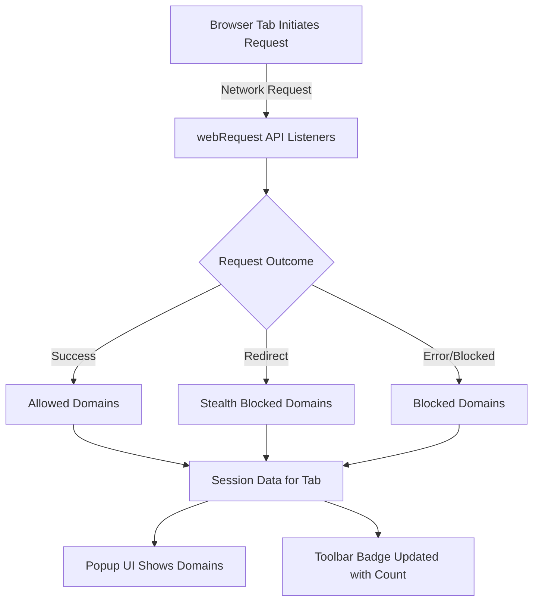

# Troubleshooting Unexpected Connection Counts

This guide helps you investigate and resolve situations where uBO Scope shows a higher-than-expected badge count or lists unexpected remote servers. You'll learn how to distinguish legitimate content delivery networks (CDNs) from potentially privacy-risky connections and narrow down sources of unexpected third-party domains.

---

## 1. Understanding the Badge Count and Connection Data

uBO Scope's badge count reflects the **number of distinct third-party domains with allowed network connections** for the current active tab. Not all connected domains are harmful or unnecessary; legitimate CDNs, APIs, or essential service providers can contribute to the count.

### Why Connection Counts Might Seem High

- Modern websites often load assets (images, scripts, fonts) from many distinct CDNs.
- Redirects and stealth connections can add domains to the count.
- Browser and service worker background connections occasionally appear.

### Key Items to Keep in Mind

- The badge only counts **distinct allowed domains**, not total requests.
- Domains shown under **allowed** were successfully connected.
- Domains under **blocked** or **stealth-blocked** had connections attempted but were intercepted.

See more about how badge counts work in [Interpreting the Badge Count and Popup Table](/guides/getting-started/understanding-badge-and-table).

---

## 2. Step-by-Step Investigation of Unexpected Connections

Follow these steps sequentially to identify the cause of unexpected counts and domains.

### Step 1: Open uBO Scope Popup for the Active Tab

1. Click the uBO Scope toolbar icon to open the popup.
2. Review the **domains connected** count at the top summary.
3. Inspect the three domain sections:
   - **Not blocked:** Domains your browser connected to.
   - **Stealth-blocked:** Connections redirected or quietly blocked.
   - **Blocked:** Explicitly blocked connections.

_Expected Result:_
- The count matches the sum of unique domains in the **not blocked** section.
- Domains there are typically expected third-party services.

### Step 2: Cross-Check Domains Against Known Legitimate Sources

1. Identify well-known CDNs, API providers, or essential framework domains.
2. Domains such as **cloudflare.net**, **akamai.net**, major social media domains, or advertising networks are common.
3. Verify if recent website changes or browser extensions might influence new remote connections.

_Tip:_ Use the Public Suffix List (PSL) to verify true domain boundaries—uBO Scope uses PSL for domain grouping.

### Step 3: Determine if Unexpected Domains Are Needed

1. Use your browser's developer tools (Network tab) to confirm which resources load from these domains.
2. Temporarily disable other extensions or content blockers to isolate behavior.
3. Consider if the domains serve critical functions (e.g., fonts, analytics, payment gateways).

_Check:_ You can compare this data against uBO Scope's popup for consistency.

### Step 4: Check for Stealth or Redirect Connections

1. Stealth-blocked connections may be redirect chains or stealthy background requests.
2. Often these are benign but may indicate trackers or hidden scripts.
3. Blocked connections confirm your content blocker’s effectiveness.

### Step 5: Narrow Down by Reproducing on a Clean Profile

If unexpected connections persist:

1. Create a fresh browser profile without other extensions.
2. Install uBO Scope only.
3. Load the website and observe connection counts.
4. Gradually enable other extensions or settings to find conflicts.

---

## 3. Practical Examples

Here’s how to analyze an example scenario.

### Example: Unexpected High Count including `cdn.exampletracker.com`

- Open the popup and see `cdn.exampletracker.com` listed under allowed.
- In your browser dev tools, find resources loaded from this domain, e.g. tracking scripts.
- Decide if you want to block this domain using uBlock Origin or another content blocker.
- After adding a custom filter, refresh the page and observe if `cdn.exampletracker.com` moves to blocked or stealth-blocked in uBO Scope.

### Example: Frequent domains from popular CDNs

- Domains such as `cloudflare.com`, `akamai.net`, and `googleapis.com` can inflate counts.
- These usually can't be blocked without breaking website functionality.
- Recognize normal usage versus suspicious, uncommon domains.

---

## 4. Best Practices and Tips

- **Regularly update your content blockers and filter lists** to minimize unwanted connections.
- Use uBO Scope in combination with uBlock Origin to identify domains that can be safely blocked.
- Always check the network requests in browser developer tools to validate connections.
- Remember some background connections are browser-driven (e.g., service workers).
- Avoid relying solely on badge count to judge privacy quality; focus on distinct third-party connections instead.

---

## 5. Troubleshooting Common Issues

| Issue | Cause | Solution |
| --- | --- | --- |
| Badge count shows zero or no update | Extension permissions missing or webRequest API restricted | Ensure uBO Scope has all required permissions (`activeTab`, `webRequest`), reinstall if necessary |
| Unexpected domains appear only in uBO Scope | Some connections bypass content blockers or originate from background scripts | Confirm with browser network logs; cross-check with other extensions |
| Domains are misclassified or missing | Public Suffix List out of date or corrupted | Restart browser or clear uBO Scope session storage for refresh |
| Popup UI not loading domains | JavaScript errors or extension service worker not running | Reload extension, check console for errors |

<Tip>
For permission issues, refer to your browser’s extension permissions page to confirm uBO Scope’s access to requested hosts and APIs.
</Tip>

---

## 6. Next Steps

- Learn about the [Badge Count and Popup Table](https://github.com/gorhill/uBO-Scope/blob/main/guides/getting-started/understanding-badge-and-table.mdx) for more context.
- Explore [Core Concepts and Terminology](/getting-started/essential-concepts/concepts-and-terminology) to understand domain categorization.
- Use [Debunking Blocker Myths](/guides/advanced-usage/debunking-blocker-myths) to enrich your knowledge on content blocker behaviors.
- Consider [Using uBO Scope for Filter List Maintenance](/guides/advanced-usage/using-ubo-scope-for-list-maintainers) if you manage or tweak filtering rules.

---

## 7. Reference Diagram to Visualize the Connection Flow in uBO Scope

This flow shows how uBO Scope listens to network requests, classifies them into connection categories, and updates its UI along with the toolbar badge.

---

## 8. Additional Resources

- [uBO Scope on GitHub](https://github.com/gorhill/uBO-Scope)
- [Public Suffix List Documentation](https://publicsuffix.org/list/)
- Browser Dev Tools Network Panel documentation of Chrome, Firefox, Safari

---

## 9. Summary

This guide equips you with a clear process to diagnose why uBO Scope shows unexpectedly high connection counts, distinguish between routine CDN traffic and potential risks, and use browser tools alongside uBO Scope for comprehensive analysis.

---

## 10. Feedback

If you encounter persistent issues or unexpected behavior beyond this guide, consult GitHub issues or community forums linked in the [Project README](https://github.com/gorhill/uBO-Scope). Your detailed reports help improve the tool’s accuracy and usefulness.

---