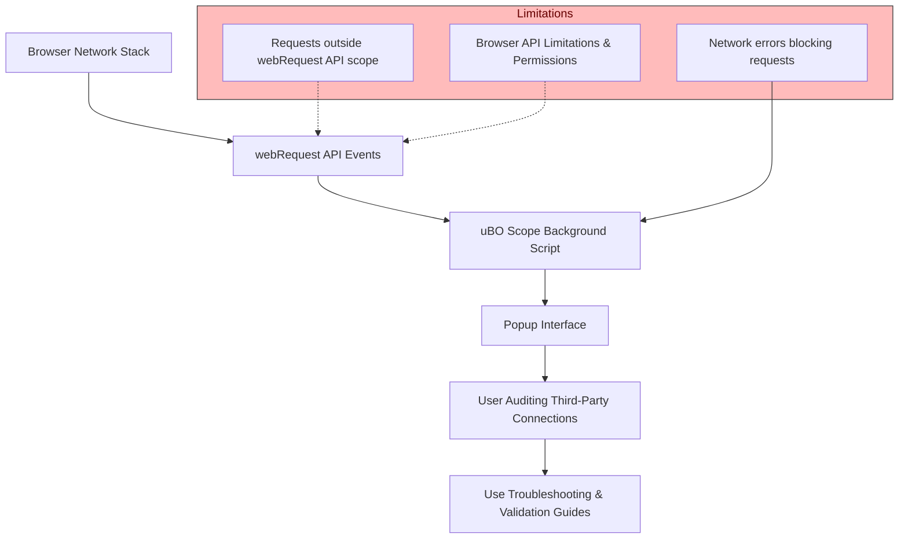

# Troubleshooting & Limitations

## Overview

This guide helps you diagnose common issues encountered while using uBO Scope, clarify which network requests can be observed, and provide practical advice for resolving problems or understanding the extension's inherent limitations. Understanding these aspects is crucial for accurate and confident auditing of third-party network connections.

---

## 1. Understanding What uBO Scope Can and Cannot See

### What uBO Scope Monitors

- uBO Scope captures **all network requests your browser's page makes through supported protocols** (HTTP, HTTPS, WebSocket).
- It uses the browser's `webRequest` API to observe these requests, gathering data about successful connections, redirects, and errors.
- The extension classifies each network request outcome into three categories:
  - **Allowed**: Requests successfully connected.
  - **Stealth-Blocked**: Requests blocked silently by content blockers or browser mechanisms without signaling to the page.
  - **Blocked**: Requests explicitly blocked due to network errors or deliberate blocking.

### What uBO Scope Cannot See

- **Network traffic outside the browser's webRequest API scope.** For example:
  - Requests made by browser internals or native code that do not trigger webRequest events.
  - Traffic over protocols not handled by webRequest API or those unsupported by the browser (e.g., some WebRTC or direct socket connections).
- **Requests hidden from the browser's API by design or platform restrictions.**
- **DNS-only blocking mechanisms that prevent the request from ever reaching the network stack visible to webRequest** (though uBO Scope reports blocked requests when the browser surfaces an error).

<Tip>
Keep in mind that uBO Scope relies on the browser's network event reporting. If a request does not trigger any webRequest event, uBO Scope will not have visibility into that request.
</Tip>

---

## 2. Common Issues and How to Resolve Them

### Issue: No Data Display in Popup

**Symptoms:**
- Popup shows 'NO DATA' or remains empty after clicking the extension icon.

**Causes and Solutions:**
- The active tab has no recent network activity, or it is a browser internal page (`about:` pages, special UI pages).
- uBO Scope permissions may be insufficient or not granted for the active tab’s URL.
- Extension background service worker could be inactive or crashed.

**Steps to Fix:**
1. Reload the active tab to generate fresh network requests.
2. Confirm that uBO Scope has the necessary permissions (`host_permissions` include the URL scheme).
3. Restart the browser or reload the extension to refresh the background process.
4. Check if other tabs show data, confirming if the issue is tab-specific.

### Issue: No Toolbar Badge Count or Badge Not Updating

**Symptoms:** Toolbar icon badge is missing or does not reflect expected counts.

**Causes and Solutions:**
- Tab ID mapping internal to uBO Scope might be outdated or cleared on tab closure.
- No connection data recorded due to lack of network requests or browser API restrictions.

**Steps to Fix:**
1. Switch to the tab you want to monitor and reload it.
2. If still no count, verify browser version is supported (Chromium 122+, Firefox 128+, Safari 18.5+).
3. Verify network activity in developer tools.
4. Restart browser or extension if issues persist.

### Issue: Unexpected Blocked or Allowed Requests

**Symptoms:** The app shows surprising allowed, stealth-blocked, or blocked third-party domains.

**Causes and Solutions:**
- Some content blockers employ stealth blocking which hides requests but still appears as stealth-blocked in uBO Scope.
- Network errors or DNS failures can classify requests as blocked.
- Some allowed connections may be CDN servers or necessary third-parties.

**Recommendation:**
- Use uBO Scope as a transparency tool to interpret outcomes rather than judge block effectiveness solely on counts.
- Refer to the guide on [Understanding Stealth Blocking](/guides/advanced-usage/understanding-stealth-blocking) to learn how stealth blocking works.

<Tip>
Remember, a lower number of distinct allowed connections generally indicates better blocking effectiveness, but context matters. Legitimate CDNs typically cause allowed third-party connections.
</Tip>

---

## 3. Extension and Platform Limitations

### Browser API Limitations

- uBO Scope depends entirely on the `webRequest` API availability and capability in the browser:
  - Browsers sometimes limit this API for security or privacy reasons.
  - Some protocols, such as WebRTC or background prefetching, may not always be fully reported.

### Performance Impact

- uBO Scope operates by listening to potentially many network events.
- On pages with excessive third-party connections, this can add overhead.
- The extension batches network event processing to reduce performance impact, but heavy sites might still see delays.

### Data Persistence

- uBO Scope stores session data temporarily to show accumulated info per tab.
- Closing a tab clears its data.
- Persistent historical tracking is not supported.

---

## 4. Practical Tips for Effective Troubleshooting

- **Reload Tabs:** Many issues resolve by simply reloading the page to regenerate network activity.
- **Check Browser Version and Permissions:** Confirm that your browser version is supported and that uBO Scope has the necessary permissions.
- **Use Developer Tools:** Compare uBO Scope data with browser developer tools Network panel to cross-verify connections.
- **Avoid Internal Pages:** The extension won’t monitor browser internal pages (`about:`, extension pages).
- **Restart Extension/Browser:** If data stops updating or badge fails, restart to reset internal states.
- **Check for Conflicting Extensions:** Other privacy or blocker extensions may interfere with or obscure network events.

---

## 5. When to Seek Further Help

- If you encounter persistent issues that cannot be resolved by the above steps,
- If you suspect a bug or unusual behavior related to a browser-specific quirk,
- Or if you want to understand complex connection behaviors for filter list maintenance,

please consult the [Troubleshooting Installation Issues](/getting-started/first-run-and-validation/troubleshooting-installation-issues) or report issues via the official [GitHub Repository](https://github.com/gorhill/uBO-Scope).

---

## 6. Summary Diagram of Data Flow and Limitations

---

## 7. Related Resources

- [Understanding the Popup Interface](/getting-started/first-run-and-validation/understanding-the-popup)
- [Audit Third-Party Network Connections](/guides/core-workflows/audit-network-connections)
- [Validate Content Blockers with uBO Scope](/guides/core-workflows/validate-blockers)
- [Understanding and Detecting Stealth-Blocked Requests](/guides/advanced-usage/understanding-stealth-blocking)
- [Troubleshooting Installation Issues](/getting-started/first-run-and-validation/troubleshooting-installation-issues)

<Tip>
Always ensure you run uBO Scope on supported browsers, with granted permissions, and refresh your tabs after installation to guarantee accurate network data capture.
</Tip>

---

This guide ensures you're equipped to interpret and troubleshoot uBO Scope's network monitoring capabilities effectively. For complex scenarios, consult the wider documentation ecosystem for deeper understanding and validation workflows.
