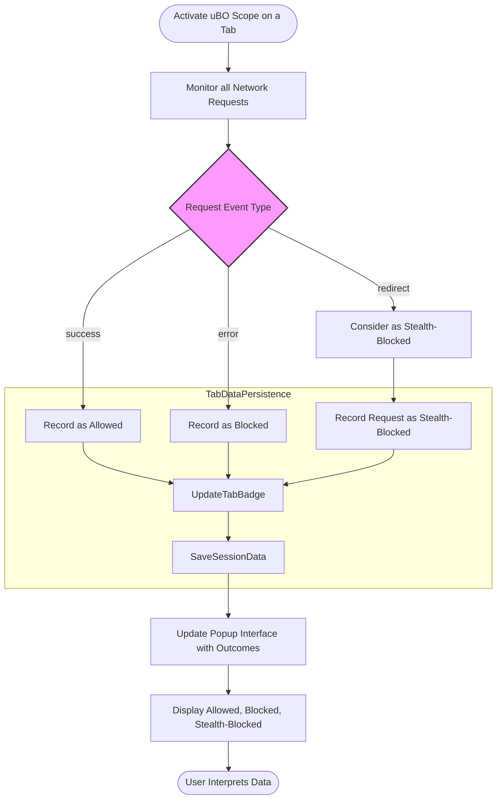

# Diagnosing Stealth Blocking and Anomalies

## Workflow Overview

**Task Description:**
This guide helps you understand how uBO Scope detects stealth blocking—network requests silently prevented by content blockers or the browser—and anomalies that may not be obvious via regular browser tools or conventional monitoring. You will learn how to interpret stealth-blocked connection data to identify hidden filtering events.

**Prerequisites:**
- uBO Scope installed and enabled in your browser (see [Installing uBO Scope](https://github.com/gorhill/uBO-Scope/blob/main/docs/getting-started/installation-basics/installing-ubo-scope.md)).
- Basic familiarity with opening and interpreting the uBO Scope popup interface ([Using the Popup](https://github.com/gorhill/uBO-Scope/blob/main/docs/guides/getting-started-essentials/understand-popup.md)).
- Have active browsing sessions with network activity to analyze.

**Expected Outcome:**
By following this guide, you will:
- Identify stealth-blocked domains that are silently blocked by extensions or the browser.
- Understand how stealth blocking differs from explicit blocking.
- Diagnose anomalies in network connections that standard tools often overlook.
- Gain practical skills to audit website requests for privacy or troubleshooting purposes.

**Time Estimate:** ~10–15 minutes

**Difficulty Level:** Intermediate

---

## Step-by-Step Instructions

<Steps>
<Step title="Open the uBO Scope Popup on an Active Tab">
Open your browser and navigate to a website where you want to inspect network connections. Click the uBO Scope toolbar icon to open its popup interface, which will display categorized connection outcomes.

**Expected Result:** The popup shows the hostname at the top and lists distinct domains under the "not blocked", "stealth-blocked", and "blocked" sections.
</Step>

<Step title="Identify the Stealth-Blocked Section">
Locate the "stealth-blocked" section in the popup. This area lists domains for which network requests were intercepted and prevented silently, without explicit error notifications.

**Expected Result:** Domains appear in red shading, with counts of blocked requests.

**Tip:** Stealth-blocking can occur due to content blockers or browser-level blocking that is invisible to usual network inspectors.
</Step>

<Step title="Compare Stealth-Blocked to Blocked and Allowed Domains">
Observe the "blocked" and "not blocked" sections alongside "stealth-blocked".

- "Not blocked" shows domains for which network requests succeeded.
- "Blocked" shows domains with explicit blocking (errors).
- "Stealth-blocked" indicates silent filtering.

**Outcome:** This comparison helps differentiate how requests are treated and exposes hidden filtering.
</Step>

<Step title="Use Real-World Browsing Examples">
Browse websites with known ad or tracking domains. Refresh the site with uBO Scope open to watch live updates.

Look for domains unexpectedly appearing under "stealth-blocked" that your content blocker might be silently filtering.

**Expected Result:** You notice domains listed under stealth that do not trigger explicit block errors but are not connected.
</Step>

<Step title="Investigate Anomalies and Unexpected Domains">
If you find suspicious or unexpected domains in stealth-blocked or even allowed sections, note them down.

Consider these questions:
- Are there domains present that you didn't expect?
- Are known tracking or ad domains being stealth-blocked?
- Are there domains that appear both under stealth and allowed (rare, but could indicate redirects)?

**Tip:** Use this insight to adjust your content blocker or privacy settings.
</Step>

<Step title="Consult Troubleshooting if No Data Appears">
If the stealth-blocked section remains empty unexpectedly, ensure uBO Scope has necessary permissions and is monitoring correctly.

Refer to [Troubleshooting Installation](https://github.com/gorhill/uBO-Scope/blob/main/docs/getting-started/installation-basics/troubleshooting-install.md) and [Verifying Installation](https://github.com/gorhill/uBO-Scope/blob/main/docs/getting-started/installation-basics/verifying-installation.md).
</Step>
</Steps>

---

## Understanding Stealth Blocking

- **What is Stealth Blocking?**
  Stealth blocking represents requests that the browser or content blockers prevent *silently*, without triggering standard error messages or visible failures. This technique is used by some blockers to minimize webpage breakage or avoid detection by websites.

- **Why Does uBO Scope Detect It?**
  Unlike browsers’ native network tools, uBO Scope listens to the `webRequest` API lifecycle events and interprets outcomes, including redirect events or requests that do not complete normally, categorizing them as stealth-blocked when no explicit error occurs but the request does not succeed.

- **Impact for Privacy and Debugging**
  Identifying stealth blocking helps reveal hidden filtering layers that might otherwise be missed, improving your understanding of which domains are truly blocked or allowed during browsing.

---

## Practical Tips and Best Practices

- Keep the uBO Scope popup open while browsing typical websites to get real-time feedback on stealth and explicit blocking.
- Use stealth-blocked domain information to cross-check with your content blocking filters or whitelist entries.
- When unsure about a domain’s role, verify by visiting the site with and without content blockers enabled.
- Remember that some stealth blocking may be from browsers or DNS-level filters, not only extensions.
- Use domain counts to prioritize which stealth-blocked servers have the most blocked requests, highlighting potentially impactful trackers.

---

## Troubleshooting Common Issues

<AccordionGroup title="Common Issues with Diagnosing Stealth Blocking">
<Accordion title="No Data or Empty Stealth-Blocked Section">
- Verify uBO Scope is installed correctly with permissions including `webRequest` and host permissions.
- Confirm you have active browsing activity with third-party requests.
- Consult [Verifying Installation](https://github.com/gorhill/uBO-Scope/blob/main/docs/getting-started/installation-basics/verifying-installation.md).
- Restart the browser or disable conflicting extensions that may block uBO Scope.
</Accordion>

<Accordion title="Stealth-Blocked Domains Don't Match Expectations">
- Stealth blocking varies between blockers; some silently allow some connections.
- Use multiple browsing sessions with different content blockers to compare results.
- Understand that stealth blocking may also result from browser internal policies.
- Review domain names carefully; some could be CDN or legitimate services.
</Accordion>

<Accordion title="Popup Does Not Update After Page Load">
- Refresh the tab and reopen the popup.
- Make sure the extension is active and not disabled.
- Check console/errors (developer console in extension context) if comfortable.
- Refer to [Troubleshooting Installation](https://github.com/gorhill/uBO-Scope/blob/main/docs/getting-started/installation-basics/troubleshooting-install.md) for comprehensive help.
</Accordion>
</AccordionGroup>

---

## Next Steps & Related Content

- After mastering stealth blocking diagnosis, explore how to interpret the [uBO Scope Popup Interface](https://github.com/gorhill/uBO-Scope/blob/main/docs/guides/getting-started-essentials/understand-popup.md) for deeper insights.
- Learn to assess badge counts with [Making Sense of Badge Counts](https://github.com/gorhill/uBO-Scope/blob/main/docs/guides/getting-started-essentials/badge-counts-meaning.md).
- For full installation context and requirements, see [Installing and Verifying uBO Scope](https://github.com/gorhill/uBO-Scope/blob/main/docs/guides/getting-started-essentials/install-and-setup.md).
- Explore [Best Practices for Assessing Content Blockers](https://github.com/gorhill/uBO-Scope/blob/main/docs/guides/advanced-use-and-best-practices/assessment-best-practices.md) for a broader understanding of blocker effectiveness.

---

## Visual Aid: Network Request Outcome Flow

This flowchart summarizes how uBO Scope categorizes requests into allowed, blocked, and stealth-blocked states that you see in the popup.

---

## Summary
Use this guide to spot stealth-blocked connections that are hidden from normal browser tools, empowering you to audit, troubleshoot, and improve your browsing security and privacy with uBO Scope.

---

## Reference
- uBO Scope Popup Interface: https://github.com/gorhill/uBO-Scope/blob/main/docs/guides/getting-started-essentials/understand-popup.md
- Installing uBO Scope: https://github.com/gorhill/uBO-Scope/blob/main/docs/getting-started/installation-basics/installing-ubo-scope.md
- Troubleshooting Installation: https://github.com/gorhill/uBO-Scope/blob/main/docs/getting-started/installation-basics/troubleshooting-install.md
- Verifying Installation: https://github.com/gorhill/uBO-Scope/blob/main/docs/getting-started/installation-basics/verifying-installation.md
- Assessment Best Practices: https://github.com/gorhill/uBO-Scope/blob/main/docs/guides/advanced-use-and-best-practices/assessment-best-practices.md

---

##### This page focuses solely on using uBO Scope's popup to diagnose stealth blocks and anomalies, building on core concepts and installation guides elsewhere in the documentation.
