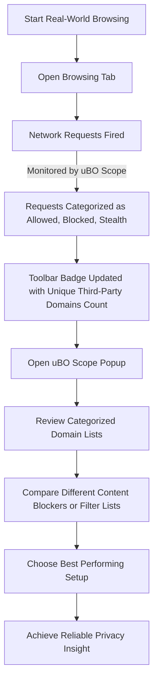

# Best Practices for Assessing Content Blockers and Third-Party Requests

Discover how to leverage uBO Scope to accurately evaluate filter lists, debunk common misconceptions from misleading 'ad blocker test' claims, and conduct fair, real-world comparisons of content blockers. This guide is tailored for privacy advocates and filter list maintainers seeking reliable, actionable insights on third-party request handling.

---

## 1. Understanding the Purpose and Goals

### What This Guide Helps You Accomplish
- Evaluate content blocker's effectiveness based on distinct third-party connections instead of simple block counts.
- Use uBO Scope to analyze network requests and outcomes with real-world browsing scenarios.
- Debunk unreliable claims from synthetic 'ad blocker test' webpages.
- Adopt fair comparison techniques to assess and improve filter lists.

### Who Should Use This Guide
- Privacy-conscious users wanting transparent insights on what your browser really connects to.
- Filter list maintainers aiming to evaluate their lists against realistic network activity.
- Content blocker evaluators searching for accurate, data-driven assessment methods.

### What You Will Achieve
By following this guide, you will:
- Gain confidence interpreting uBO Scope data.
- Learn to avoid common interpretation mistakes that lead to false conclusions.
- Develop a methodology for consistent and meaningful content blocker assessment.

### Time Estimate
Approximately 15–30 minutes for reading and applying the core practices during your browser sessions.

### Difficulty Level
Intermediate — assumes familiarity with browser extensions and understanding of content blocking concepts.

---

## 2. Assessing Content Blockers Using uBO Scope

### Step 1: Use Real Browsing Activity for Testing

1. **Navigate Browsing Sessions Naturally:** Avoid relying on artificially crafted test pages that mimic ad-blocker triggers. These pages often produce unrealistic network requests.
2. **Observe the Toolbar Badge:** The badge number represents the count of distinct third-party domains to which connections were made (i.e., _allowed_ connections).
3. **Open the uBO Scope Popup:** Click the extension icon and view categorized lists:
   - **Not Blocked**: Domains your browser connected to.
   - **Stealth-Blocked**: Domains silently blocked by content blockers or the browser.
   - **Blocked**: Domains explicitly blocked.
4. **Compare Across Blockers or Filter Lists:** Use the same browsing session or identical scenario, not synthetic tests, to measure which blocker or filter list truly reduces third-party connections.

<Check>
Remember, a _lower_ badge count signals better privacy because it means fewer distinct third-party domains were contacted.
</Check>

---

### Step 2: Debunk Misleading 'Ad Blocker Test' Claims

Many 'ad blocker test' websites rely on unrealistic assumptions and network behaviors.

- **Test Pages Can be Deceptive:** They make network requests to domains no real website uses, which content blockers often ignore or treat differently.
- **Stealth Techniques Conceal True Blocking:** Content blockers may silently prevent certain requests, invisible to web page scripts but visible to uBO Scope.
- **Block Count vs. Real Connections:** High block counts do not automatically indicate superior blocking; they can paradoxically correspond to connecting to _more_ third parties overall.

Use uBO Scope data to see beyond these misleading tests—focusing on actual distinct third-party domain connections rather than block triggers or counts.

---

### Step 3: Conduct Fair and Repeatable Comparisons

1. **Set Up Consistent Environments:** Test blockers and filter lists under the same browser version, network conditions, and browsing scenario.
2. **Clean State:** Use a fresh browser profile or clear relevant caches and data to avoid residual state interference.
3. **Monitor the Same Pages:** Navigate through identical websites with real-world content loading.
4. **Capture and Analyze Data:** Use the uBO Scope popup to collect domain connection outcomes, documenting allowed, blocked, and stealth-blocked domains.
5. **Evaluate Third-Party Domains Count:** Focus on the unique number of third-party domains successfully connected to, not just raw block metrics.

<Tip>
Consider using multiple browsing sessions or visits to popular sites to gain a representative assessment. Single-page tests may not reflect true blocking performance.
</Tip>

---

## 3. Practical Tips & Best Practices for Accurate Assessment

- **Interpret the Badge Wisely:** A badge showing zero or a very low count usually means stricter blocking or fewer third-party connections.
- **Use the Popup to Drill Down:** Review domain lists to identify which third parties are blocked, stealth-blocked, or allowed.
- **Beware of Overblocking:** Some domains counted as third parties may be legitimate, such as CDN providers. Consider this to avoid overconflating counts with privacy impact.
- **Understand Stealth Blocking:** Domains listed under stealth-blocked may be silently blocked by your content blocker or the browser, invisible in standard tools.

<Warning>
Do not equate higher block counts with better privacy — this is a common misinterpretation that uBO Scope explicitly aims to correct.
</Warning>

---

## 4. Example Scenario: Evaluating Two Filter Lists

### Setup
- Use the same browser and version.
- Install uBO Scope.
- Configure your content blocker to test Filter List A.
- Open uBO Scope popup on your browsing session.
- Record the badge count and domain outcome breakdown.
- Repeat the steps with Filter List B.

### Analysis
- Compare total distinct third-party domains connected (the badge number).
- Review domains blocked and stealth-blocked for differences.

### Outcome
- The filter list yielding fewer allowed third-party domains while maintaining site functionality is more effective.

---

## 5. Troubleshooting Assessment Challenges

### Issue: Badge Count Not Updating
- Ensure browsing activity includes network requests to third-party domains.
- Confirm that uBO Scope has proper permissions and is enabled in your browser.
- Reload or open a new tab and revisit a site with known third-party content.

### Issue: No Data Displayed in Popup
- Confirm that the active tab has network activity.
- Verify that uBO Scope is granted `webRequest` permissions.
- Close and reopen the popup.

### Issue: Unexpected Domain Appearances
- Some legitimate services (e.g., CDNs) may show up as third-party connections.
- Distinguish domains that actually impact privacy from innocuous services by reviewing domain names and cross-referencing known CDNs.

<Note>
Refer to the documentation on "Using the Popup: Viewing and Interpreting Network Connections" for details on reading and navigating the popup interface.
</Note>

---

## 6. Next Steps & Further Learning

- Explore the [Diagnosing Stealth Blocking and Anomalies](https://docs.example.com/guides/advanced-use-and-best-practices/analyze-stealth-blocking) guide to deepen your analysis skills.
- Review the [Core Concepts & Terminology](https://docs.example.com/overview/about-ubo-scope/core-concepts-terminology) page to solidify understanding of key terms.
- Use the [uBO Scope Features at a Glance](https://docs.example.com/overview/feature-overview/feature-glance) to uncover additional extension capabilities supporting assessment.

---

For full context on installing and starting with uBO Scope, see the Getting Started section. The robustness and transparency of uBO Scope make it the essential tool for genuine assessment of content blockers aligned with real-world browsing privacy.

---

## Visual Summary: Key Workflow to Assess Content Blockers with uBO Scope

---
