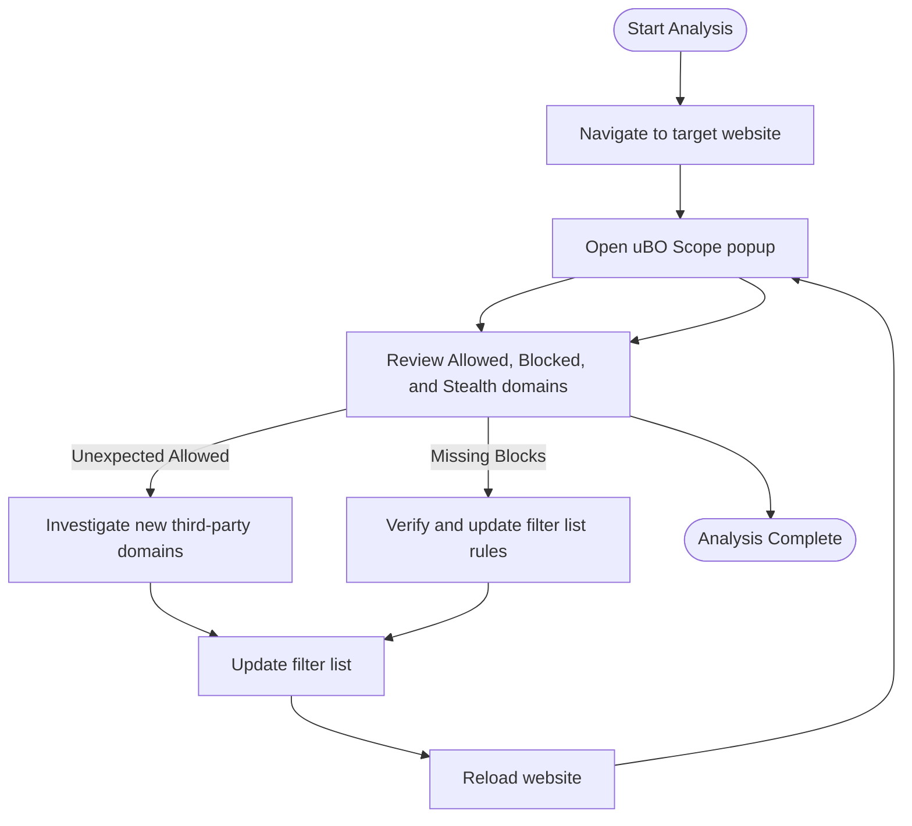

# Using uBO Scope as a Filter List Maintainer

## Overview

As a filter list maintainer, your goal is to ensure that your content blocking lists effectively block unwanted third-party resources while not interfering undesirably with legitimate content. This guide empowers you to leverage uBO Scope to validate your filter lists by examining block effectiveness in real browsing conditions, identifying unexpected third-party calls, and continuing your analysis workflow even when standard browser developer tools are limited or inaccessible.

---

## Prerequisites

Before proceeding, make sure you have:

- Installed uBO Scope in a supported browser (Chrome, Firefox, Safari 18.5+, or later).
- A working content blocker (such as uBlock Origin) with your filter list(s) active.
- Basic familiarity with the uBO Scope popup UI and connection outcomes (allowed, blocked, stealth).
- Access to the website or content you want to test under realistic browsing conditions.

If you need installation instructions or an introduction to the popup UI, refer to [Installing uBO Scope](https://your-docs-url/guides/getting-started/installation-and-setup) and [Understanding the Popup UI](https://your-docs-url/guides/getting-started/understanding-the-ui).

---

## What You Will Achieve

After following this guide, you will be able to:

- Verify that your filter lists are effectively blocking the intended third-party domains.
- Detect and investigate unexpected third-party connections that may require list updates.
- Utilize uBO Scope as an independent analysis tool when browser developer tools are restricted or insufficient.

---

## Estimated Time

Allow 15 to 30 minutes for a single site analysis and verification session, depending on the site's complexity and your familiarity with third-party filtering.

---

# Step-by-Step: Using uBO Scope for Filter List Maintenance

### Step 1: Open uBO Scope for the Target Website

1. Navigate to the website you intend to evaluate.
2. Click on the uBO Scope extension icon in your browser toolbar.
3. The popup will display the domain of the active tab and list third-party domains categorized by outcome:
   - **Not Blocked (Allowed):** Domains your filter list did not block.
   - **Stealth-blocked:** Domains whose requests were canceled silently before any network connection.
   - **Blocked:** Domains actively blocked with an error outcome.

> **Expected Result:**
> You should see the domains contacted by this webpage split into these three clearly labeled sections with counts.

---

### Step 2: Analyze Blocked and Stealth-Blocked Domains

- Review the **Blocked** list:
  - Confirm it contains all key third-party domains your filter list targets.
  - If expected domains do not appear here, verify your filter rules' scope and syntax.
- Review the **Stealth-blocked** list:
  - These are network requests canceled before connection, indicative of stealth blocking mechanisms.
  - Ensure important privacy-invasive domains are captured here too.

---

### Step 3: Investigate Allowed Domains

- Examine the **Not Blocked (Allowed)** list carefully:
  - Look for unexpected or suspicious third-party domains that your lists may not yet cover.
  - Consider the significance of these domains in the context of your list's coverage and your privacy goals.
  - Use domain knowledge or external lookup to assess if additions to your filter list are justified.

> **Tip:**
> Use the plugin's displayed counts next to each domain to prioritize frequently contacted hosts.

---

### Step 4: Verify Block Effectiveness Without Developer Tools

Sometimes, browser developer tools are unavailable or restricted (e.g., in kiosk environments or with locked-down profiles). uBO Scope remains fully functional and shows:

- Real-time connection outcomes per tab.
- Domain-level aggregation across allowed, stealth, and blocked.

Use this to:

- Confirm blocking even when the network panel is inaccessible.
- Share reproducible results with collaborators by noting exact domain lists and counts.

---

### Step 5: Document and Update Your Filter List

- Based on uBO Scope's findings, note newly discovered domains to add or remove.
- Test updated list rules again with uBO Scope to confirm expected blocking behavior.
- Repeat across different sites to validate comprehensive coverage.

---

## Practical Examples

### Example: Spotting Undetected Third-Parties

Suppose you maintain a filter list targeting known ad networks. On a popular news site:

- The **Allowed** section shows a new domain `tracking.examplecdn.com` not previously in your list.
- The domain appears frequently in the `count` badges, indicating active use.

Action:

- Investigate `tracking.examplecdn.com` for tracking behavior.
- If confirmed, add a blocking rule in your list for this domain.
- Confirm the new domain moves to **Blocked** or **Stealth-blocked** sections after reload.

### Example: Verifying Changes

After adding a new rule to block `ads.example.net`:

- Use uBO Scope on a site where this domain was previously allowed.
- Confirm it appears under **Blocked** or **Stealth-blocked**.
- Check the badge count increases, reflecting new blocks.

---

## Troubleshooting & Tips

### Common Issues

- **No data shown in popup:** Refresh the webpage and open uBO Scope again. Ensure uBO Scope is enabled and permissions granted.
- **Unexpected domains remain allowed:** Verify your filter syntax and priority. Some hosts might use alternate domains; consider wildcard blocking with caution.
- **Stealth block counts seem low:** Some requests may not reach the network layer if blocked by other extensions or policies.

### Best Practices

- Regularly analyze popular sites using uBO Scope to discover emerging third-party domains.
- Use uBO Scope alongside your unblock lists for context on false positives or benign cases.
- Document repeated findings over sessions for historical comparisons and auditing.

### Performance Considerations

uBO Scope is lightweight and uses session storage efficiently, supporting smooth real-time monitoring without browser slowdowns.

---

## Next Steps & Related Documentation

- Explore [Interpreting Blocked, Stealth, and Allowed Outcomes](https://your-docs-url/guides/advanced-use-cases/interpreting-connection-outcomes) to deepen your understanding of connection results.
- Read [Debunking Block Count Myths](https://your-docs-url/guides/core-workflows/mythbusting-block-counts) to correctly gauge filter effectiveness.
- Learn about the [System Architecture](https://your-docs-url/overview/architecture-and-concepts/system-architecture) for insight into how uBO Scope processes data.

For community support, issue tracking, or contributing, visit the [uBO Scope GitHub repository](https://github.com/gorhill/uBO-Scope).

---

## Visual Flow of Using uBO Scope as a Filter List Maintainer

This illustrates a practical, iterative workflow supporting filter list maintenance with uBO Scope.

---

## Conclusion

uBO Scope equips you with direct, local visibility into third-party domain connections as affected by your filter lists. This transparency enables confident maintainer decisions, rapid detection of new tracking domains, and seamless operation even in restricted browsing environments. By integrating uBO Scope into your workflow, you elevate the precision and effectiveness of your content blocking efforts.

---

<Check>
Always keep uBO Scope updated to leverage the latest domain parsing from the Public Suffix List and ensure compatibility with browsers.
</Check>

<Info>
For advanced analysis tips, refer also to the 'Target Audience & Use Cases' and 'Core Concepts & Terminology' guides.
</Info>
