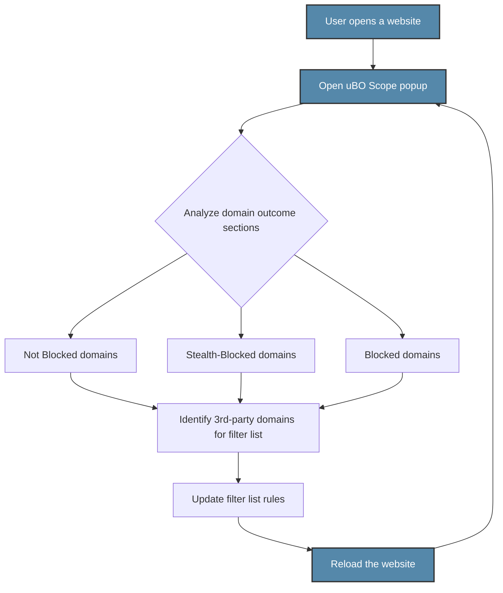

# Filter List Maintenance with uBO Scope

## Overview

This guide empowers filter list authors and privacy enthusiasts to efficiently audit and refine filter lists using uBO Scope’s fine-grained domain analysis features. Even on devices with limited access to advanced browser developer tools, uBO Scope provides transparent visibility into all attempted and successful network requests per browser tab, allowing precise identification of third-party domains.

By leveraging this page of the extension, users can pinpoint the actual third-party resources their browser loads, assess which ones are blocked, stealth-blocked, or allowed, and use this intelligence to improve the quality and effectiveness of filter lists.

---

## Prerequisites

- **uBO Scope extension installed and active** in a supported browser (Chromium 122+, Firefox 128+, Safari 18.5+).
- Basic familiarity with browser tabs and navigating the extension popup interface.
- At least one active browsing session with network requests to analyze.

> For installation and setup, see [Installing uBO Scope](../guides/getting-started/installing-extension).

---

## Expected Outcome

After completing this guide, you will be able to:

- Interpret the detailed domain connection data shown in uBO Scope’s popup.
- Identify third-party domains that evade blocking or are stealth-blocked.
- Use domain request counts and categorizations as actionable signals to update and refine filter lists.
- Understand the role of domain and hostname granularity in auditing network activity.

---

## Time Estimate

- Approximately 10 to 20 minutes per website analysis session, depending on the complexity of network requests.

---

## Difficulty Level

- Intermediate: Users should be comfortable with privacy concepts and browsing network resource domains.

---

## Using the Filter List Maintenance Page

### Step 1: Open the uBO Scope Popup

1. Click the uBO Scope extension icon in your browser toolbar.
2. The popup will display data related to the active browser tab.

> If no data is shown, ensure the page has loaded recently and uBO Scope has the necessary permissions. See [Troubleshooting Common Issues](../getting-started/using-validating/troubleshooting).

### Step 2: Understand the Domain Breakdown

The popup categorizes network-connected domains into three sections:

- **Not Blocked:** Domains that permitted a successful connection.
- **Stealth-Blocked:** Domains where connection attempts were redirected or hidden (non-blocking stealth).
- **Blocked:** Domains where requests were actively blocked by filter lists or content blockers.

Each domain entry also shows the count of requests originated.

### Step 3: Analyze the Third-Party Domains

1. Note the primary domain and hostname of the active tab displayed at the top.
2. Review the domains in each section to detect unexpected allowed third-party domains.
3. Observe those that are stealth-blocked or blocked, verifying if filter lists are effectively covering them.

### Step 4: Focus on Domain Counts and Patterns

- Domains with a higher request count represent heavier resource usage or repeated attempts.
- Multiple hostnames under the same domain might indicate broader resource distribution.
- Domains that are allowed but not recognized as necessary third parties should be flagged for filter list consideration.

### Step 5: Refine Filter Lists Accordingly

- Use insights from allowed domains to add new blocking rules if appropriate.
- Review stealth-blocked domains to understand if they are circumventing filters or causing issues.
- Exclude legitimate CDN or service provider domains to avoid breaking sites.

> Tip: Apply domain and hostname parsing to avoid overblocking and maintain site functionality.

### Step 6: Verify Updates on Subsequent Browsing Sessions

After updating your filter list:

1. Reload the target website.
2. Open the uBO Scope popup again.
3. Confirm that unwanted third parties are now blocked or stealth-blocked as intended.

---

## Practical Example

Imagine maintaining a filter list for a news website that unexpectedly loads scripts from `trackers.example.com`:

1. Open the site and uBO Scope popup.
2. Under "Not Blocked," see `trackers.example.com` with a high request count.
3. Realize your filter list does not yet block this domain.
4. Add a blocking rule targeting `trackers.example.com`.
5. Reload the site and confirm the domain appears now under "Blocked" or "Stealth-Blocked".

---

## Tips and Best Practices

- **Incremental Changes:** Modify filter lists in small steps to isolate the impact of each change.
- **Data Persistence:** Use uBO Scope’s session data to track domain activity over time.
- **Avoid Overblocking:** Always verify if an allowed domain is critical to site functionality before blocking.
- **Use Punycode Decoding:** uBO Scope automatically converts internationalized domain names to human-readable form for easier audits.

---

## Common Pitfalls

- **No Data in Popup:** Often caused by missing permissions or inactive tabs. Verify browser permissions and reload pages.
- **Misinterpretation of Badge Count:** The badge number counts distinct allowed third-party domains, not total requests or blocked items.
- **Assuming All Third Parties Are Malicious:** Some domains are essential CDNs or services; blocking them breaks websites.

Refer to [Interpreting Network Activity and the Badge Counter](../guides/using-ubo-scope/interpreting-network-activity) for nuanced understanding.

---

## Troubleshooting

<Accordion title="Popup Shows 'NO DATA' or Incomplete Domain List">

- Ensure you have navigated to a web page and waited for it to fully load.
- Confirm uBO Scope’s permissions are intact (activeTab, webRequest, storage).
- Reload or restart your browser if necessary.
- If issues persist, see [Troubleshooting Common Issues](../getting-started/using-validating/troubleshooting).

</Accordion>

<Accordion title="Unexpected Domains Always Allowed">

- Verify if the domain is a legitimate CDN or essential service.
- Check your active filter list for missing blocking rules.
- Update the list and test again.

</Accordion>

---

## Next Steps

- Continue with [Exploring the Popup Interface](../getting-started/using-validating/exploring-popup) to get deeper UI insights.
- Study [Debunking Content Blocker Myths](../guides/using-ubo-scope/debunking-adblock-myths) to grasp effective privacy analysis.
- Consult [Troubleshooting and Limitations](../guides/using-ubo-scope/troubleshooting-and-limitations) for optimizing your usage.

---

## Resources

- Official uBO Scope GitHub repository: [github.com/gorhill/uBO-Scope](https://github.com/gorhill/uBO-Scope)
- Public Suffix List (used for domain parsing): [publicsuffix.org](https://publicsuffix.org/)

---

## Summary Diagram of the User Workflow

---

# End of Guide

---

[Back to Guide Index](../index.md) | [Installation Guide](../guides/getting-started/installing-extension.md) | [Popup Interface Tour](../guides/getting-started/first-look-popup.md)