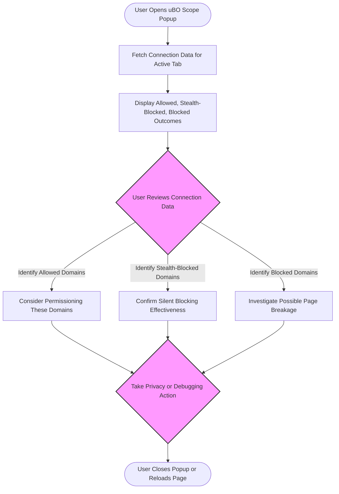

# Interpreting Blocked, Stealth-Blocked, and Allowed Outcomes in uBO Scope

## Workflow Overview

### Task Description
This guide helps users understand the distinctions between the different network connection outcomes reported by uBO Scope: **Allowed (not blocked)**, **Stealth-blocked**, and **Blocked**. By mastering these definitions and their implications, users can make informed decisions about privacy, troubleshooting, and content-blocking effectiveness.

### Prerequisites
- uBO Scope extension installed and active in a supported browser (Chrome, Firefox, Safari).
- Basic familiarity with the uBO Scope popup UI.
- A webpage loaded in an active tab to analyze.

### Expected Outcome
Users will be able to confidently interpret what each network request outcome means, accurately analyze third-party connections seen in the popup UI, and leverage this knowledge for privacy auditing or filter list debugging.

### Time Estimate
10 to 15 minutes.

### Difficulty Level
Beginner to intermediate.

---

## Step-by-Step Interpretation Guide

### 1. Understanding Outcome Categories
uBO Scope classifies network connections into three categories, each revealing different aspects of network activity:

- **Allowed (Not Blocked):** Connections that were successfully made to third-party domains. These represent network requests permitted by your content blocker and the browser.

- **Stealth-blocked:** Connections that were silently blocked or redirected by your content blocker without notifying the webpage. These requests did not reach the remote server and typically avoid webpage breakage or detection.

- **Blocked:** Requests explicitly blocked by the content blocker resulting in errors or failures reported by the browser’s network stack.

These outcomes are displayed in the popup UI under distinct sections with domain counts to empower transparent analysis.

### 2. How uBO Scope Determines These Outcomes

- **Allowed:** Counted when network requests successfully resolve and the browser reports a valid response.

- **Stealth-blocked:** Identified typically on redirections or cancellations initiated by the blocker that prevent the request from reaching any third-party server, often without error responses.

- **Blocked:** Tracked when requests fail (error events) or are dropped explicitly by the blocker, causing the browser to report errors.

<u>Note:</u> uBO Scope monitors network events through the browser’s `webRequest` API capturing all outcomes regardless of which content blocker is active, ensuring comprehensive visibility.

### 3. Practical User Workflow to Interpret Results

<Steps>
<Step title="Open the uBO Scope Popup on the Active Tab">
Click the uBO Scope toolbar icon while visiting a webpage to view the popup UI. Observe the hostname displayed and the count of connected domains.
</Step>
<Step title="Review Allowed Section">
Examine the 'not blocked' section listing domains that were contacted successfully. These may include needed resources like CDN providers or analytics platforms.
</Step>
<Step title="Check Stealth-Blocked Section">
Look at the 'stealth-blocked' domains to identify requests your content blocker prevented silently. This helps understand what was blocked without webpage notification.
</Step>
<Step title="Inspect Blocked Section">
Review any domains under 'blocked' which indicate requests that failed outright.
</Step>
<Step title="Make Privacy or Debugging Decisions">
Use this data to evaluate exposure to third parties, confirm blocking effectiveness, or troubleshoot issues caused by blocking.
</Step>
</Steps>

### 4. Decision Points

- If you see many unexpected allowed domains, consider tightening filters.
- Extensive stealth-blocked domains reveal effective silent blocking.
- If blocked domains correlate with page malfunctions, investigate further.

### 5. Verification

Confirm the numbers in each section match the connection badge count on the toolbar. Confirm consistent domain labeling and counts for clarity.

---

## Real-World Examples

### Example 1: Privacy-Conscious User Checking Third-Party Exposure
While visiting a news site, you open uBO Scope and find:
- **Allowed:** `cdn.newswebsite.com (3)`, `ads.example.com (1)`
- **Stealth-blocked:** `track.badadvertiser.com (2)`, `analytics.unwantedtracker.net (5)`
- **Blocked:** (empty)

You realize ads.example.com connected, which might be acceptable since ads are shown, but stealth-blocked trackers successfully were blocked silently, reducing tracking footprint.

### Example 2: Filter List Maintainer Troubleshooting
Testing a filter list update, you observe:
- **Allowed:** Unexpected `tracker.newtracker123.com (4)` appears.
- **Stealth-blocked:** `tracker.oldtracker.com (7)`
- **Blocked:** `malware.badsite.com (2)`

This indicates your list silently blocks older trackers but missed the new tracker. You decide to update your filter rules accordingly.

---

## Troubleshooting & Tips

<Tip>
If no data appears under any outcome categories, ensure uBO Scope is enabled, permissions granted, and the page is actively making network requests.
</Tip>

<Warning>
Keep in mind that some domains may appear under 'allowed' due to essential dependencies (e.g., CDN or fonts). Blocking these indiscriminately may break webpage functionality.
</Warning>

<Tip>
The stealth blocked outcome is particularly useful to detect silent network request cancellations that are invisible to webpages — valuable for stealthy content blocking.
</Tip>

<Info>
Repeatedly check the badge count and popup after page reloads, as outcomes can vary with dynamic network activity.
</Info>

---

## Next Steps & Related Documentation

- Review the [Understanding the Popup UI guide](/guides/getting-started/understanding-the-ui) for detailed UI navigation.
- Explore [Analyzing Third-Party Connections on a Website](/guides/core-workflows/analyzing-connections) for practical analysis workflows.
- Deep dive into [Core Concepts & Terminology](/overview/architecture-and-concepts/core-concepts-terminology) for foundational knowledge.
- For filter list maintainers, consult the [Filter List Maintainers Guide](/guides/advanced-use-cases/filter-list-maintainers-guide).

---

## Diagram: User Interaction with Connection Outcomes

---

For more detail, see the [System Architecture](/overview/architecture-and-concepts/system-architecture) document explaining how these outcomes are detected internally.

---