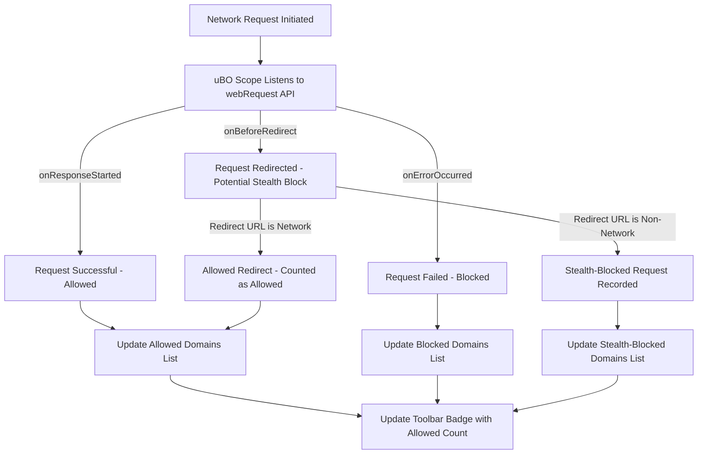

# Spotting and Understanding Stealth-Blocked Requests

Unlock the hidden world of stealth-blocked requests—network connections that content blockers intentionally hide to avoid detection. This guide walks you through how uBO Scope reveals these stealth blocks, enabling you to analyze complex blocking scenarios, troubleshoot elusive issues, and optimize your content blocker configurations.

---

## What Are Stealth-Blocked Requests?

Stealth-blocked requests are network connections that certain content blockers suppress without making the blocking obvious to the webpage or user. Instead of outright blocking or failing a request, these blockers intercept or manipulate requests so that the blocked resources appear invisible or unattainable, but without network errors.

Because they don't trigger explicit errors or visible blocks, stealth-blocked requests can evade standard detection methods. This makes them harder to spot but crucial to understand when verifying the effectiveness and side effects of content blocking.

## Why Does uBO Scope Highlight Stealth Blocks?

uBO Scope uniquely identifies stealth-blocked requests because it listens to the browser's `webRequest` API, capturing low-level network events regardless of the content blocker's own UI or error reporting.

By categorizing network requests into **allowed**, **blocked**, and **stealth-blocked**, uBO Scope provides a clear breakdown of third-party domains and hostnames that are interacting with your browser session, even when the blocks are hidden internally.

This visibility empowers you to:

- Detect subtle blocking behaviors that may explain unexpected webpage behavior.
- Validate and tune filter lists and blocker rules for precision.
- Troubleshoot edge cases where blocking is harder to observe.

## Prerequisites

- uBO Scope installed and enabled in your browser. See [Installing uBO Scope](https://github.com/gorhill/uBO-Scope#getting-started/prerequisites-installation/installing-ubo-scope).
- Basic familiarity with uBO Scope's popup and badge indicators (see [Interpreting the Badge and Popup Data](/getting-started/first-run-setup/interpreting-badge-popup)).
- A browsing session with network requests subject to content blocking (e.g., with uBlock Origin enabled).

## Expected Outcome

After working through this guide, you will be able to:

- Identify stealth-blocked requests within uBO Scope’s popup interface.
- Understand the nature and purpose of stealth blocks compared to allowed and blocked requests.
- Use stealth block information to investigate unexpected or hidden third-party connections.
- Improve troubleshooting and configuration strategies for content blockers.

---

## Step-by-Step Workflow

### 1. Open uBO Scope Popup

- Click the uBO Scope toolbar icon on your browser.
- The popup displays three domain categories under sections titled “not blocked,” “stealth-blocked,” and “blocked.”

**What you will see:**
- Domains under “stealth-blocked” are those with requests intercepted by blockers using stealth techniques.

### 2. Understand Domain and Hostname Classification

- Each domain listed aggregates network requests to any subdomains belonging to it.
- Counts beside domains show how many times requests occurred during the active tab session.

**Tip:** The counts help reveal domains with repeated stealth blocking and potential impact.

### 3. Analyze Stealth Blocks

- Focus on domains in the “stealth-blocked” section to grasp which requests were suppressed discreetly.
- Compare with the “blocked” list to differentiate between outright denial (errors) and stealth suppression.

### 4. Correlate With Network Behavior

- Use stealth block data to diagnose webpages where resources fail silently, causing layout or functionality issues.
- Identify if stealth blocking aligns with your content blocking filters or if unusual third-party activity is present.

### 5. Refine Blocking Rules

- Leverage stealth block insights when authoring or updating filters to fine-tune what should be blocked with stealth versus hard blocking.
- Consider stealth blocking to reduce website breakage while maintaining privacy.

### 6. Refresh and Monitor

- Reload the page and watch stealth-blocked domains update live within uBO Scope.
- Observe how adjustments to content blocker settings reflect on the stealth-blocked list.

---

## Practical Examples

### Example 1: Identifying Stealth Blocks on a News Site

1. Navigate to your favorite news website.
2. Open the uBO Scope popup.
3. Notice some ad-related domains listed under “stealth-blocked” (e.g., `ads.example.com`).
4. These stealth blocks mean requests are quietly suppressed, preventing ads from loading without triggering an error.

### Example 2: Differentiating Stealth from Blocked

- Domains under “blocked” typically have network errors logged — visible to the extension and sometimes the browser.
- Domains under “stealth-blocked” have failed silently, but uBO Scope reveals them via the `redirect` events intercepted at the network level.

---

## How uBO Scope Distinguishes Stealth Blocks Internally

uBO Scope listens to three browser webRequest events:

- **onBeforeRedirect** — logged as `redirect` event in uBO Scope, marking stealth blocks.
- **onErrorOccurred** — logged as `error`, marking clearly blocked requests.
- **onResponseStarted** — logged as `success`, marking allowed requests.

When a request triggers a `redirect` event and the redirect URL is non-network (e.g., a special internal blockpage or a data URL), uBO Scope categorizes this request as stealth-blocked.

This subtle handling differentiates stealth blocks from outright network failures, helping you visualize these hidden behaviors.

---

## Tips & Best Practices

- **Always cross-reference stealth-blocked with allowed & blocked sections** to understand the full network impact.
- **Use uBO Scope alongside content blocker's logger tool** for a comprehensive picture.
- **Update uBO Scope regularly** for best compatibility with browser changes affecting the webRequest API.
- **Do not rely solely on block counts to assess blocker effectiveness**; stealth blocks often imply a more discreet blocking strategy.

---

## Troubleshooting Stealth Block Insights

<AccordionGroup title="Common Issues and Solutions">
<Accordion title="Stealth-blocked domains show unexpectedly high counts">
Check if third-party resources legitimately require blocking or if your filters are overly broad. Stealth blocks, while helping to avoid detection, may cause side effects if excessive.
</Accordion>
<Accordion title="No stealth-blocked domains appear despite known blocking">
Confirm that you are using a blocker that employs stealth techniques and that your browser supports full webRequest event reporting. Some browsers or extensions limit this visibility.
</Accordion>
<Accordion title="Confusion between stealth and blocked listings">
Remember: "blocked" means explicit failures/errors; "stealth" means suppressed redirects with no network error. Use both for thorough diagnostics.
</Accordion>
</AccordionGroup>

---

## Next Steps & Further Learning

- Deepen your understanding by reading [Understanding the Popup: Allowed, Blocked, and Stealth Domains](/guides/interpreting-results/understanding-popup).
- Explore [Using uBO Scope to Evaluate Content Blockers](/guides/interpreting-results/evaluating-content-blockers) to learn how stealth blocking fits into content blocker evaluation.
- Review [Troubleshooting: When Some Requests Are Missing](/guides/advanced-use/troubleshooting-incomplete-data) if you suspect incomplete data reporting in your analysis.

---

## Diagram: How uBO Scope Categorizes Network Requests

---

## References

- uBO Scope source and development: [GitHub repository](https://github.com/gorhill/uBO-Scope)
- Browser webRequest API: Understanding network request events
- Public Suffix List: Used by uBO Scope for domain parsing

---

This guide gives you the practical knowledge needed to spot stealth blocks in the wild and leverage uBO Scope effectively to improve your content blocking strategy.