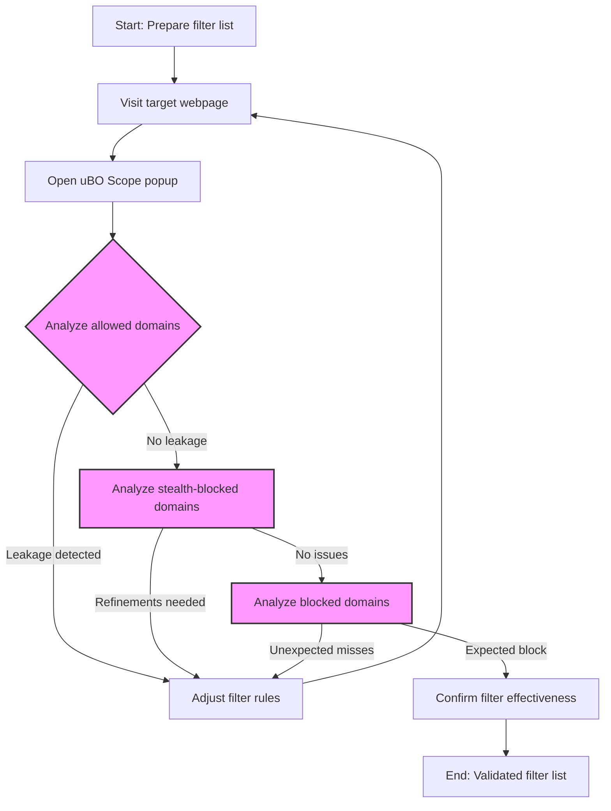

# Practical Workflows for Filter List Maintainers Using uBO Scope

uBO Scope is an invaluable tool for filter list maintainers seeking to test and verify their filter rules effectively. This guide walks you through practical workflows to spot third-party leakage, validate your filter lists in real browsing contexts, and improve privacy protections, even when working with limited browser tooling.

---

## 1. Understanding Your Goals as a Filter List Maintainer

Filter list maintainers want to ensure their rules effectively limit unwanted third-party connections without breaking legitimate site functionality. uBO Scope helps by exposing exactly which remote domains are contacted by each webpage and how these connections are handled: allowed, stealth-blocked, or blocked.

Your core objectives using uBO Scope:

- **Verify filter rules actually block or hide connections** in real-world browsing scenarios.
- **Detect any leakage of third-party requests** that your filter rules miss.
- **Measure the exposure to distinct remote third-party domains**, focusing on domain counts rather than raw block counts.
- **Identify stealth-blocked connections** that may evade other measurement tools.

---

## 2. Workflow Overview

### Prerequisites
- uBO Scope installed and active in your preferred browser (Chromium 122+, Firefox 128+, or Safari 18.5+).
- Basic familiarity with filter list concepts and debugging network requests.
- Access to web pages where you want to test filters (real, actively used sites are best).

### Expected Outcome
- A clear breakdown of remote domains contacted by the page.
- Identification of domains allowed, stealth-blocked, and completely blocked.
- Data to refine and improve your filter rules.

### Time Estimate
- Initial familiarization: 5-10 minutes.
- Per-site analysis and refinement: 10-30 minutes depending on complexity.

### Difficulty Level
- Intermediate, requiring some knowledge of networking and filtering.

---

## 3. Step-by-Step: Using uBO Scope to Test and Validate Filters

<Steps>
<Step title="Open the uBO Scope Popup on Target Pages">
1. Navigate to the webpage where you want to test your filter rules.
2. Click the uBO Scope toolbar icon to open the popup panel.
3. Wait a few seconds for the data to load and display.

<Check>
The popup header shows the domain of the current tab with counts of connected domains summarized below.
</Check>
</Step>

<Step title="Analyze the Allowed Domains Section">
1. Locate the 'not blocked' section showing allowed domains.
2. Review the list of domains and their counts — each represents a third-party to which successful connections were made.
3. Check if any domains here should have been blocked or stealth-blocked by your filters.

<Tip>
Allowed domains with high counts may indicate unintended leakage or missed filtering opportunities.
</Tip>
</Step>

<Step title="Inspect the Stealth-Blocked Domains Section">
1. Examine the 'stealth-blocked' section. This lists domains with connections redirected or hidden from the main flow.
2. These stealth-blocked connections can represent subtle or partial blocking that traditional tools may miss.
3. Use this insight to investigate if your filters should be improved to catch these connections clearly.
</Step>

<Step title="Review the Blocked Domains Section">
1. The 'blocked' section lists domains where connections were outright denied or failed.
2. Confirm if these align with your filter rules' targets.
3. If expected domains are missing, your filters may need tightening or debugging.
</Step>

<Step title="Leverage the Summary Count and Badge Feedback">
1. Notice the summary count in the popup and the browser action badge number; both report the number of distinct allowed third-party domains for the active tab.
2. A lower count generally indicates higher filter effectiveness.
3. Compare this number when enabling or disabling specific filter rules to validate their impact.
</Step>

<Step title="Iteratively Refine Filter Rules Based on Data">
1. Modify your filter lists according to findings (blocking missed domains or adjusting stealth-blocking).
2. Reload the webpage and repeat analysis to validate the effects of your updated filters.
3. Continue this iterative loop to fine-tune the balance between blocking unwanted domains and preserving site functionality.
</Step>
</Steps>

---

## 4. Real-World Example: Testing a New Filter Set

Suppose you have added rules intended to block tracking by a set of known ad domains on a popular news site.

- Begin by visiting the news site.
- Open uBO Scope’s popup to verify if those domains appear under **blocked**.
- If some tracking domains appear under **not blocked**, this reveals leakage.
- Review your rules to enhance match criteria.
- Confirm stealth-blocked domains in the **stealth-blocked** section aren’t leaking privacy-sensitive connections.
- Iterate your rule changes until unwanted domains consistently move to the blocked sections and the allowed count lowers.

---

## 5. Tips and Best Practices for Effective Filtering

- **Use real websites** for testing, as fabricated test pages may not reflect realistic network behavior.
- Pay attention to domains with large request counts — they are the highest impact.
- Keep your filter list updated and test after each major change.
- Compare badge counts before and after rule adjustments to quantitatively assess impact.
- Don’t rely solely on block counts reported by other blockers; focus on distinct allowed domains as revealed by uBO Scope.
- Use stealth-blocked insights to detect partial bypasses or subtle connections.

---

## 6. Common Pitfalls and Troubleshooting

<AccordionGroup title="Troubleshooting Common Issues">
<Accordion title="Popup Shows 'NO DATA' or Empty Sections">
- Ensure you have navigated to an active tab with network requests.
- Confirm that uBO Scope has required permissions and is enabled.
- Try refreshing the page and reopening the popup.
- Check browser console for errors if you are developing or debugging.
</Accordion>

<Accordion title="Allowed Domains Are Unexpectedly High">
- Review if legitimate third-party domains like CDNs or analytics are considered critical by your project.
- Some connections are necessary and expected for functionality.
- Consider whitelisting frequently used domains if appropriate.
</Accordion>

<Accordion title="Stealth-Blocked Domains Are Confusing">
- Stealth-blocking means connection attempts were redirected or partially blocked.
- This often occurs with filters doing redirections or DNS-level blocking.
- Use this info to refine and strengthen your rules.
</Accordion>
</AccordionGroup>

---

## 7. Next Steps and Further Reading

- For initial setup and installation instructions, see [Installation and Setup](/guides/getting-started/installation-setup).
- To understand badge counts and UI interpretation, consult [Interpreting the Badge and Main UI](/guides/main-workflows/interpreting-badge).
- For advanced troubleshooting and edge cases, refer to [Troubleshooting & Understanding Edge Cases](/guides/advanced-use/troubleshooting-and-edge-cases).
- Join the community discussions on GitHub: [uBO Scope GitHub Repository](https://github.com/gorhill/uBO-Scope).

Harness uBO Scope to measure your filter lists beyond block counts and gain confidence in your privacy enforcement.

---

## Diagram: Workflow for Filter List Validation with uBO Scope

