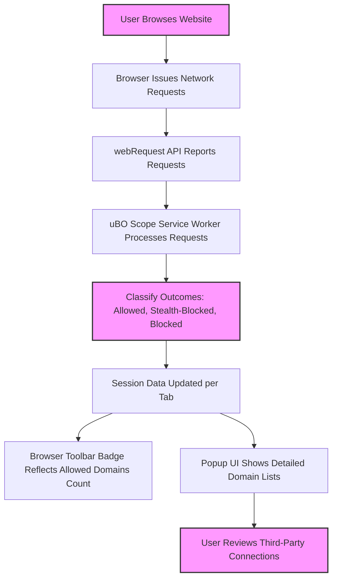

# Tips for Clearer Results and Fewer Connections

Optimize your browsing experience by applying proven practices to reduce third-party connections visible in uBO Scope. This guide compiles actionable tips to help you minimize exposure to remote servers, understand connection outcomes, and maintain a cleaner privacy posture while using the extension effectively.

---

## 1. Understanding Third-Party Connections

Before reducing connections, it's essential to grasp what uBO Scope reports:

- **Allowed domains** are remote third-party servers your browser successfully connected to.
- **Stealth-blocked** domains represent requests intercepted or redirected stealthily by content blockers or browsers, showing as blocked but sometimes invisible to webpages.
- **Blocked domains** are outright failed requests due to content blocking or network errors.

Remember, the badge count reports **distinct third-party remote domains with successful connections per tab**. Fewer distinct domains typically indicate better privacy outcomes.

<Tip>
Always interpret connection counts in context: some third-party domains are legitimate (e.g., common CDNs). Aim for meaningful reduction rather than zero, which is often impractical.
</Tip>

## 2. Workflow Overview

### Prerequisites
- uBO Scope extension installed and enabled on a supported browser.
- Basic familiarity with the popup UI and badge interpretation.

### Time Estimate
Following these tips should take under 10 minutes to implement initially. Benefits grow with continued application.

### Expected Outcome
- Reduced number of distinct third-party connections per browsing session.
- Clearer, more reliable popup reports with less noise.
- Enhanced ability to detect real tracking attempts and unnecessary connections.

## 3. Practical Tips to Reduce Connections

<Steps>
<Step title="Audit Your Current Browsing Setup">
Examine allowed third-party domains per tab using the uBO Scope popup. Identify domains frequently appearing across sites that may be unnecessary.

- Focus on domains fetching trackers or ads.
- Compare allowed versus stealth-blocked and blocked domains to understand what your current blockers intercept.
</Step>

<Step title="Use Trusted Content Blockers in Conjunction">
Employ reputable content blockers alongside uBO Scope for connection management.

- uBO Scope reports connections regardless of which blocker is used.
- Adjust your blocker’s filter lists to reduce connections to trackers, ad servers, and analytics domains.
</Step>

<Step title="Enable or Update Filter Lists Regularly">
Regularly update filter lists in your content blockers to keep blocking rules effective and comprehensive.

- New trackers and domains emerge; outdated filters allow more connections.
- Complement with regional or language-specific filter lists if applicable.
</Step>

<Step title="Disable Automatic Whitelisting or Allowances">
Review if your blockers or browsers have settings that allow certain third-party connections by default.

- Some browsers or extensions might silently allow popular CDN connections.
- Adjust settings to tighten permissions where possible.
</Step>

<Step title="Reduce Unnecessary Third-Party Content Usage">
When possible, opt for websites or services requiring fewer third-party resources.

- Prefer lean websites with minimal third-party scripts.
- Use reader modes or simplified views where available to cut third-party loads.
</Step>

<Step title="Clear Your Browser Cache and Cookies Regularly">
Cached scripts and cookies can reload trackers invisibly.

- Clearing these can force the browser to re-evaluate connections.
- Helps uBO Scope reflect live connection changes accurately.
</Step>

<Step title="Monitor and Analyze Stealth-Blocked Domains">
Stealth-blocked connections are those quietly intercepted.

- Use the uBO Scope popup’s stealth-blocked section to monitor hidden activities.
- Adjust filters or blocker settings if stealth blocking is insufficient.
</Step>
</Steps>

## 4. Best Practices for Maintaining Clarity in uBO Scope

- **Open the popup routinely** to check live tab data and domain counts.
- **Avoid coincidental blockage test sites** that do not reflect real-world connections (see core concepts documentation).
- **Use uBO Scope concurrently with your primary content blocker**; the extension is for insight, not blocking.
- Understand that some connections are essential (e.g., from CDNs) and cannot or should not be blocked.

<Note>
The extension highlights the number of distinct allowed domains — a meaningful privacy metric — rather than raw request counts or block counts.
</Note>

## 5. Common Pitfalls to Avoid

- **Misinterpreting the badge count:** A high number might indicate extra third-party domains loaded, not just blocked requests.
- **Relying on stale filter lists:** Without updates, blockers fail to reduce connections.
- **Ignoring stealth-blocked domains:** These often represent the most insidious tracking attempts silently thwarted.

## 6. Verification and Tracking Progress

Revisit uBO Scope popup after applying changes:

- Confirm the distinct domain count decreases.
- Check for reductions in allowed domains matching unwanted tracker hosts.
- Use the stealth-blocked list to observe changes in intercepted connections.

Repeat periodically to maintain a minimal set of necessary third-party connections.

## 7. Troubleshooting: When Connections Don’t Decrease

- **Blocked but persistent connections:** Some trackers use direct IPs or techniques bypassing webRequest API; these won't appear or be blockable here.
- **Invisible connections:** Traffic via browser plugins or WebSocket connections may not fully report.
- **Browser cache causing stale data:** Clear cache and revisit the site.

Refer to [Troubleshooting & Understanding Edge Cases](/guides/advanced-use/troubleshooting-and-edge-cases) for details.

## 8. Next Steps and Additional Resources

- Explore the [Analyzing Third-Party Connections Per Tab](/guides/main-workflows/analyzing-network-requests) guide to deepen your understanding of popup data.
- Review [Interpreting the Badge and Main UI](/guides/main-workflows/interpreting-badge) for comprehensive badge meaning.
- For filter maintainers, consult [Filter Maintainer Workflow](/guides/advanced-use/filter-maintainer-workflow) to optimize blocking sets based on uBO Scope insights.
- Keep your extension updated via official store links:
  - [Chrome Web Store](https://chromewebstore.google.com/detail/ubo-scope/bbdpgcaljkaaigfcomhidmneffjjjfgp)
  - [Firefox Add-ons](https://addons.mozilla.org/firefox/addon/ubo-scope/)

---

## Appendix: Example Scenario

Suppose you regularly visit a news website with uBO Scope:

- Badge count shows 15 third-party remote domains.
- You identify trackers like `tracking.example.com` and ad domains in the allowed list.
- After enabling stronger filter lists and tweaking blocker settings, the count drops to 7.
- Stealth-blocked domains increase, indicating more blocked trackers.
- This confirms the effectiveness of your changes, validating the clarity of connection reporting.

---

## Illustrative Mermaid Diagram: Typical Data Flow for Connection Reporting and User Insights

This flow helps visualize how network data is captured, processed, and surfaced by uBO Scope for actionable user insight.

---

For detailed background on terminology, architecture, and integration, please see:
- [Key Terms & Concepts](/overview/core-concepts-architecture/core-terminology)
- [How uBO Scope Works (Architecture Overview)](/overview/core-concepts-architecture/how-ubo-scope-works)
- [Integration & Compatibility](/overview/core-concepts-architecture/integration-context)

---

Feel free to combine these tips with regular review of your blockers and uBO Scope outputs for continuous privacy improvement.