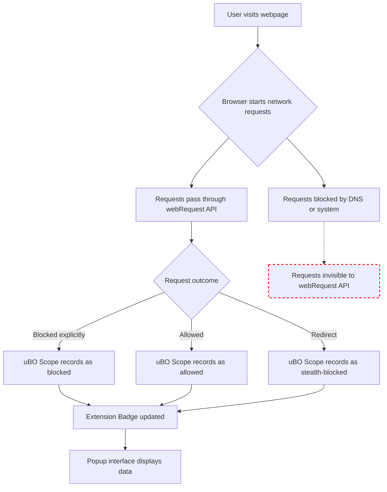

# Troubleshooting: When Some Requests Are Missing

## Overview
This section helps you diagnose why some network requests may not appear in the uBO Scope popup interface. Understanding these limitations is vital to correctly interpreting your network data and avoiding confusion when expected requests are missing.

uBO Scope relies on your browser's `webRequest` API to monitor network activity. However, certain types of requests or blocking mechanisms occur outside the visibility of this API, which means uBO Scope cannot report on them. This guide explains what these cases are, why they happen, and how to verify the completeness of your data.

---

## 1. Understanding the Scope and Limitations of WebRequest API

### What uBO Scope Monitors
- All HTTP/S and WebSocket network requests initiated by webpages that are visible through the browser's `webRequest` API.
- Requests made by the main document or subresources loaded within tabs.

### What uBO Scope Cannot See
- Network requests executed outside the browser’s context, such as those initiated by other software or the operating system.
- DNS requests blocked at the OS or network level before the browser initiates a connection.
- Connections blocked by external content blockers that operate at DNS or system firewall levels.
- Any request not reported through the browser's `webRequest` API.

<Tip>
The `webRequest` API is the backbone of uBO Scope. If a request does not traverse this API, uBO Scope cannot detect or analyze it.
</Tip>

---

## 2. Common Reasons for Missing Requests

### A. DNS or System-Level Blocking

Network calls may be blocked on your system or network before the browser attempts to connect:
- DNS-based blockers such as Pi-hole or custom DNS servers suppress domain name resolutions.
- Firewall or antivirus software preventing connections.

Requests blocked this way never appear to the browser's network stack, hence no records in the `webRequest` API.

<Warning>
If a request is missing due to DNS or system blocking, uBO Scope cannot show it as blocked or stealth-blocked. It simply won't appear at all.
</Warning>

### B. Requests Outside WebRequest API Reach

Some browsers might have internal network optimizations or private APIs that bypass `webRequest`:
- Preloaded or speculative connections.
- Service workers or extensions that cannot be intercepted.

These requests are invisible to uBO Scope.

### C. Browser or Extension Version Limitations

Older browser versions or incompatible configurations can reduce the completeness of data collected.

Verify your browser meets the minimum requirements:
- Chromium-based browsers require version 122+
- Firefox requires version 128+
- Safari requires version 18.5+

---

## 3. Diagnosing Missing Requests

Follow these steps to identify why certain requests are missing:

<Steps>
<Step title="Check Browser and Extension Versions">
Ensure your browser and uBO Scope extension are updated to supported versions. Outdated versions may have missing or incomplete webRequest support.
</Step>
<Step title="Generate Network Traffic in Tab">
Navigate to a website or web app known to contact third-party servers. Observe the uBO Scope badge and popup data updating accordingly.
</Step>
<Step title="Confirm Popup Data Displays Requests">
Open the uBO Scope popup to verify that allowed, blocked, and stealth-blocked domains are listed for the active tab.
</Step>
<Step title="Compare with Known System-Level Blockers">
Determine if you have DNS or firewall software that may silently block network requests. Temporarily disable them to test if more requests appear.
</Step>
<Step title="Use Browser Developer Tools">
Open Developer Tools > Network tab to see if requests register there but do not appear in uBO Scope.
If requests appear here but not in uBO Scope, there may be webRequest API limitations or timing issues.
</Step>
</Steps>

---

## 4. Practical Tips and Best Practices

- **Disable conflicting blockers:** When troubleshooting, disable other content blockers or system DNS filters to isolate uBO Scope's visibility.
- **Use realistic websites:** Test with common, real-world sites rather than artificial 'ad-blocker test' pages to check genuine network behavior.
- **Avoid browser optimizations:** Some browsers speculate network requests (e.g., prefetching) that may not be fully reported; this is expected behavior.
- **Verify extension permissions:** Check that uBO Scope has all required permissions (`webRequest`, `storage`, `activeTab`) to function fully.
- **Restart browser:** Sometimes restarting the browser refreshes extension permissions and clears cached state.

---

## 5. Troubleshooting Scenarios

<AccordionGroup title="Common Issues and Solutions">
<Accordion title="No Requests Appear in the Popup">
**Cause:** Extension may not be installed properly or permissions missing.

**Solution:** Reinstall uBO Scope, check permissions, and ensure extension icon appears in the toolbar.
</Accordion>
<Accordion title="Requests Appear in DevTools but Not in uBO Scope">
**Cause:** Requests blocked before the webRequest API can see them, or extension service worker unloaded.

**Solution:** Verify no system-level DNS or firewall blocking. Reload the extension. Allow network requests to complete.
</Accordion>
<Accordion title="Block Counts Not Updating Correctly">
**Cause:** Browser or extension race conditions, or webRequest listeners disabled.

**Solution:** Restart browser and uBO Scope. Update to latest browser version.
</Accordion>
<Accordion title="Stealth-Blocked Requests Not Showing">
**Cause:** Some stealth-blocked connections may be blocked too early, or outside API scope.

**Solution:** Use in conjunction with other developer tools to confirm network blocking layers.
</Accordion>
</AccordionGroup>

---

## 6. Understanding Visibility with Flow Diagram

This diagram visualizes points where network requests may become invisible to uBO Scope, specifically when blocked before reaching the webRequest API.

---

## 7. Additional Resources
- [System Requirements](https://yourdocs.com/getting-started/prerequisites-installation/system-requirements) – Ensure your environment supports full functionality.
- [Understanding the Popup: Allowed, Blocked, and Stealth Domains](https://yourdocs.com/guides/interpreting-results/understanding-popup) – Learn more about the different request categories.
- [Quick Validation Checklist](https://yourdocs.com/getting-started/validation-troubleshooting/quick-validation) – Step through essential checks for verifying uBO Scope operation.

---

## Summary
When some network requests are missing from uBO Scope's data, it is often due to inherent limitations of the browser's `webRequest` API or prior blocking at DNS or system levels. This page guides you through identifying these scenarios and offers practical troubleshooting steps to confirm accurate and complete network visibility through the extension.

