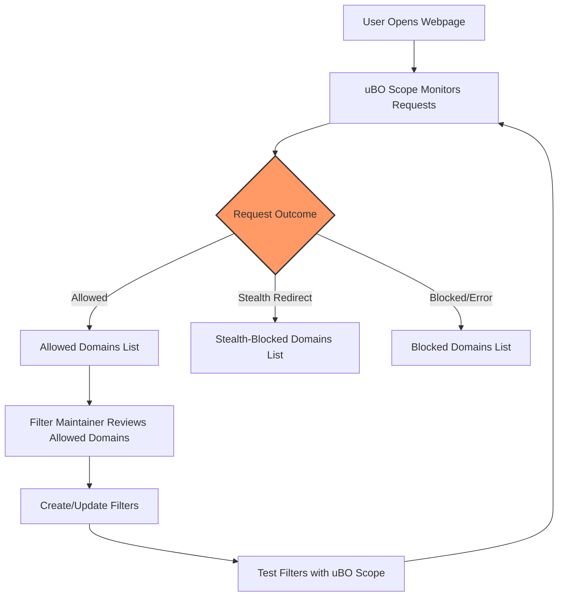

# Using uBO Scope for Filter List Maintenance

uBO Scope is an essential tool for filter list maintainers and privacy researchers who need clear visibility into which third-party domains are contacted by web pages, especially in environments where traditional browser developer tools are unavailable or limited. This guide explains how to leverage uBO Scope to identify unblocked domains, assess the effectiveness of content blocking filters, and collect evidence to support updates and refinements to filter lists.

---

## 1. Overview

uBO Scope reveals all network requests made by your browser on a given webpage, categorized into **allowed** (not blocked), **stealth-blocked**, and **blocked** domains. As a filter list maintainer, you want to identify which domains are slipping past existing filters and which ones are correctly blocked, to improve your filter rules.

This page focuses exclusively on how uBO Scope supports this workflow:

- **Documenting unblocked domains** that might need blocking.
- **Evaluating current filter effectiveness** based on real network activity.
- **Gathering concrete evidence** about network request outcomes to justify filter list adjustments.

---

## 2. Prerequisites

Before you begin:

- Ensure uBO Scope is installed and activated in your supported browser (Chrome, Firefox, Safari). Refer to the [Browser Installation Guide](getting-started/install-and-requirements/browser-installation) if needed.
- Confirm that uBO Scope is operational by viewing the toolbar badge and popup activity data. See [Validating Successful Setup](getting-started/first-run-and-setup/quick-validation).
- Have the webpage loaded in a browser tab where you want to analyze filter performance.

---

## 3. Step-by-Step Instructions for Filter List Maintenance

<Steps>
<Step title="Open the uBO Scope Popup for the Target Page">
Click the uBO Scope extension icon in your browser’s toolbar while the webpage tab is active. This opens the popup panel displaying network connection summaries.
</Step>
<Step title="Understand Domain Categorization">
Inside the popup, you’ll see three key sections:

- **Not blocked (allowed)**: Domains where connections succeeded and requests were not blocked.
- **Stealth-blocked**: Domains where requests were redirected, filtered stealthily by content blockers.
- **Blocked**: Domains with requests explicitly blocked or failed.

Focusing on the **not blocked** list is crucial for filter maintenance, as these domains might require new blocking rules.
</Step>
<Step title="Document Unblocked Domains for Review">
Review the list of domains in the "not blocked" section. Each domain is accompanied by a badge count indicating the number of network requests made.

- Export or manually note these domains for further analysis.
- Look for unexpected or suspicious third-party domains that should ideally be blocked.
- Use this data as evidence for creating or refining filter rules.
</Step>
<Step title="Assess Filter Effectiveness">
Compare the allowed domains with those in the blocked and stealth-blocked sections.

- Domains that appear only in allowed indicate gaps in existing filters.
- Stealth-blocked domains show more subtle filtering that might impact certain resource connections.
- Blocked domains confirm rules currently working effectively.

This triage helps prioritize updating filter lists where allowed domains are high-priority.
</Step>
<Step title="Iterate With Browsing Sessions">
Repeatedly test different webpages and browsing scenarios to build a comprehensive domain list.

- Verify whether newly added filters reduce the number of allowed domains in subsequent tests.
- Use the count in the toolbar badge as a quick indicator of improvements.

Also, note that the popup updates dynamically with page navigation and resource loading.
</Step>
</Steps>

---

## 4. Practical Tips & Best Practices

- **Verify domain basenames**: uBO Scope automatically extracts and groups by the base domain using the Public Suffix List. This ensures filters target appropriate domain levels.
- **Count badges mean frequency**: Higher badge counts reflect more frequent requests to that domain, deserving closer scrutiny.
- **Use Unicode domain names carefully**: uBO Scope displays Internationalized Domain Names (IDN) in Unicode format, making international domains easier to recognize.

<Tip>
Leverage uBO Scope on devices where browser dev tools are limited or unavailable, such as mobile browsers or restrictive environments. It remains a reliable auditing tool across platforms.
</Tip>

<Tip>
Combine your observations here with the [Analyzing Allowed, Stealth, and Blocked Domains](guides/core-workflows/analyzing-allowed-stealth-blocked) guide to deepen your understanding of request outcomes.
</Tip>

---

## 5. Common Pitfalls & Troubleshooting

<AccordionGroup title="Troubleshooting Filter List Maintenance with uBO Scope">
<Accordion title="No Data or Empty Popup on Page">

This may indicate the extension isn't capturing network requests.
- Confirm that uBO Scope is activated and granted the necessary permissions.
- Reload the page or try a different tab.
- Check the [Troubleshooting Common Setup Issues](getting-started/troubleshooting/common-issues) guide for detailed help.

</Accordion>
<Accordion title="Domains Appear Only in Allowed Section Despite Blocking">

This can happen if your blocking filters are incomplete or the content blocker uses stealth mode, making some requests appear allowed.
- Review your filter syntax and sources.
- Use the stealth-blocked list to identify stealth filtering effects.
- Consider updating or resetting filters if unexpected domains remain allowed.

</Accordion>
<Accordion title="Unblocked Domains Appear as Minor or Rare Requests">

Sometimes domains with low request counts are excluded from blocking filters.
- Determine if blocking these domains is critical or if they pose minimal privacy risk.
- Prioritize blocking domains with higher impact (higher badge counts).

</Accordion>
</AccordionGroup>

---

## 6. Example: Using uBO Scope to Identify Unblocked Domains

Imagine you’re maintaining a filter list for a popular news website. You load the site, open uBO Scope, and observe:

- Badge count 12 indicating 12 distinct allowed third-party domains.
- Among allowed domains, `thirdpartyads.com` and `trackers.example.net` appear prominently with high request counts.
- In blocked and stealth-blocked sections, some analytics and ad-serving domains appear, but key unwanted domains are still allowed.

Based on this evidence, you decide to write new filter rules targeting `thirdpartyads.com` and related domains to enhance user privacy.

---

## 7. Next Steps

- Test your filter list changes across multiple websites using uBO Scope to verify improvements.
- Consult [Analyzing Allowed, Stealth, and Blocked Domains](guides/core-workflows/analyzing-allowed-stealth-blocked) for detailed domain analysis techniques.
- Explore the [Performance Tips and Known Limitations](guides/advanced-use/performance-and-limitations) guide to optimize usage on large-scale tests.
- Participate in filter list communities and contribute your findings.

---

## 8. Additional Resources

- [Browser Installation Guide](getting-started/install-and-requirements/browser-installation)
- [Validating Successful Setup](getting-started/first-run-and-setup/quick-validation)
- [Analyzing Allowed, Stealth, and Blocked Domains](guides/core-workflows/analyzing-allowed-stealth-blocked)
- [Troubleshooting Common Setup Issues](getting-started/troubleshooting/common-issues)
- uBO Scope GitHub Repository: [https://github.com/gorhill/uBO-Scope](https://github.com/gorhill/uBO-Scope)

---

## 9. Summary Diagram

This diagram illustrates the user flow in using uBO Scope for filter list maintenance: observing, categorizing network requests, reviewing allowed domains for potential filtering, creating filter rules, and validating them through repeated testing.
