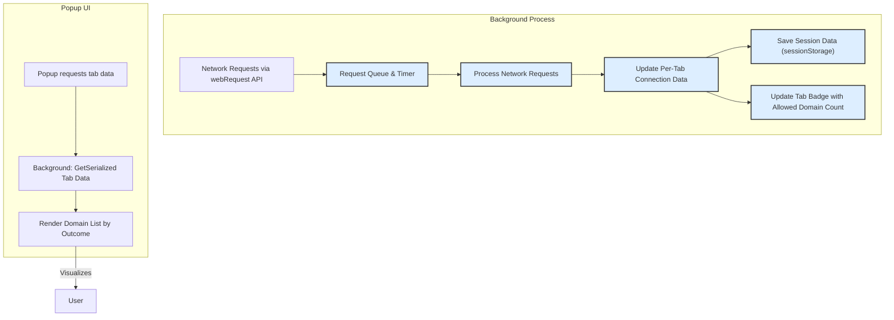

# Ensuring Performance and Data Integrity in uBO Scope

uBO Scope balances comprehensive network connection tracking with efficient performance and robust data accuracy. This guide explains how uBO Scope manages session data, updates tab badges dynamically, and utilizes best practices to keep network connection metrics reliable and responsive as you browse.

---

## 1. Understanding Data Handling and Session Management

### What uBO Scope Tracks

- **Per-Tab Data**: uBO Scope maintains connection details scoped to each browser tab, differentiating main domains and third-party connections.
- **Connection Outcomes**: Connections are categorized as Allowed, Blocked, or Stealth-blocked with counts per domain.
- **Session Persistence**: Data is stored during your browsing session using session storage to retain performance while allowing cleanup once tabs close.

### How Data is Stored

- **Session Storage Usage**: Network request outcomes and tab details are serialized and saved using browser session storage (`sessionWrite` and `sessionRead`).
- **Public Suffix List**: To accurately group domain data, uBO Scope loads and caches the official Public Suffix List.

> This approach ensures minimal resource use and enables efficient serialization and deserialization of network data.

### Benefits

- Performance is preserved as data handling uses asynchronous reads/writes and batch processing.
- Data integrity is maintained by clearing tab data once tabs close, preventing stale or orphaned entries.

---

## 2. Real-time Badge Updates and UI Responsiveness

### Dynamic Badge Text

- The browser action badge reflects the count of **distinct allowed third-party domains** for the active tab.
- Updates are triggered when the extension processes new network events, ensuring the badge reflects the current network profile.

### Efficient Event Processing

- Network events (`redirect`, `error`, `success`) are queued and processed in batches asynchronously to avoid performance bottlenecks.
- The extension uses timers to group incoming network requests and updates tab data and badges after a short delay.

### Popup Rendering

- The popup UI asynchronously requests and displays the latest per-tab network data.
- Domains are grouped by outcome category, sorted alphabetically for quick scanning.

---

## 3. Best Practices for Maintaining Accurate and Responsive Data

### Keep Browser and Extension Updated

Ensure your browser version satisfies the minimum requirements for uBO Scope, as listed in the [System Requirements & Supported Browsers](https://example.com/getting-started/setup/prerequisites) guide. Updates improve API compatibility and storage reliability.

### Avoid Browsing Habits That Complicate Tracking

- Rapidly opening and closing tabs can delay or complicate data persistence; wait a few seconds for the badge to update.
- Using other extensions that heavily modify web requests might interfere with event reporting.

### Recognize Limitations

- Network requests originating outside the webRequest API scope (e.g., native DNS requests, some native apps) cannot be tracked.
- Some stealth blocking mechanisms may only be partially reflected due to browser API constraints.

### Extension Settings and Permissions

- Check that storage permissions are granted to allow session data operations.
- If experiencing badge or popup delays, verify that session storage is accessible and not being cleared by browser privacy settings.

---

## 4. Troubleshooting Common Performance and Data Integrity Issues

<AccordionGroup title="Common Issues and Solutions">
<Accordion title="Persistent Badge Count Not Updating">
If the badge count does not update after navigating:

- Reload the tab or open the popup manually to force data refresh.
- Ensure no conflicting extensions are blocking webRequest events.
- Check for any browser errors in the extension console.
</Accordion>
<Accordion title="Popup Shows No Data or Stale Data">
- Close and reopen the popup to fetch fresh data.
- Verify the background script is running and session storage is functional.
- Restart the browser to reset extension state.
</Accordion>
<Accordion title="Tab Data Not Resetting on Close">
- This may be caused by unexpected browser behavior or crashing.
- Check if tab removal events trigger properly; try disabling other extensions.
- Refer to the [Troubleshooting Installation & Common Issues](https://example.com/getting-started/validate-and-troubleshoot/troubleshooting) guide.
</Accordion>
</AccordionGroup>

---

## 5. Tips for Optimizing uBO Scope Experience

- Regularly clear temporary browser data if stale counts persist.
- Use the extension on tabs where detailed network insight is critical; avoid background tabs for real-time accuracy.
- If you maintain filter lists, leverage uBO Scope's domain counts to verify stealth-block behavior regularly.

---

## 6. How uBO Scope Fits Into Your Privacy Workflow

By managing data efficiently and reliably, uBO Scope serves as a trustworthy companion to privacy-focused users:

- It reveals the *true* number of third-party connections regardless of content blocking.
- Badge counts provide immediate, meaningful insight without spurious inflation.
- The responsive popup allows quick investigation of domains driving network activity.

Use this page's practices along with other documentation to maintain accuracy and performance:

- [Understanding Allowed, Blocked, and Stealth Connections](https://example.com/guides/analyzing_connections/understanding-domain-connections)
- [Your First Insights: Interpreting the Popup](https://example.com/guides/getting_started/first-insights)

---

## 7. References & Further Reading

- Source code for session management and background processing: `js/background.js`
- Popup UI data rendering and badge update flow: `js/popup.js`
- Browser compatibility and permissions: [System Requirements & Supported Browsers](https://example.com/getting-started/setup/prerequisites)

---

## Appendix: Background Data Flow Diagram

This diagram highlights how uBO Scope collects, processes, and reports network connection data efficiently and reliably while maintaining the performance and data integrity central to user experience.
