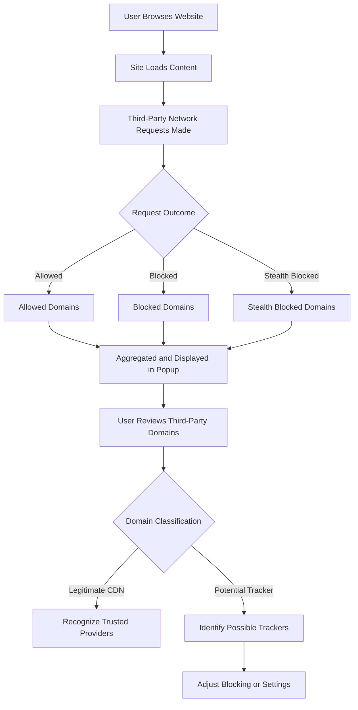

# Real-World Usage: Understanding Third-Party Trackers

## Overview

This guide walks you through how to use the uBO Scope popup interface to track and interpret third-party connections when browsing everyday websites. You will learn how to review the different categories of network requests displayed in the popup — allowed, blocked, and stealth-blocked — and how to distinguish legitimate content delivery networks (CDNs) from potential trackers.

By mastering these insights, you enhance your ability to monitor your online privacy, spot unusual or unnecessary third-party connections, and make informed decisions about content blocking.

## Prerequisites

- Have uBO Scope installed and enabled in your supported browser (Chrome 122+, Firefox 128+, or Safari 18.5+).
- Browse or reload a typical website to generate third-party network request data.
- Familiarity with basic browsing and recognizing domains.

## Expected Outcome

After completing this guide, you will be able to:

- Open and navigate the uBO Scope popup interface.
- Interpret the connection counts and categories for the active tab.
- Understand the significance of allowed, blocked, and stealth-blocked requests.
- Identify common legitimate domains like CDNs versus potential trackers.

## Time Estimate

Approximately 10 minutes.

## Difficulty Level

Beginner to Intermediate.

---

## Understanding the uBO Scope Popup Interface

### Step 1: Open the uBO Scope Popup

- Click the uBO Scope extension icon near your browser's address bar to open the popup.
- The popup will display details for the currently active tab.

### What You See:

- **Hostname Header:** Shows the current tab's hostname and domain.
- **Summary Section:** Displays the total number of distinct third-party domains connected.
- **Three Outcome Sections:**
  - **Not Blocked (Allowed):** Domains from which resources were successfully fetched (connections allowed).
  - **Stealth-Blocked:** Domains where requests were silently redirected or blocked without an explicit error. This often corresponds to stealth blocking by content blockers.
  - **Blocked:** Domains for which requests failed or were actively blocked (e.g., by your content blocker or network policies).

### Step 2: Review the Summary Count

- The number under 'domains connected' is the count of distinct third-party domains that your browser contacted successfully.
- A **lower count** is preferable since it indicates fewer external domains were allowed.

### Step 3: Explore Domain Lists in Each Category

- Each category lists domains along with a small badge showing the number of times that domain was contacted.
- Domains are sorted alphabetically for easy scanning.

### Step 4: Distinguish Legitimate CDNs vs. Potential Trackers

- **Legitimate CDNs Examples:**
  - `cdn.jsdelivr.net`
  - `cloudflare.net`
  - `akamai.net`

These domains typically support delivery of scripts, images, or styles essential for site functionality.

- **Potential Trackers:**
  - Unknown or obscure third-party domains frequently making requests.
  - Domains linked to advertising, analytics, or social media tracking.

**Tip:** Use the domain name and your judgment about the site's nature. Many trusted websites use CDNs, so not all third-party domains are harmful.

---

## Detailed Example Walkthrough

Imagine you visit a news site. After loading the page:

- Open uBO Scope popup.
- The summary shows `12` domains connected.

Under **Not Blocked**, you find domains like:

- `cloudflare.net` (53 requests)
- `cdn.jsdelivr.net` (12 requests)

Under **Stealth-Blocked**, you see:

- `ads.example.com` (7 requests)

Under **Blocked**, you see:

- `tracker.example.org` (15 requests)

**Interpretation:**

- The allowed domains are mainly CDNs supporting site delivery.
- The stealth-blocked and blocked domains belong to ad or tracking networks, blocked by your content blocker silently or explicitly.

This shows uBO Scope clearly reports the real-world network activity and blocking outcomes.

---

## Troubleshooting Common Issues

<AccordionGroup title="Troubleshooting Real-World Usage">
<Accordion title="Popup Shows No Data or 'NO DATA'">
- Ensure the webpage has fully loaded and made network requests.
- Refresh the page and popup if needed.
- Check that the extension has the required permissions (webRequest, activeTab).
- See the [Troubleshooting Common Setup Issues](https://github.com/gorhill/uBO-Scope/wiki/Troubleshooting) guide.
</Accordion>
<Accordion title="Domains Seem Unexpected or Confusing">
- Remember uBO Scope reports *all* third-party connections, including legitimate services.
- Cross-check suspicious domains via online lookup services to verify legitimacy.
- Review the [Core Concepts & Terminology](../overview/introduction-core-concepts/core-concepts-terminology) for definitions.
</Accordion>
</AccordionGroup>

---

## Best Practices & Tips

- **Check Badge Counts Regularly:** Use the toolbar badge count as a quick privacy snapshot.
- **Use the Extension While Browsing:** Open the popup frequently on sites you want to audit.
- **Complement with Blockers:** uBO Scope reveals network activity but works well alongside a configured content blocker.
- **Look for Domain Clusters:** Legitimate CDNs tend to appear consistently across trusted sites.
- **Stay Updated:** Watch for extension updates to get new filtering and reporting features.

---

## Next Steps & Related Content

- After understanding trackers, delve into [Making Sense of Badge Counts and Block Metrics](../badge-counts) for deeper insights.
- Explore [Use Cases for Filter List Maintainers](../use-cases-filterlists) to see how experts utilize this data.
- Revisit [How It Works: Architecture & Data Flow](../../overview/architecture-usage/how-it-works-arch-diagram) for internal process overview.

---

## Additional Resources

- uBO Scope GitHub Repository: [https://github.com/gorhill/uBO-Scope](https://github.com/gorhill/uBO-Scope)
- Public Suffix List (used for domain grouping): [https://publicsuffix.org/](https://publicsuffix.org/)

---

## Visual Flow of Using uBO Scope Popup

This flow captures the user experience of seeing network activity in real time, categorizing requests, and making informed privacy decisions.

---

## Summary

By following this guide, you will become adept at interpreting the uBO Scope popup display and distinguishing between safe content delivery and potential privacy risks in real-world browsing.

Focus on real sites, notice patterns, and use the information to refine your blocking or simply be better informed about where your browser connects.

