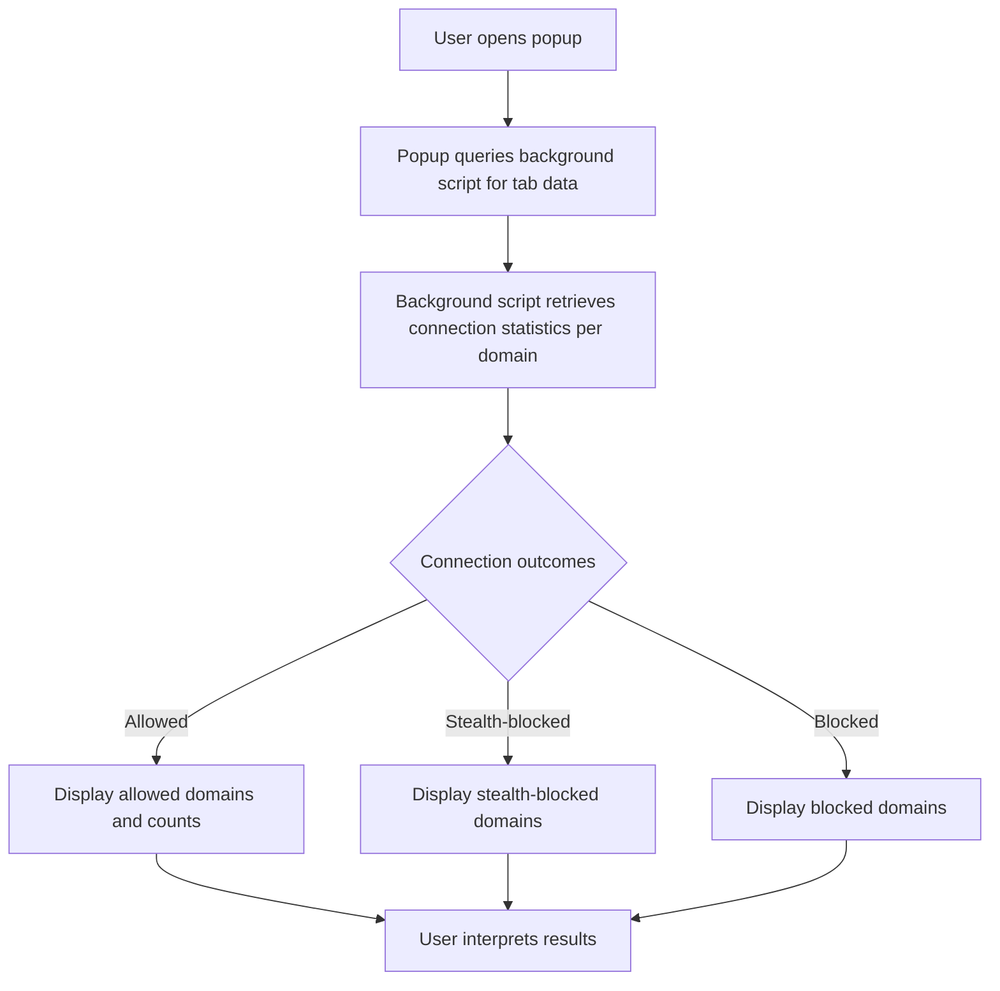

# Interpreting Domain Connection Statistics

Understanding the connection statistics presented by uBO Scope empowers you to gain real insights into network activity on the current browser tab. This guide walks you through how to read the popup interface’s domain connection statistics, distinguishing trusted vs. third-party domains and interpreting network request outcomes effectively.

---

## 1. What This Page Helps You Accomplish

- Learn how to interpret the categorized domain connection listings shown by uBO Scope.
- Understand the statuses "allowed", "stealth-blocked", and "blocked" for domains.
- Differentiate between first-party (trusted) and third-party domains.
- Grasp how the extension tracks and displays connection outcomes by domain.
- Use the information to evaluate network activity and privacy implications.

---

## 2. Prerequisites

Before using this guide, ensure:

- uBO Scope is installed and enabled in your browser (refer to [Installing uBO Scope](../installing-ubo-scope)).
- You have loaded a webpage/tab and opened the uBO Scope popup to view real-time connection data (see [Your First Usage: Viewing Remote Connections](../../getting-started/using-extension/first-usage)).
- Basic understanding of browser tabs and domains.

---

## 3. Expected Outcome

By the end of this guide, you will confidently be able to read the domain connection statistics panel within uBO Scope’s popup interface and understand what the counts and categories mean in terms of network request results and privacy status.

---

## 4. Time Estimate and Difficulty

- Time to complete: 5–7 minutes
- Difficulty: Beginner to Intermediate

---

## 5. Understanding the Domain Connection Statistics Panel

When you open the uBO Scope popup on an active tab, it presents a clear summary of network connections made by that tab.

### 5.1 The Panel Structure

- **Hostname Display:** At the top, the popup shows the hostname and its domain corresponding to the active tab.
- **Summary Section:** Shows the total number of unique domains contacted.
- **Outcome Sections:** Divided into three categories:
  - **Allowed (not blocked)**
  - **Stealth-blocked**
  - **Blocked**

Each section lists domains observed with counts of how many requests were made to them.

### 5.2 What the Outcomes Mean

| Outcome         | Meaning                                                                                     |
|-----------------|---------------------------------------------------------------------------------------------|
| **Allowed**     | These domains received network requests which were completed successfully (not blocked).   |
| **Stealth-blocked** | Domains for which requests were redirected or canceled silently by content blockers, without alerting the site. |
| **Blocked**     | Domains for which network requests were explicitly blocked by the content blocker or by network errors reported. |

### 5.3 Domains and Counts

- Domains reflect the *registered domain* as determined by the Public Suffix List (PSL).
- Each domain entry shows a badge with the count of requests made to that domain.
- Counts help identify which domains are most contacted or targeted by blocking measures.

### 5.4 Trusted vs. Third-Party Domains

- The **tab’s domain** (i.e., the website you are visiting) is considered first-party or trusted.
- Domains shown are almost always third-party remote servers contacted by the tab.
- uBO Scope focuses on tracking third-party domains to highlight potential privacy concerns.

### 5.5 Visual Cues

- Allowed domains highlight in green shades to indicate successful connections.
- Stealth-blocked and blocked domains highlight in red shades, signaling blocked or suspect activity.
- Sections with no domains are hidden to reduce visual clutter.

---

## 6. Step-by-Step: Reading and Making Sense of the Data

<Steps>
<Step title="Open the uBO Scope Popup">
Open the extension’s toolbar icon on the active browser tab to reveal the popup interface.
</Step>
<Step title="Identify the Tab Hostname and Registered Domain">
At the top header, note the hostname and its registered domain. This helps you understand what site’s activity you are viewing.
</Step>
<Step title="Check the Total Domains Connected">
Refer to the summary section showing how many unique domains were contacted. A higher number indicates more third-party requests.
</Step>
<Step title="Explore the Allowed Section">
Review the domains here — these are your successful outbound connections. Expect CDN domains and frequently used services here.
</Step>
<Step title="Review Stealth-Blocked Domains">
Look at stealth-blocked domains that were silently rerouted or canceled. This is indicative of background blocking which does not break site functionality visibly.
</Step>
<Step title="Analyze Blocked Domains">
Notice the domains explicitly blocked — these represent network requests that were stopped by your content blocker or due to errors.
</Step>
<Step title="Interpret Counts Per Domain">
For each domain, the count shows how many connection attempts were made. High counts to blocked domains may indicate aggressive blocking.
</Step>
<Step title="Correlate Domain Names with Services">
Translate domain names to known vendor or service names to understand the nature of connections (e.g., analytics, ad servers, CDNs).
</Step>
<Step title="Assess Privacy Implications">
Use the data to judge whether expected or unexpected third-party domains are contacted on the current webpage.
</Step>
</Steps>

---

## 7. Tips and Best Practices

- **Focus on Third-Party Domains:** The badge count and popup list emphasize third-party connections, which are most relevant for privacy.
- **A Lower Number is Better:** A smaller count of allowed third-party domains generally means fewer external connections, enhancing privacy.
- **Use Counts to Spot Anomalies:** Unexpected spikes in counts or new domains could indicate tracking or malware activity.
- **Check Both Allowed and Blocked Lists:** This gives a realistic picture of what connections succeed and which ones your blocker prevents.

<Note>
The badge in the toolbar also reflects the count of distinct allowed third-party domains. This quick visual indicator complements insights from the popup.
</Note>

---

## 8. Common Pitfalls and Troubleshooting

<AccordionGroup title="Troubleshooting Domain Connection Statistics">
<Accordion title="Popup Shows No Data or 'NO DATA'">
- This occurs if the tab has not loaded or network activity is not yet recorded.
- Try refreshing the page or switching to a tab with active network requests.
</Accordion>
<Accordion title="Counts Seem Low or Inaccurate">
- uBO Scope measures network requests reported by the browser’s webRequest API.
- Network requests outside webRequest reach (e.g., encrypted DNS or browser internal requests) will not be shown.
- Some third-party requests might be stealth blocked silently.
</Accordion>
<Accordion title="Domain Names Are Not Clear or Unexpected">
- Domains are registered domains derived using the Public Suffix List.
- Use online domain lookup tools if unsure about a domain.
- Unicode domains are displayed in Unicode for clarity.
</Accordion>
</AccordionGroup>

---

## 9. Real-World Example

Imagine visiting a news website that loads scripts and images from multiple ad networks and analytics vendors.

When you open the uBO Scope popup, you will see:
- The site’s domain shown at the top.
- In `Allowed`, CDN providers and analytics domains that were allowed.
- In `Stealth-blocked`, some tracking domains that the content blocker silently stopped.
- In `Blocked`, domains explicitly blocked due to filter rules.

You can identify which external servers your browser contacts, the degree of blocking, and decide if the privacy posture matches your expectations.

---

## 10. Next Steps

- Learn how to verify the effectiveness of your content blocker with [Verifying Effectiveness of Content Blockers](../verifying-content-blocker-effectiveness).
- Deepen your understanding of remote connections and the implications of the toolbar badge in [Understanding the Toolbar Badge Count](../../guides/getting-started-with-ubo-scope/understanding-the-badge).
- Troubleshoot common issues related to connection data with [Troubleshooting Common Setup Problems](../../getting-started/using-extension/common-issues).

---

## Appendix: Glossary of Key Terms

- **Domain:** The registered domain name derived from the hostname using the Public Suffix List.
- **Hostname:** The full host identifier in a URL (e.g., subdomain.example.com).
- **Allowed:** Network requests to domains completed successfully.
- **Blocked:** Network requests prevented or failed.
- **Stealth-blocked:** Network requests silently redirected or canceled to avoid detection by the webpage.

---

## References

- [Public Suffix List](https://publicsuffix.org/) — Defines effective top-level domains used to derive registered domains.
- [uBO Scope on GitHub](https://github.com/gorhill/uBO-Scope) — Source and documentation repository.

---

## Visual Overview Diagram

---

With this guide, you are equipped to transform the connection statistics panel into actionable insight, enhancing your browsing privacy awareness and control.

---

# End of Guide
