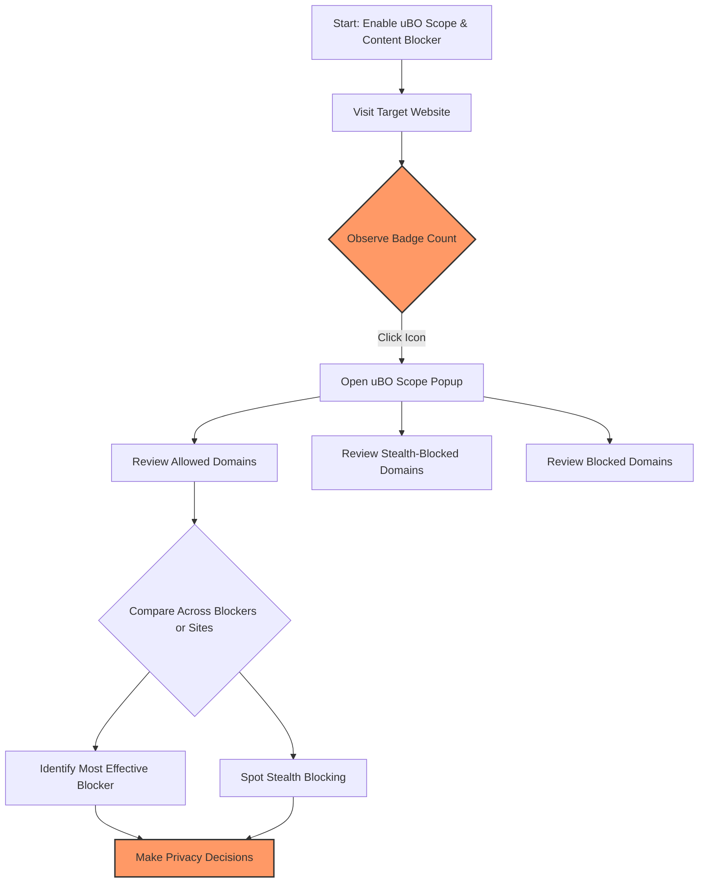

# Evaluating Effectiveness of Content Blockers with uBO Scope

## Overview

This scenario-driven tutorial guides you through using **uBO Scope** to accurately assess how effective your content blockers are at controlling third-party connections. With uBO Scope, you can verify the actual third-party remote servers your browser connects to under different blocking strategies, debunk common assumptions about block counts, and recognize misleading metrics commonly presented by other tools.

## Prerequisites

- uBO Scope installed and enabled in your browser (Chromium 122+, Firefox 128+, or Safari 18.5+).
- A content blocker active in your browser (e.g., uBlock Origin, AdGuard, or browser-native blockers).
- Basic familiarity with browser toolbar extensions and accessing browser extension popups.
- A test website or multiple websites you want to analyze.

## What You Will Achieve

- Understand the true meaning behind the badge count displayed by uBO Scope.
- Learn to differentiate real allowed third-party connections from blocked and stealth-blocked ones.
- Develop the skill to critically evaluate block counts that other blockers report.
- Be able to avoid misleading 'ad blocker test' sites and rely on accurate network connection data.

## Time Estimate

Approximately 15-25 minutes to complete the workflow, depending on practice and the number of blockers/websites tested.

## Difficulty Level

Intermediate — Users should be comfortable using browser extensions and interpreting network-domain concepts.

---

# Step-by-Step Guide

### Step 1: Launch uBO Scope on your Target Page

1. Navigate to the website you want to test while your chosen content blocker is active.
2. Click the uBO Scope toolbar icon. The badge shows a number representing the unique third-party domains connected to.
3. Open the uBO Scope popup for detailed insights by clicking the icon.

**Expected result:** The popup shows three connection categories:

- **Not Blocked:** Domains from which network connections succeeded.
- **Stealth-Blocked:** Domains where connection attempts were subtly redirected or altered.
- **Blocked:** Domains from which requests were outright blocked by your content blocker.

<Tip>
The number on the toolbar icon badge is the count of unique third-party domains your browser connected to, not the block count. Lower values indicate fewer third-party connections and better privacy.
</Tip>

### Step 2: Understand the Categories in the Popup

- **Not Blocked:** These are third-party servers your browser successfully connected with that were allowed by your content blocker. Expect legitimate CDNs or essential service domains here.

- **Stealth-Blocked:** These represent connections that were intercepted or redirected, typically by stealth blocking techniques used by blockers to avoid webpage breakage or detection. They are different from outright blocked connections.

- **Blocked:** Domains you explicitly blocked, with no successful connection. This often includes trackers or ad servers.

**Expected result:** You will see a clear list of domain names with connection frequencies under each category.

<Note>
Understanding these categories helps reveal what your content blocker truly blocks and what it allows, often showing more than the simple badge count suggests.
</Note>

### Step 3: Compare Different Content Blockers and Settings

1. Repeat the above two steps on the same target website with different content blockers enabled or with different blocker profiles (e.g., different filter lists).
2. Observe the change in the badge count and the popup detail:
   - Does switching blockers reduce the unique allowed domains?
   - Does a higher block count on an icon correspond to fewer allowed domains?

**Key insight:** A blocker reporting a high badge block count does not necessarily block more unique third-party domains. uBO Scope focuses on distinct allowed connections, which directly impact privacy.

<Tip>
Use the popup domain lists to see exactly which domains are allowed or blocked, instead of just relying on the badge count.
</Tip>

### Step 4: Recognize and Avoid Misleading Ad Blocker Test Sites

- Do not trust results from so-called “ad blocker test” webpages that attempt to measure blocker effectiveness by generating artificial requests.
- These test sites often:
  - Create many fabricated network requests that don’t mirror real-world web activity.
  - Fail to account for stealth blocking techniques, resulting in misleading pass/fail signals.

Instead, rely on uBO Scope’s direct observation of actual network requests occurring in real browsing scenarios.

### Optional Step 5: Advanced: Use uBO Scope for Filter List Maintenance

Filter list maintainers can utilize uBO Scope to:
- Validate that updates effectively block the intended third-party domains.
- Detect unintentional allowances or stealthy redirects.
- Improve filter quality based on real request observations.

---

## Practical Examples

### Example 1: Evaluating uBlock Origin vs. Another Blocker

- Load your favorite news site with uBlock Origin enabled.
- Open uBO Scope popup and note the number of allowed domains.
- Disable uBlock Origin and enable another blocker; reload the page.
- Open uBO Scope popup and compare allowed domain counts.

**Result:** Which blocker actually allows fewer unique third-party domains? The badge block count on other blockers may be higher, but the allowed connections list reveals the truth.

### Example 2: Spotting Stealth Blocking in Action

- On a social media site, open uBO Scope popup.
- Notice domains listed under stealth-blocked.

**Interpretation:** These servers attempted connections but were intercepted stealthily, minimizing detection and webpage disruption.

---

## Tips and Best Practices

- **Focus on allowed connection counts:** This number is the most meaningful privacy indicator.
- **Use the popup domains list for granular insight:** Exploring the exact domains provides clarity beyond raw counts.
- **Understand stealth blocking:** It is a common technique that hides blocking activity but impacts privacy.
- **Test on real-world websites:** Avoid artificial test pages that generate unrealistic network traffic.
- **Regularly update uBO Scope and your blockers:** To ensure accurate and up-to-date measurements.

## Troubleshooting

### Issue: The badge count does not change after switching blockers

- Verify that you reloaded the webpage after changing content blockers.
- Confirm that uBO Scope has necessary permissions (usually granted during installation).
- Check if uBO Scope popup updates by opening and closing it.
- If problem persists, restart the browser.

### Issue: No domain data appears in the popup

- Ensure you are on an active browsing tab with network activity.
- Refresh the page to trigger new network requests.
- Confirm uBO Scope extension is enabled and not disabled by the browser.

### Issue: Confusing domain names or encodings

- uBO Scope uses the Public Suffix List to accurately identify domains.
- Unicode punycode domains are converted for readability in the popup.

---

## Next Steps & Related Content

- Explore [Understanding the Extension Popup and Badge Count](/guides/getting-started/first-look-popup) to master popup usage.
- Try the [Step-by-Step: Monitoring Website Connections](/guides/analyzing-connections/workflow-monitoring) guide for broader network analysis skills.
- Consult [Core Concepts & Terminology](/overview/system-concepts-and-architecture/core-concepts-terminology) for deeper understanding of connection categories.
- Visit [Best Practices for Interpreting Results](/guides/advanced-troubleshooting/best-practices) to enhance your analysis techniques.

---

## Summary Diagram

This flow illustrates the user process for evaluating content blockers with uBO Scope, from enabling extensions through detailed analysis and decision making.
