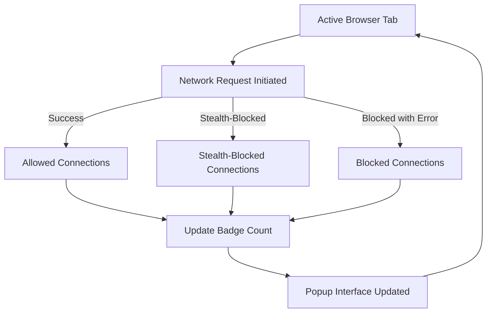

# Interpreting Network Activity: Allowed, Blocked, and Stealth Connections

## Understanding the Badge and Popup Status: Your Gateway to Network Transparency

When you install uBO Scope, the toolbar badge and popup interface become your chief tools for monitoring the distinct third-party remote servers your browser interacts with. This guide dives into deciphering what the badge numbers mean, how to read the popup connection details, and strategies to differentiate between benign services, advertising domains, and stealth-blocked attempts.

---

## 1. Workflow Overview

### What This Guide Helps You Achieve
- Grasp the semantics behind the toolbar badge count and popup connection categories.
- Learn how to read and interpret connection outcomes displayed in the popup for any active browser tab.
- Identify practical methods to distinguish harmless CDNs from advertising or tracking servers.
- Understand the meaning and impact of "stealth-blocked" connections.
- Master interpreting the session state of network activity captured by uBO Scope.

### Prerequisites
- uBO Scope extension installed and active in your browser.
- Basic familiarity with browser tabs and accessing extensions' popup interfaces.
- Ideally, a few minutes spent on the popup overview guide to understand general UI layout.

### Expected Outcome
- Confidently interpret the badge counts.
- Accurately assess allowed, blocked, and stealth-blocked domains in the popup.
- Recognize common network activity patterns, reducing false alarm or confusion.

### Time Estimate
Around 10-15 minutes to read through and practice interpreting your network activity with uBO Scope.

### Difficulty Level
Beginner to Intermediate.

---

## 2. Step-by-Step Instructions for Interpreting Network Activity

### Step 1: Understand the Meaning of the Badge Number
- The number displayed on the uBO Scope toolbar badge represents the count of **distinct third-party domains** your current tab has connected to successfully.
- A **lower badge count is generally better**, indicating fewer third-party connections, which often translates to better privacy and less tracking.

### Step 2: Open the Popup to View Detailed Connection Outcomes
- Click the uBO Scope icon in your toolbar to open the popup.
- The popup displays the current tab's hostname and the base domain.
- Below the header, three clear sections list:
  - **Not blocked (Allowed)**: Domains where connections succeeded.
  - **Stealth-blocked**: Domains where connection attempts were intercepted stealthily by content blockers.
  - **Blocked**: Domains where connection attempts failed or were explicitly blocked.
- The summary at the top shows the number of distinct domains connected.

### Step 3: Interpreting Each Outcome Category
- **Allowed (Not Blocked)**
  - These domains successfully returned data or resources.
  - Includes essential services, legitimate third-party CDNs, and sometimes advertising servers.
  - Example: Content delivery networks that your accessed page relies on for images, scripts, fonts, etc.

- **Stealth-Blocked**
  - These connection attempts were blocked quietly by your content blocker.
  - The browser does not show error codes; these requests are suppressed so as not to alert the page.
  - Includes trackers or ad domains that the blocker prevents without triggering errors.

- **Blocked**
  - These requests were explicitly blocked but returned errors visible to the browser.
  - Could be caused by network errors or direct user-initiated blocking.

### Step 4: Distinguish Between Harmless and Concerning Domains
- Use the domain names and counts in the popup to spot patterns:
  - **Harmless CDNs** typically have low counts and belong to well-known networks (e.g., `cdn.jsdelivr.net`, `fonts.googleapis.com`).
  - **Advertising and tracking services** commonly appear under allowed or stealth-blocked with domains like `ads.example.com`.
- Frequent connection attempts from advertising servers or stealth-blocked domains may suggest privacy leakage.

### Step 5: Read the Session State for Context
- The popup data reflects real-time and cumulative data during your current tab session.
- Refresh the page or navigate to a new site to observe changes in badge counts and popup listings.
- If you see "NO DATA" under the hostname, the extension did not detect network activity, possibly due to fast tab closure or page reloads.

### Step 6: Verify Badge Updates with Network Changes
- When new third-party connections are made, the badge count increments, reflecting the increased breadth of connections.
- Domains moving from stealth or blocked to allowed may indicate content blocker bypasses or changes to site behavior.

---

## 3. Real-World Examples

### Example 1: Recognizing a Typical CDN
- Badge shows: 5
- Popup Allowed section lists:
  - `cdn.jsdelivr.net` (12 requests)
  - `fonts.googleapis.com` (3 requests)
  - `cdnjs.cloudflare.com` (8 requests)
- Interpretation: This tab loads resources from common, safe CDNs supporting website assets.

### Example 2: Identifying Advertising Domains
- Popup Stealth-blocked section lists:
  - `ads.trackingdomain.com` (14 attempts)
- Allowed listing includes `analytics.example.com` (5 requests).
- Interpretation: Content blockers are actively preventing ads; some analytics may still be allowed.

### Example 3: Troubleshooting No Network Data
- Popup shows “NO DATA” after opening a new tab.
- Possible causes:
  - Page did not generate network requests yet.
  - Extension permissions missing or webRequest API restricted.
- Action: Verify permissions, reload page.

---

## 4. Troubleshooting & Best Practices

### Common Issues and Solutions

<AccordionGroup title="Common Troubleshooting Scenarios">
<Accordion title="Popup Shows NO DATA or Empty Results">
- Ensure the tab is active and the page has loaded.
- Verify uBO Scope permissions are granted in your browser.
- Reload the tab and check again.
</Accordion>
<Accordion title="Badge Count Does Not Update">
- Sometimes the extension delays updating badge; wait a few seconds.
- Restart the browser or disable/re-enable the extension.
- Confirm no browser policy restrictions block webRequest API usage.
</Accordion>
<Accordion title="Unfamiliar Domains Appear in Allowed Section">
- Investigate domains online to verify legitimacy.
- Consider adding additional content blockers or filter lists to block suspicious domains.
- Use stealth-blocked counts as an indicator of blocking effectiveness.
</Accordion>
</AccordionGroup>

### Best Practices
- Regularly check the popup after visiting new or unfamiliar websites.
- Observe stealth-blocked counts as a measure of content blocker effectiveness.
- Use the domain counts to profile typical versus suspicious network behavior.
- Combine with other privacy tools to gain comprehensive insight.

---

## 5. Next Steps & Related Content

- After mastering interpretation, explore [Real-World Use Cases: Evaluating Content Blockers and Filter Lists](/guides/analyzing-connections/real-world-scenarios) for practical scenarios on leveraging this data.
- For setup details, refer to [Installing and Setting Up uBO Scope](/guides/getting-started/installation-setup).
- To deepen your understanding of core terms, visit [Key Concepts & Terminology](/overview/architecture-core/core-concepts).

---

## Appendix: How uBO Scope Collects and Categorizes Network Outcomes

While the following details are for advanced users curious about internal mechanisms, they reveal how outcomes map to popup sections:

- **Allowed**: Successful network requests that returned a valid response.
- **Stealth-Blocked**: Requests caught by content blockers in a way that no error is reported to the browser.
- **Blocked**: Requests that failed with explicit errors reported by the browser or network layer.

This categorization helps ensure comprehensive reporting regardless of content blocker strategies.

---

By mastering the reading of the badge counts and popup statuses, you gain powerful visibility into your browser's interactions with third parties. This insight equips you to make privacy-focused decisions, optimize your browsing security posture, and understand your content blockers' true impact.

---

#### For further exploration or to report issues, visit the official repository: [uBO Scope GitHub](https://github.com/gorhill/uBO-Scope)

---

## Visualizing the Flow of Connection Outcomes

This diagram shows how network requests from your active tab flow through categorization, resulting in the updated badge and popup display you see.

---

# End of Guide
