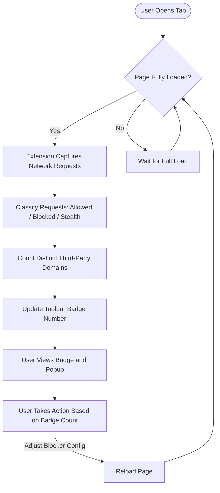

# Making Sense of the Toolbar Badge Count

The toolbar badge count in uBO Scope is a powerful, immediate indicator of your current tab's network behavior. It reflects the number of *distinct third-party domains* contacted during your browsing session on a given tab. Understanding this count empowers you to evaluate your privacy exposure, compare content blockers objectively, and verify network connection changes with confidence.

---

## 1. What the Badge Count Represents

The toolbar badge shows a single number—the count of unique third-party domains your current tab has connected to. This does **not** measure the number of requests or blocked items but instead the variety of distinct servers reached.

- **Third-party domains**: Domains that are different from the main website's domain.
- **Distinct**: Each domain is counted once regardless of how many requests it made.

A *lower badge count* typically indicates better privacy since fewer external entities are contacted.

<Check>
The badge count increases only when new distinct third-party domains successfully connect during the tab's lifetime.
</Check>

---

## 2. Why a Lower Badge Count Means Better Privacy

Each third-party domain you connect to potentially exposes you to tracking or increases your data footprint. 

- **Fewer domains** means fewer organizations receiving your browsing data.
- Legitimate third parties, like well-known Content Delivery Networks (CDNs), usually represent a small number alongside first-party servers.

Therefore, you can use the badge as a quick privacy metric:

- A count of `0` or very low numbers on most sites suggests effective blocking.
- A high count signals many third parties are loaded—possibly reducing privacy.

---

## 3. How uBO Scope Counts Domains

Behind the scenes, uBO Scope monitors network requests for the active tab and groups all contacted hostnames by their registered domain using the Public Suffix List.

- It tracks every network request and categorizes the outcome as allowed, stealth-blocked, or blocked.
- The badge count shows unique domains from the **allowed** category—the set of third-party servers your browser ultimately connected to.

This approach ensures accuracy by:

- Avoiding inflated counts caused by counting subdomains separately.
- Ignoring blocked-only requests that didn’t lead to network connections.

---

## 4. Using the Badge Count to Compare Content Blockers

The badge count can help you evaluate which content blocker better protects your privacy:

1. **Open a website with content loaded.**
2. **Observe the toolbar badge with your current content blocker enabled.**
3. **Switch to another content blocker or change configurations.**
4. **Reload the same page and compare the badge count.**

A blocker producing a *lower* badge count is allowing fewer third-party connections and may be providing better protection.

<Warning>
The number of blocked requests shown by other tools or the block count itself is less useful than the badge count. A high block count can coincide with more distinct third-party connections if the blocker misses stealth connections or allows many distinct domains.
</Warning>

---

## 5. Validating Changes to Your Browsing Configuration

After making changes—such as:

- Adding new filters or rules,
- Switching DNS or proxy settings,
- Updating your content blocker,

use the badge count as a quick consistency check:

- Open your target site.
- Ensure the badge count reflects the expected privacy level.
- Use the popup panel (see the `Interpreting the Popup Panel` guide) for a detailed breakdown.

If the badge count unexpectedly increases, investigate which new third parties are contacted.

---

## 6. How to Interpret Empty or Missing Badge Counts

The badge shows no number when the current tab has no recorded connections or when the extension cannot access network data.

Common causes include:

- The page is still loading or freshly opened.
- Unsupported site protocols or browser states where `webRequest` API doesn't report requests.
- Permissions or extension setup issues.

If the badge consistently fails to appear, refer to the troubleshooting guides for verification.

---

## 7. Practical Tips & Best Practices

- **Always Reload Pages after Configuration Changes** to ensure that changes take effect and the badge count updates accordingly.
- **Use the Popup Panel alongside the Badge** to see detailed domain names, counts, and categories (allowed, stealth-blocked, blocked).
- **Trust the Badge Over Block Counts** reported by other tools when evaluating privacy.
- **Remember Session Context**: The badge reflects data only from the current tab session, resetting when a new page loads in that tab.
- **Be Aware of Browsers' Limitations**: Some browsers or sites may not expose all requests through the `webRequest` API.

---

## 8. Common Pitfalls and Troubleshooting

<AccordionGroup title="Troubleshooting the Badge Count">  
<Accordion title="Badge Count Is Always Empty or Zero">  
- Verify that uBO Scope is correctly installed with necessary permissions.
- Reload the current tab completely.
- Confirm that your browser supports the required `webRequest` API.
- Check if other extensions might interfere or disable network monitoring.
</Accordion>  
<Accordion title="Badge Count Seems Too High">  
- Consider that some third parties are legitimately needed (e.g., CDNs).
- Use the popup panel to identify domains contributing to the count.
- Disable other extensions temporarily to isolate suspicious connections.
</Accordion>  
<Accordion title="Badge Count Does Not Update After Reload">  
- Make sure the page fully reloads.
- Close and reopen the popup panel to refresh data.
- Restart the browser if inconsistent.
</Accordion>  
</AccordionGroup>

---

## 9. Summary

The badge count in uBO Scope is your trusted, at-a-glance indicator of the number of distinct third-party domains your current tab has contacted. Leveraging this count provides clarity on your privacy exposure and enables robust comparisons across content blockers or configuration changes. Use it alongside the popup for a comprehensive view and to ensure your browsing remains as private as possible.

---

## 10. Next Steps & Related Documentation

- Dive into **[Interpreting the Popup Panel](/guides/analyzing-connections/interpreting-popup-stats)** to explore detailed domain insights behind the badge number.
- Review **[Your First uBO Scope Session](/guides/getting-started/your-first-session)** for an end-to-end introduction.
- Consult **[Troubleshooting Common Issues](/getting-started/troubleshooting/troubleshooting-common-issues)** if the badge or popup behaves unexpectedly.
- Understand **[How Network Monitoring Works](/overview-tab/architecture-concepts-group/how-network-monitoring-works)** for foundational knowledge of uBO Scope’s mechanisms.

---

### Diagram: User Flow for Badge Count Interpretation

This diagram illustrates the lifecycle of the badge count—from page load through request monitoring to user interpretation and action.

---

<Tip>
Use the badge count as a reliable, privacy-focused metric rather than block counts to evaluate your browsing exposure.
</Tip>

<Info>
For deeper understanding, pair badge count insights with the detailed domain breakdown in the popup panel.
</Info>
