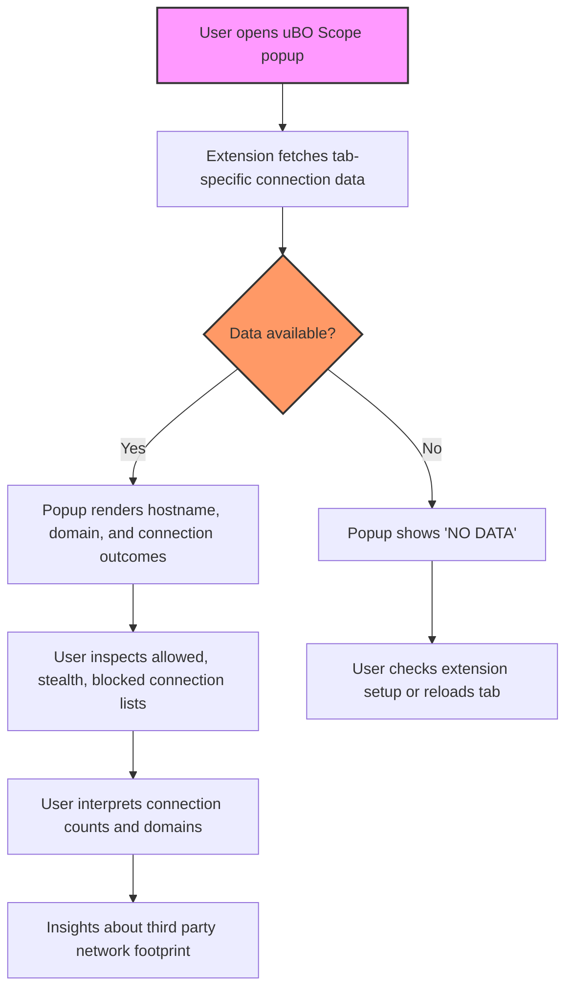

# Analyzing Remote Servers Connected by Webpages

Unlock the full transparency of your web browsing by using uBO Scope to discover every remote server your browser talks to — whether the connections succeeded, were blocked, or stealthily redirected. This guide walks you through how to use uBO Scope's popup interface to inspect outbound connections made by any webpage, helping you distinguish benign third parties from potential trackers.

---

## Workflow Overview

### What This Guide Helps You Do
- Reveal all third-party remote servers contacted by the active webpage.
- Identify whether connections were allowed, blocked, or stealth-blocked.
- Understand how many unique remote domains your browser reached.
- Interpret the connection counts and outcomes to assess page network activity.

### Prerequisites
- Have uBO Scope installed and enabled in your browser (Chromium v122+, Firefox v128+, or Safari v18.5+).
- Browser tab actively loaded with the webpage to analyze.
- Permissions granted for uBO Scope to monitor network requests.

### Expected Outcome
After completing this guide, you will confidently: 
- Use the uBO Scope popup to see detailed lists of remote domains connected.
- Understand the meanings of allowed, stealth-blocked, and blocked outcomes.
- Spot legitimate third-party domains versus suspicious or excessive connections.

### Time Commitment
Approximate total time: 5 to 10 minutes.

### Difficulty Level
Beginner to Intermediate — no prior technical background needed.

---

## Step-by-Step Instructions

<Steps>
<Step title="Open uBO Scope Popup on the Active Tab">
Access the uBO Scope extension icon in your browser toolbar. Click it while focused on the tab whose connections you want to inspect. The uBO Scope popup window will open, displaying connection data for that page.
</Step>
<Step title="Identify the Main Hostname and Domain">
At the top of the popup, confirm the hostname and root domain of the active webpage. This anchors your contextual understanding of which site’s connections you’re analyzing.
</Step>
<Step title="Review the 'domains connected' Count">
Next, observe the total number of distinct third-party remote domains that the webpage contacted. A lower number typically indicates fewer third parties involved.
</Step>
<Step title="Explore Connection Outcome Sections">
The popup is divided into sections, each representing a connection outcome:
- **Not Blocked**: Domains successfully connected.
- **Stealth-Blocked**: Domains with connections redirected or hidden.
- **Blocked**: Domains with blocked connection attempts.
Click each section header or scroll through the lists to review domains and how many requests were made to each.
</Step>
<Step title="Interpret Domain Names and Counts">
For each listed domain:
- The domain name shows the third-party server contacted.
- The count next to it indicates how many times the webpage tried to connect to that domain.

Use this to identify heavy third-party dependencies or suspiciously frequent tracking servers.
</Step>
<Step title="Consider the Context of Connections">
Remember not all third-party domains are trackers; common providers like CDNs or analytics services may appear. Use the domain and count data to form a mental map of the page’s network footprint.
</Step>
<Step title="Close the Popup and Repeat as Needed">
Once finished, close the popup. You can repeat this process on any tab or page to compare connection profiles.
</Step>
</Steps>

---

## Practical Examples

### Example: Analyzing a News Website
You open the uBO Scope popup on a news article page. The popup shows:
- Not Blocked:
  - `cdn.news-site.com` (10 connections)
  - `analytics.tracker.com` (3 connections)
- Stealth-Blocked:
  - `ads.network.com` (5 connections)
- Blocked:
  - `tracker.badads.com` (7 attempts)

Interpreting this, you can see the CDN is necessary for content delivery, analytics are minimal, and problematic trackers are blocked.

### Example: Spotting Excessive Trackers
On an e-commerce page, you notice:
- Not Blocked:
  - `shoppingcdn.com` (12 connections)
  - `tracking.network.com` (50 connections)
- Stealth-Blocked:
  - Several ad domains
- Blocked:
  - Many others

This signals a high number of tracking connections, some allowed, which you may wish to investigate or block further.

---

## Tips & Best Practices

- **Use the Badge Count as a Quick Indicator:** The toolbar icon badge shows the count of distinct remote domains currently connected per tab. A sudden spike might indicate unexpected tracking or embedded third parties.
- **Frequent Connections Can Indicate Persistent Trackers:** Domains with high request counts demand focused attention.
- **Distinguish Legitimate Providers:** CDNs or major service providers generally have recognizable domain names and fewer connection attempts.
- **Refresh the Page When Testing:** Changes in content or ads can alter third-party connections dynamically.
- **Remember Stealth Blocking:** Some connections are redirected or stealthily handled, and their domains appear in the 'stealth-blocked' section.

---

## Troubleshooting

<AccordionGroup title="Troubleshooting Common Issues">
<Accordion title="No Data or Empty Popup">
- Verify the extension is enabled and has necessary permissions.
- Check you are viewing the popup on the active browser tab.
- Confirm the webpage successfully loaded and made network requests.
- Refer to the Troubleshooting & Validation guide for detailed fixes.
</Accordion>
<Accordion title="Badge Count Not Updating">
- The badge updates asynchronously; wait a few seconds after page load.
- Reload the tab to force data refresh.
- Confirm your browser supports `webRequest` API fully.
</Accordion>
<Accordion title="Unrecognized Domains or Suspicious Activity">
- Use reputable domain lookup tools or filter lists to identify unknown domains.
- Cross-check with privacy community resources for tracker identification.
</Accordion>
</AccordionGroup>

<Tip>
For advanced users, confirming connections using standard browser developer tools alongside uBO Scope can provide deeper insight.
</Tip>

---

## Understanding Connection Outcomes

- **Allowed (Not Blocked):** Connections that fully succeeded.
- **Stealth-Blocked:** Connections that were redirected or modified by filters but still touched; they count as stealth-blocked to indicate some form of filtering occurred.
- **Blocked:** Connections that were prevented from completing.

The categorization helps paint the true picture of network activity, especially when using other content blockers that might silently allow certain connections.

---

## Next Steps & Related Documentation

- After mastering connection analysis, explore the guide on [Making Sense of the Badge Count](/guides/analyzing-network-connections/badge-count-deep-dive) to understand how the numeric badge aggregates network activity.
- Dive deeper into [Interpreting the uBO Scope Popup](/guides/getting-started/understanding-the-popup) if you want more details on UI elements.
- For initial installation and setup, see [Installing and Enabling uBO Scope](/guides/getting-started/install-extension) and [Set Up & Open the Extension](/getting-started/configuration-first-use/initial-setup-and-access).
- Troubleshooting tips are covered extensively in [Troubleshooting & Validation](/getting-started/configuration-first-use/quick-troubleshooting).

Explore these to progress from everyday use to expert-level network analysis.

---

## Additional Resources
- Official GitHub Repository: [https://github.com/gorhill/uBO-Scope](https://github.com/gorhill/uBO-Scope)
- Public Suffix List Used: Enables domain parsing to root domains accurately.

---

# Visual Overview

---