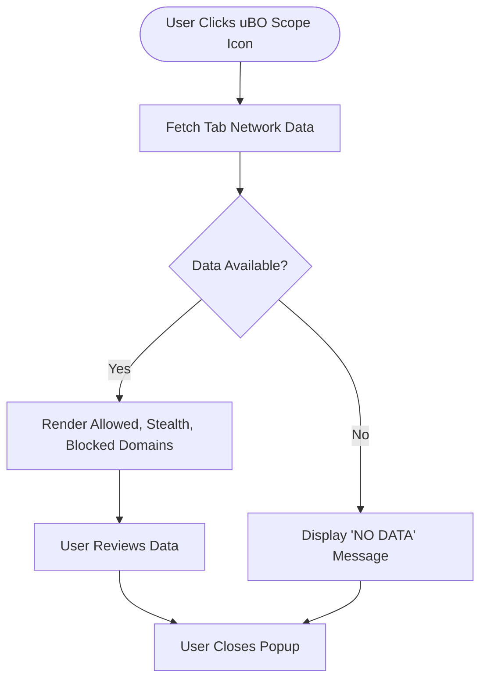

# Understanding the Toolbar Badge and Popup Data

## Overview

This guide helps you comprehend what the toolbar badge number represents and how to interpret the detailed connection outcomes shown in uBO Scope's popup interface. You will learn what the different popup categories—allowed, blocked, and stealth—mean, why these counts matter for your privacy, and how to use this knowledge to maintain better web hygiene.

---

### Who This Guide Is For
- Privacy-conscious users wanting to audit third-party connections per webpage tab.
- Filter list maintainers seeking insight on actual network request outcomes.
- Users validating content blocker effectiveness beyond simple block counts.

### Prerequisites
- uBO Scope installed and active in your browser.
- Basic familiarity with browser tabs and web navigation.
- Opening webpages with third-party network activity.

### What You Will Achieve
- Understand the significance of the badge count on the toolbar icon.
- Interpret the three popup sections and their domain outcome data.
- Differentiate between "allowed", "blocked", and "stealth" categories.
- Use popup information to assess privacy exposure and blocker effectiveness.

---

## 1. What the Toolbar Badge Count Represents

When you browse, uBO Scope monitors the distinct third-party domains your current tab contacts. The badge on the toolbar icon displays:

- **A Number:** The count of unique third-party domains that have been *allowed* (i.e., connections that succeeded or were permitted).

This count **does not** represent how many requests were *blocked*, nor the total requests made, but purely the number of unique remote servers from which content was successfully fetched.

**Why this matters:**

- A **lower badge count** indicates fewer third-party connections, often correlating with better privacy.
- Monitoring this count exposes if a website is making excessive third-party server contacts.
- Not all third parties are bad; some are needed (like CDN providers), but a high count could indicate unnecessary or privacy-invasive connections.

<Tip>
Think of the badge count as a privacy "dashboard gauge"—it shows how many outsiders a webpage is talking to, giving you a quick health check of your privacy.
</Tip>

---

## 2. Understanding Popup Categories and Their Data

When you click the toolbar icon, the popup shows detailed connection outcomes divided into three sections, each listing domains and the number of connections:

| Category          | Meaning                                                | What You See                                                 |
|-------------------|--------------------------------------------------------|--------------------------------------------------------------|
| **Not Blocked** (Allowed) | Domains where the webpage successfully made connections or were permitted by your blocker | List of domains and counts for resources loaded from them    |
| **Stealth-Blocked** (Stealth) | Requests that the blocker silently blocked without alerting the page, often to prevent page breakage or tracking | Domains that experienced stealth blocking with counts          |
| **Blocked**       | Domains where the requests were outright blocked causing failed network connections | Domains whose requests were explicitly blocked with counts    |

Each category lists domains in ascending order by name with a count badge representing the number of times a connection was made or blocked from that domain.

### What "Allowed", "Stealth", and "Blocked" Really Mean
- **Allowed:** These connections completed successfully or were explicitly allowed, representing the third parties your browser communicated with.

- **Stealth:** These are connections that the blocker intercepted and neutralized quietly — the user or the webpage might not notice blocking happened. It helps avoid breaking webpage functionality or revealing blocking to trackers.

- **Blocked:** These connections were actively prevented, resulting in failed requests. This is the strictest form of blocking.

<Tip>
Popups help you see not just what was blocked, but also what got through and what the blocker blocked 'silently'. This holistic view is crucial for understanding your true exposure.
</Tip>

---

## 3. How to Read and Use This Data Effectively

### Step-by-Step User Workflow

<Steps>
<Step title="Observe the Toolbar Badge Count">
- Note the number displayed on the badge when visiting a webpage.
- Fewer third-party connections generally indicate a smaller privacy footprint.
- No number means no allowed third-party connections detected.
</Step>
<Step title="Open the Popup to Inspect Details">
- Click the uBO Scope extension icon to open the popup.
- Review the hostname shown at the top to confirm which tab's data you are inspecting.
- Look at the summary line showing total distinct connected domains.
</Step>
<Step title="Explore Individual Categories">
- Under **Not Blocked**, see the domains with permitted connections. These are the third parties the webpage fetched resources from.
- Under **Stealth-Blocked**, check domains where the blocker silently interrupted requests for privacy or page integrity.
- Under **Blocked**, identify domains that were explicitly blocked.
</Step>
<Step title="Assess Privacy and Hygiene">
- Compare the badge count with the summary in the popup to validate data consistency.
- If many domains fall under allowed, consider if this level of third-party presence is acceptable.
- Use stealth and blocked categories to confirm your content blocker is active and protecting you effectively.
</Step>
</Steps>

### Practical Example

Suppose you visit a news website:
- The toolbar badge shows "8".
- In the popup, you see:
  - **Not Blocked:** domains like `cdn.example.com` (3 connections), `analytics.goodcdn.net` (2 connections).
  - **Stealth-Blocked:** `tracker.evilads.com` (5 stealth blocked).
  - **Blocked:** `malware.badserver.org` (1 blocked).

Interpretation:
- Your browser connected to 8 unique third-party domains allowing resources to be loaded.
- Stealth blocking prevented trackers without breaking the site.
- One malicious domain was outright blocked.

<Tip>
Regularly checking these details after browsing sites you trust and don't trust helps you keep an informed view of your privacy exposure.
</Tip>

---

## 4. Common Pitfalls and Tips

### Common Issues Users Face
- **Badge count higher than expected:** Not all third parties are malicious. CDNs, fonts, or APIs may add to the count legitimately.
- **Empty popup or 'No Data' displayed:** This usually means uBO Scope has not recorded any network activity for that tab yet or data has not loaded.
- **Mismatch between badge and popup:** Reflects timing issues; give the extension a moment to update or refresh the tab.

### Best Practices
- Combine uBO Scope insights with your preferred content blocker settings to fine-tune privacy.
- Use the stealth category to understand subtle blocking that might not be obvious elsewhere.
- Regularly monitor popular websites to detect changes in their third-party connections.

### Why These Numbers Matter
- Third-party domains represent potential privacy risks through tracking or data leakage.
- Monitoring domain counts prevents becoming complacent with unsettlingly high background connections.
- Understanding outcomes (allowed, stealth, blocked) empowers you to make decisions on blockers or whitelist adjustments.

---

## 5. Verification and Troubleshooting

### How to Confirm Correct Data Display
- Ensure you have active network activity on the webpage (load images, scripts, ads).
- Wait a few seconds after page load to allow data to populate.
- Reload the page and open the popup again to verify changes in domain counts.

### Troubleshooting Tips
<Accordion title="Why is the badge empty or missing?">
- Verify extension is installed and enabled.
- Confirm you have navigated to a webpage.
- Check permissions, especially `webRequest` and `activeTab`.
- Restart browser if needed.
</Accordion>
<Accordion title="Popup shows 'NO DATA' or empty lists.">
- The extension may not have tracked network requests yet.
- Reload the tab and try again.
- Confirm you are inspecting the correct tab.
</Accordion>
<Accordion title="Numbers don't update or seem stuck.">
- Network requests may be delayed or the extension's data may be stale.
- Try closing and reopening the popup.
- Reload the tab to refresh.
</Accordion>

---

## 6. Next Steps

- Explore [Understanding the Popup and Badge](https://your-docs-link/getting-started/getting-going/exploring-popup) to deepen your understanding of UI interactions.
- Review [Case Studies: Comparing Blocking Tools and Assessing Privacy](https://your-docs-link/guides/analyzing-results/case-studies-blocking) for real-world use examples.
- Consult [Guide for Filter List Maintainers](https://your-docs-link/guides/analyzing-results/filter-maintainers-guide) if you maintain or fine-tune blocking lists.

---

## Summary

- The toolbar badge displays unique allowed third-party domains per tab.
- The popup divides domains into allowed, stealth-blocked, and blocked categories.
- Understanding these outcomes is critical for assessing privacy and blocker effectiveness.
- Use the popup data proactively to audit websites and maintain web hygiene.

---

## Appendix

### Sample Popup Data Structure
```json
{
  "hostname": "www.example.com",
  "domain": "example.com",
  "allowed": {
    "domains": [["cdn.example.com", 3], ["apis.example.net", 1]],
    "hostnames": {}
  },
  "stealth": {
    "domains": [["tracker.badads.com", 5]],
    "hostnames": {}
  },
  "blocked": {
    "domains": [["malicious.site.org", 1]],
    "hostnames": {}
  }
}
```

### Related Diagram: User Flow When Inspecting Popup Data


---

For detailed usage and related concepts, see also:
- [What is uBO Scope?](https://your-docs-link/overview/introduction-group/what-is-ubo-scope)
- [Core Concepts & Terminology](https://your-docs-link/overview/architecture-group/core-concepts-terminology)
- [Understanding the Popup and Badge](https://your-docs-link/getting-started/getting-going/exploring-popup)
- [Troubleshooting Common Issues](https://your-docs-link/getting-started/getting-going/troubleshooting-setup)

<br/>
© uBO Scope by Raymond Hill

