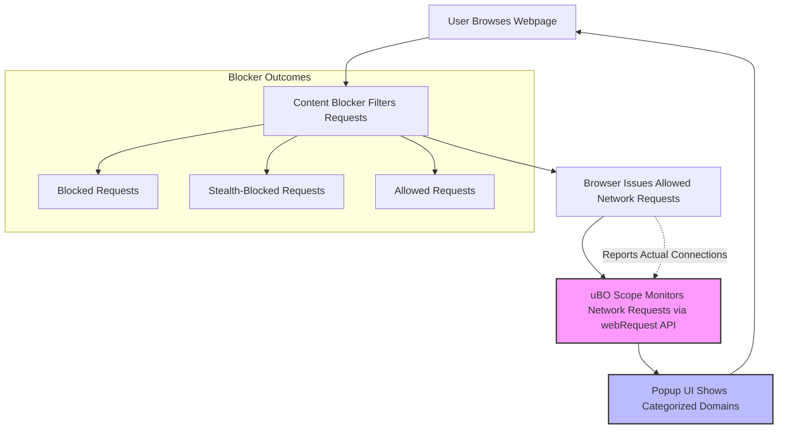

# Comparing Content Blockers and Interpreting Data

## 1. Understanding Your Objective

When using uBO Scope alongside your preferred content blockers (like uBlock Origin, AdGuard, or others), your goal is to gain an objective, transparent view of actual network requests issued by websites during your browsing sessions. This reflects the **real-world** third-party connections occurring, regardless of how content blockers report or hide them.

> Most standard content blockers report filtered results internally, which can be incomplete or misleading. uBO Scope surfaces the network-level truth.

## 2. Why Use uBO Scope with Content Blockers?

- **Get Reliable Counts**: The badge on uBO Scope’s toolbar shows the number of distinct third-party domains that your browser actually connected to, reflecting true exposure.
- **Avoid Misleading Badge Counts**: Content blocker badges often show only blocked resource counts or are influenced by internal heuristics, which can lead to distorted reading of privacy or blocker effectiveness.
- **See Stealth-Blocked Connections**: Some content blockers stealth-block or redirect requests to avoid detection. uBO Scope clearly reports these as "stealth-blocked", revealing more precise filtering behavior.

## 3. How to Use uBO Scope Alongside Your Content Blocker

### Step 1: Enable Both Extensions
- Install your favorite content blocker and uBO Scope in your browser.
- Make sure both are activated and allowed necessary permissions.

### Step 2: Open an Active Browsing Tab
- Visit the website you want to analyze with blocking enabled.

### Step 3: Open uBO Scope's Popup
- Click the uBO Scope icon in your toolbar.
- Review the categorized connection lists:
  - **Not Blocked** (allowed)
  - **Stealth-Blocked**
  - **Blocked**
- The summary at the top shows the total number of distinct third-party domains where the browser has made connections.

### Step 4: Compare with Your Content Blocker
- Note that your content blocker's badge count might differ significantly.
- Use uBO Scope's data to validate what was truly allowed or blocked.

## 4. Interpreting the Data: What It Means for You

- **Low Allowed Domains Count**: Indicates stricter content blocking or fewer third-party connections, which typically means better privacy protection.
- **High Allowed Domains Count**: Suggests more third-party resources load successfully, potentially lowering privacy or increasing tracking surface.
- **Stealth-Blocked Domains**: Reflect resources filtered in ways designed to avoid detection; evaluating these reveals advanced blocking tactics that might not affect your content blocker's badge.

## 5. Real-World Example Workflow

Imagine you visit an e-commerce site with both a blocker and uBO Scope enabled:

1. You see your content blocker badge showing "45 blocks".
2. uBO Scope shows "allowed" connections count: 30 domains.
3. Upon opening the uBO Scope popup, you see:
   - 30 allowed third-party domains
   - 10 stealth-blocked domains
   - 5 blocked domains

From this, you realize some third-party connections were allowed despite the high block count reported by your blocker, giving you a clearer, more truthful baseline.

## 6. Best Practices for Effective Comparison

- **Use uBO Scope as a Verifier, Not a Blocker**: uBO Scope complements your content blocker rather than replacing it.
- **Regularly Review the Popup’s Domain Lists**: This enables spotting new or unexpected third-party domains your content blocker might miss.
- **Track Changes Over Sessions**: Observe if allowed or stealth-blocked counts fluctuate as websites update.
- **Beware of "Ad Blocker Tests" Websites**: These provide artificial scenarios that do not reflect genuine web behavior.

## 7. Common Pitfalls & How to Avoid Them

<AccordionGroup title="Troubleshooting & Common Issues">
<Accordion title="Seeing Unexpectedly High Allowed Domain Counts">Sometimes high allowed domain counts can surprise you. Ensure your content blocker’s filtering is up to date. Check if stealth blocking is in effect which uBO Scope exposes, but may not affect block counts elsewhere.</Accordion>
<Accordion title="Confusing Badge Counts Between Extensions">Remember the difference between blocked resource counts and distinct third-party domains allowed. uBO Scope counts distinct third-party domains connected to, not blocked resource counts.</Accordion>
<Accordion title="Misinterpreting Stealth-Blocked Entries">Stealth-blocked does not mean allowed. These are requests blocked but in a way that might evade detection by websites and some blockers’ UI metrics.</Accordion>
</AccordionGroup>

## 8. Visualizing the Workflow

## 9. Next Steps

- Explore [Your First Run](/getting-started/first-use-validation/your-first-run) to learn detailed steps on opening and navigating the popup.
- Review [Reading the Popup](/guides/getting-started/first-look-popup) for detailed understanding of domain categories.
- Visit [Understanding Connection Statistics](/guides/analyzing-traffic/understanding-connection-stats) to deepen your interpretation of the connection counts.

---

## Appendix: Quick Tips

- The extension keeps counts by distinct domains, not individual requests, which matters for privacy insights.
- Stealth-blocking is a sophisticated blocking mode that some content blockers use to avoid detection by webpages.
- Remember that not all third-party domains are malicious; some serve legitimate purposes like CDNs for scripts or assets.

---

## Summary
Using uBO Scope alongside your content blocker empowers you with true visibility into your browser's third-party connections. This combination helps you avoid misleading badge statistics and better understand the privacy impact of your content filtering choices.

