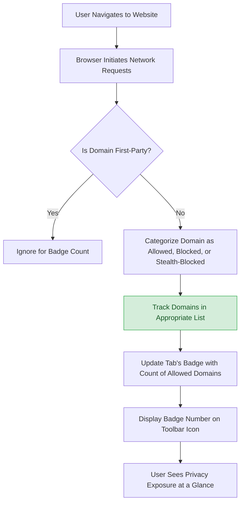

# Understanding the Badge Count: What Does It Really Tell You?

## Introduction
The toolbar badge in uBO Scope displays a single number that reflects the **count of distinct third-party domains** your browser tab connected to during web browsing. This page explains what that number represents, clears up common misunderstandings, and shows why a lower badge count indicates stronger privacy protection.

---

## What the Badge Count Represents

- **Distinct Third-Party Domains:** The badge number shows the count of unique third-party domains that successfully connected while loading the active web page.
- **Third-Party Defined:** A third-party domain is any domain different from the main website's domain. For example, if you visit `example.com` and your browser connects to `cdn.example.net`, `ads.tracker.com`, and `analytics.foo.org`, these three domains contribute to the badge count.
- **Connections Counted Despite Blocking:** uBO Scope measures connections at the network level, including those that were allowed, blocked, or stealth-blocked. However, **only allowed connections increase the badge count**.

<u>Important:</u> The badge reflects **domains that were actually connected to and not blocked**. A higher number means more third-party servers loaded resources or communicated with your browser.

---

## Why the Badge Is a Reliable Privacy Indicator

The badge gives you a clear lens into your **true online exposure**:

- **Lower is Better:** Fewer third-party connections means your browser is exposed to fewer external servers, translating to stronger privacy.
- **Shows Real World Behavior:** Unlike typical "block count" stats, which count individual blocked requests that may target many servers, the badge reflects actual **distinct remote servers contacted**.
- **Resistant to Misleading Metrics:** Some content blockers report high block counts but allow many distinct third parties, which results in a higher badge count. uBO Scope helps you see beyond superficial block numbers.

---

## Common Misconceptions

### Misconception 1: "More Blocked Requests Means Better Protection"

- **Reality:** Block counts do not reflect the number of distinct domains connected.
- It’s possible for a content blocker to block many requests but still allow connections to many third-party domains.
- uBO Scope’s badge number focuses directly on **how many third-party servers your browser talks to**, which is a truer privacy metric.

### Misconception 2: "Ad Blocker Test Pages Accurately Represent Privacy"

- Many test pages use fabricated domains and network scenarios that don't represent real browsing.
- Such pages can't detect stealth-blocking or content blocker subtleties.
- The badge count from uBO Scope reflects your actual browsing, making it trustworthy.

---

## How uBO Scope Calculates the Badge Count

1. **Network Monitoring:** Using browser APIs (`webRequest`), uBO Scope listens to all network requests made by your browser tab.
2. **Domain Extraction:** Each request URL's hostname is parsed, then mapped to its registered domain using the Public Suffix List to group subdomains properly.
3. **Connection Outcomes Categorized:** Each domain is classified as allowed, stealth-blocked, or fully blocked.
4. **Badge Updated:** The badge displays the count of allowed third-party domains per tab.

---

## Real-World Example

Suppose you visit `news.example.com`:

- Your browser connects to `news.example.com` (first-party).
- Loads images from `cdn.images.com` and `media.cdn.com`.
- Loads ads from `ads.network.com` (blocked by your content blocker).
- Analytics request sent to `analytics.tracker.net` (allowed).

**Badge count explanation:**
- First party domain `news.example.com` is excluded.
- Blocked ad domain `ads.network.com` is not counted.
- Allowed third-party domains: `cdn.images.com`, `media.cdn.com`, and `analytics.tracker.net` count as 3.
- Badge shows "3".

---

## Interpreting Badge Changes

- **An increase in the badge number** typically means your browser connected to more distinct third-party servers.
- **A decrease or zero** indicates either a page with no third-party connections or effective blocking.
- If you notice unexpected spikes, investigate the domains (via the popup UI) to identify possible privacy risks or unwanted trackers.

---

## Step-by-Step Guide to Verify the Badge Count

<Steps>
  <Step title='Open uBO Scope Popup'>
    Click the uBO Scope icon in your browser toolbar to open the popup panel. You will see the current tab's domain details and categorized connection lists.
  </Step>
  <Step title='Check the "Not Blocked" Section'>
    Review the "not blocked" panel, which lists distinct allowed third-party domains contributing to the badge count.
  </Step>
  <Step title='Count Domains Manually'>
    Count the unique domains displayed to confirm it matches the badge number on the toolbar icon.
  </Step>
  <Step title='Analyze Blocked and Stealth-Blocked Sections'>
    Understand which domains are blocked or stealth-blocked to see what was prevented from connecting.
  </Step>
  <Step title='Test on Different Websites'>
    Visit sites with expected different privacy profiles and watch how the badge count changes accordingly.
  </Step>
</Steps>

---

## Tips for Using the Badge Effectively

<Tip>
The badge count is not just a number. Use it to:
- Gauge the privacy score of each website.
- Detect anomalous connections or suspicious third-party domains.
- Validate effectiveness of your content blockers or privacy settings.
</Tip>

<Note>
The badge ignores first-party domains and counts only unique third parties, helping reduce noise and focus on privacy-relevant exposure.
</Note>

<Warning>
Not all third-party connections are malicious or unwanted. Legitimate services like CDNs and analytics may be necessary for site functionality.
</Warning>

---

## Troubleshooting Common Badge Issues

<AccordionGroup title="Badge Count Not Updating Correctly">
  <Accordion title="Badge Shows Zero Despite Connections">
    - Ensure uBO Scope is properly installed and has necessary permissions.
    - Confirm your browser supports the required `webRequest` API.
    - Refresh the page or open a new tab to trigger new data collection.
    - See the [First Launch & Verification guide](/getting-started/installation-and-setup/first-launch-verification) for troubleshooting steps.
  </Accordion>
  <Accordion title="Badge Shows a Number But Popup Is Empty">
    - This can happen temporarily during data loading.
    - Close and reopen the popup.
    - Restart your browser extension or the browser itself.
    - Verify network activity is captured on active tabs.
  </Accordion>
  <Accordion title="Badge Count Seems Too High or Low">
    - Remember the badge counts distinct domains, not requests.
    - Compare with the popup domains list.
    - Some browser features or extensions might interfere with data capture.
    - Review your content blocker’s settings.
  </Accordion>
</AccordionGroup>

---

## Next Steps

- Explore the [Interpreting the Popup and Domain Connections](/guides/getting-started/first-insights) guide to understand domain lists in depth.
- Use the [Investigating Which Third Parties Are Contacted by a Website](/guides/analyzing-traffic/workflow-site-investigation) for detailed workflows on analyzing traffic.
- Learn about the limitations and how effectively uBO Scope can reveal network activity in [Limitations: What uBO Scope Can and Cannot Reveal](/guides/analyzing-traffic/limits-dns-and-stealth).

---

## Summary Diagram

---

## Summary
The uBO Scope toolbar badge number is a powerful, concise indicator of how many distinct third-party remote servers your current browser tab connects to. By focusing on domains, not just individual connections, it gives you a meaningful signal about your online privacy exposure.

Use the badge to monitor your browsing habits, identify unwanted trackers, and verify your content blockers’ effectiveness. Complement this overview with the detailed popup panel to get insights into each third-party domain involved.

---

## References
- [uBO Scope GitHub Repository](https://github.com/gorhill/uBO-Scope)
- [What is uBO Scope?](/overview/introduction/what-is-ubo-scope)
- [Interpreting the Popup and Domain Connections](/guides/getting-started/first-insights)
- [Investigating Which Third Parties Are Contacted by a Website](/guides/analyzing-traffic/workflow-site-investigation)
- [First Launch & Verification](/getting-started/installation-and-setup/first-launch-verification)
- [Troubleshooting Common Issues](/getting-started/usage-and-troubleshooting/troubleshooting-common-issues)