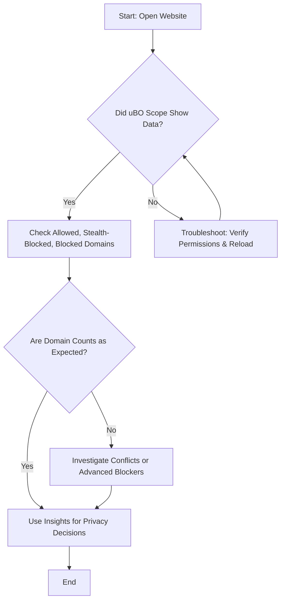

# Real-World Scenarios and Common Solutions

## Overview
This guide provides practical, step-by-step workflows to help you effectively use uBO Scope to evaluate websites, debunk popular misconceptions about content blockers, and resolve common issues related to network request visibility. You will learn how to interpret connection outcomes, understand stealth blocking, and handle challenges when advanced blockers are involved.

By following these scenarios and solutions, you can confidently analyze web traffic, improve your troubleshooting skills, and make informed decisions about your privacy tools.

---

## 1. Evaluating a Website's Network Connections

### Intent
To analyze the remote servers a website connects to in order to assess privacy and third-party exposure.

### Prerequisites
- uBO Scope installed and active in your preferred browser (Chrome, Firefox, or Safari).
- Basic familiarity with the uBO Scope popup interface.

### Time Estimate
About 5 minutes per website.

### Difficulty Level
Beginner to Intermediate.

### Steps
<Steps>
<Step title="Open your browser and navigate to the website you want to analyze">Simply load the target website in your browser tab where uBO Scope is installed and enabled.</Step>
<Step title="Click the uBO Scope extension icon">This opens the popup showing connection data for the current tab.</Step>
<Step title="Review the connection summary and domain lists">
- Check the 'domains connected' count.
- Observe the three lists: 'not blocked' (allowed), 'stealth-blocked', and 'blocked' domains.
</Step>
<Step title="Interpret the results">
- Lower counts of allowed domains usually indicate better privacy.
- Domains in the stealth-blocked list indicate requests detected and blocked silently to avoid site breakage.
- Blocked domains are explicitly prevented from connecting.
</Step>
<Step title="Use insights to compare sites or blockers">Compare the distinct third-party domains across different sites or blocker configurations.</Step>
</Steps>

### Expected Results
You will see categorized third-party domains indicating how they were handled by your content blocker setup.

### Tips
- Understanding the distinction between allowed and stealth-blocked is crucial for accurate interpretation.

---

## 2. Debunking Popular Adblocker Myths Using uBO Scope

Many users misunderstand content blocker effectiveness based on superficial metrics. Use uBO Scope to test these beliefs.

### Scenario 1: "A Blocker That Reports More Blocks is Better"

#### Workflow
1. Enable uBO Scope alongside the content blockers you want to compare.
2. Browse several typical websites.
3. For each site, open uBO Scope popup and note the number of allowed third-party domains versus blocked.
4. Understand that a higher block count does not mean fewer connections; focus on the number of allowed (not blocked) third-party domains.

#### Outcome
uBO Scope reveals the actual distinct third-parties connected, helping you realize that fewer allowed domains are better, even if block counts differ.

### Scenario 2: "Ad Blocker Test Pages Show Reliable Results"

#### Workflow
1. Attempt an ad blocker test page with your setup.
2. Note discrepancies between uBO Scope's connection logs and the test page results.
3. Recognize that many test pages generate unrealistic requests and cannot detect stealth blocking.

#### Outcome
You'll see that real-world traffic differs significantly from test scenarios, reinforcing that uBO Scope provides a more accurate view.

---

## 3. Troubleshooting Network Request Visibility Issues

If you notice no data or unexpected results in the uBO Scope popup, follow these steps.

### Symptoms
- Popup shows "NO DATA".
- Badge count does not update.
- Network requests seem missing or incomplete.

### Common Causes & Solutions

<AccordionGroup title="Common Troubleshooting Steps">
<Accordion title="Verify Extension Permissions">
<u>What to do:</u>

- Ensure uBO Scope has permissions for `webRequest`, `activeTab`, and `storage` in your browser's extension settings.
- Check the manifest to confirm host permissions include HTTP/HTTPS URLs.

<u>Why:</u> These permissions are essential to monitor network traffic.
</Accordion>
<Accordion title="Reload uBO Scope and Browser Tab">
- Close and reopen the tab or reload the page.
- Refresh or restart the extension.

<u>Why:</u> The service worker may restart or lose state; reloading refreshes data capture.
</Accordion>
<Accordion title="Check for Conflicting Extensions">
- Temporarily disable other content blockers or privacy extensions.
- Confirm uBO Scope populates data.

<u>Why:</u> Conflicting extensions might interfere with webRequest monitoring.
</Accordion>
<Accordion title="Confirm Browser Support and Version">
- Make sure your browser version meets the minimum requirements (e.g., Chrome 122+, Firefox 128+, Safari 18.5+).

<u>Why:</u> Older versions may lack required APIs or have bugs.
</Accordion>
<Accordion title="Inspect Network Requests Directly">
- Use browser developer tools to view network activity.
- Compare with uBO Scope's popup data.

<u>Why:</u> Helps verify if requests are made and detected by the browser.
</Accordion>
</AccordionGroup>

### Additional Tips

- Recognize that uBO Scope only tracks network requests visible through the `webRequest` API.
- Network traffic bypassing this API (e.g., via browser internals) won't appear.
- Advanced blockers or stealth methods may limit visibility but cannot hide from uBO Scope if based on `webRequest`.

---

## 4. Understanding Stealth Blocking and Analyzing Results

### What is Stealth Blocking?
Stealth blocking hides the fact that a request was blocked to avoid site breakage or detection by webpages, often implemented by silently canceling or redirecting requests.

### How uBO Scope Detects It
uBO Scope categorizes such requests separately, listing domains that triggered redirects or errors associated with stealth blocking.

### How to Analyze Stealth Data

- Focus on the "stealth-blocked" list in the popup.
- These domains represent requests that were intercepted invisibly.
- Consider lowering the number of such domains to improve privacy and minimize tracking risk.

### Practical Usage
Use stealth blocking data to:

- Understand which third-parties your blocker silently manages.
- Detect potential under-reporting from other blockers or test pages.
- Adjust filter lists or settings accordingly.

---

## 5. Best Practices and Tips

- Use uBO Scope regularly on sites you frequent to benchmark and track privacy exposure over time.
- Combine the extension with other content blockers to gain a holistic view.
- Don't rely solely on badge counts; inspect detailed domain lists for full context.
- Avoid relying on synthetic test pages; trust real-world browsing data.
- Refresh your session data by reloading tabs to ensure accurate results.

---

## 6. Summary Workflow Diagram

---

## 7. Additional Resources

For more in-depth understanding and cross-reference, consult:

- [Your First Run](https://example.com/getting-started/first-use-validation/your-first-run): Learn how to open and interpret the popup.
- [Reading the Popup: Domains and Outcome Types](https://example.com/guides/getting-started/first-look-popup): Detailed explanation of the popup interface.
- [Understanding Connection Statistics](https://example.com/guides/analyzing-traffic/understanding-connection-stats): For deeper interpretation of connection data.
- [Comparing Content Blockers and Interpreting Data](https://example.com/guides/analyzing-traffic/content-blocker-comparison): Learn how to use uBO Scope with other blockers.
- [Troubleshooting Installation & Setup](https://example.com/getting-started/first-use-validation/troubleshooting-installation): Fix common issues with extension setup.

---

## 8. Where to Go Next

Once comfortable with these real-world workflows and troubleshooting steps, explore advanced topics such as:

- Filter list maintenance by leveraging uBO Scope's data.
- Developing custom privacy strategies based on connection patterns.
- Integrating uBO Scope insights into broader network security workflows.

These are covered in other guides within the documentation set.

---

