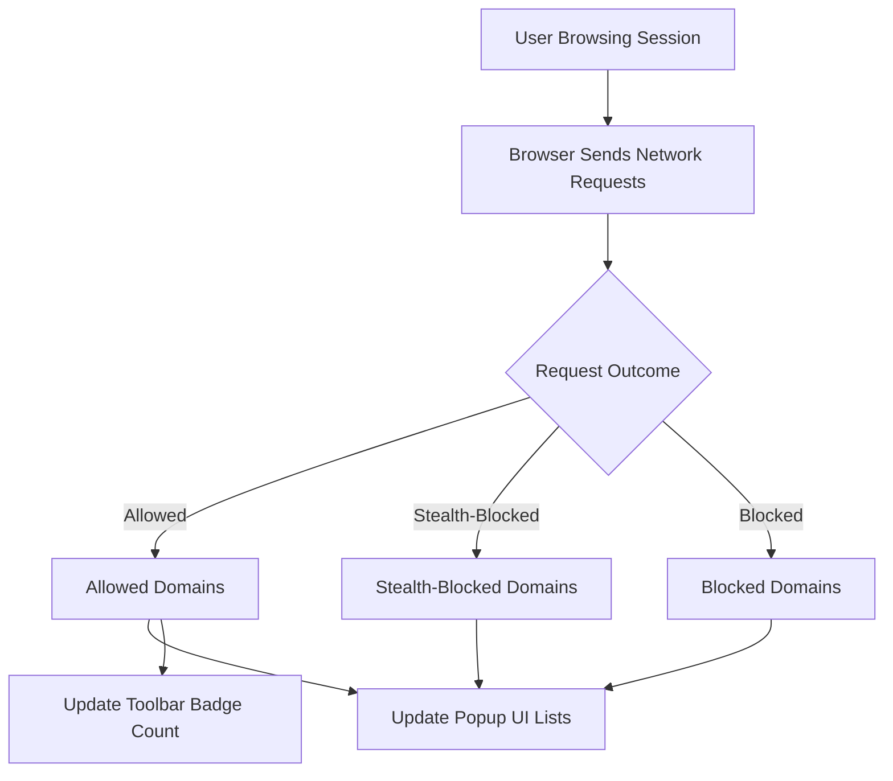

# Understanding Connection Statistics

## Overview

This page explains how uBO Scope records, interprets, and summarizes network connection attempts and their outcomes for the current browsing session. You will learn how to understand the counts of distinct remote servers your browser interacts with, why the separation into "allowed", "stealth-blocked", and "blocked" matters, and why tracking the number of unique third-party domains provides key privacy insights.

## What This Page Helps You Accomplish

- Understand what connection statistics uBO Scope displays
- Interpret the distinct counts of remote servers in different outcome categories
- Learn why a lower count generally signals better privacy and blocking effectiveness

## Prerequisites

- uBO Scope extension installed and active in your browser
- You have visited one or more web pages to generate network data
- Familiarity with the popup user interface of uBO Scope (see related documentation)

## Expected Outcome

By following this guide, you can confidently interpret the connection statistics shown by uBO Scope and use them to gauge your browsing privacy and the effectiveness of content blocking.

---

## 1. How uBO Scope Tracks Network Connections

uBO Scope listens to all network requests your browser attempts to make, including those that succeed, are blocked, or are stealth-blocked (hidden redirects). It groups these requests into three categories:

- **Allowed:** Connections that successfully fetched resources (not blocked).
- **Stealth-Blocked:** Connections redirected or blocked in a subtle way to avoid website breakage or detection.
- **Blocked:** Connections actively blocked and prevented from completing.

Each connection is associated with a hostname, which uBO Scope uses to derive the effective domain via the Public Suffix List.

<u>Why domains matter:</u> Many different hostnames may belong to the same domain; grouping hostnames by domain helps focus on the actual organizations your browser contacts.

## 2. Understanding the Popup Statistics

When you open the uBO Scope popup, it shows:

- The number of distinct domains connected to (“Domains connected” count)
- Lists of domains categorized by outcome: allowed, stealth-blocked, blocked

### Meaning of Counts

- **Domains connected count:** The number shown on the toolbar badge and in the summary is the count of distinct third-party domains your browser connected to without blocking. A lower number here generally means fewer entities are tracking or serving content.

- **Allowed domains:** These are third-party domains from which your browser downloaded resources successfully.

- **Stealth-blocked domains:** These represent connections redirected or silently blocked by the content blocker to maintain site integrity without revealing blocking.

- **Blocked domains:** Overtly blocked connections that did not complete.

### Why Focus on Domains?

Tracking per domain rather than per individual hostname provides a clearer picture of the variety of distinct entities your browser communicates with. For example, many hostnames under `cdn.example.com` and `static.example.com` count as one domain: `example.com`.

## 3. Why Lower Counts Are Better

A high number of allowed distinct domains typically indicates:

- Many third-party trackers or content delivery networks (CDNs) involved
- Potential privacy leaks due to extensive external server interaction

Reducing the allowed distinct domain count through effective blocking improves your browsing privacy by minimizing external trackers and unnecessary network requests.

## 4. Real-World Example

Imagine visiting a news website that loads content from:

- `news.example.com`
- `ads.tracker.com`
- `cdn.examplecdn.net`
- `analytics.tracker.com`

In the popup, the domains would appear sorted into:

- Allowed: `news.example.com`, `cdn.examplecdn.net`
- Stealth-blocked or Blocked: `ads.tracker.com`, `analytics.tracker.com`

The badge count corresponds to the number of allowed distinct domains (2 in this case).

## 5. Tips and Best Practices

- Use the badge count as your top-level metric to assess your exposure to third-party servers.
- Beware that a higher blocked count does not necessarily translate to better privacy; it might indicate more third-party domains are contacted before blocking.
- Regularly check the allowed domains to stay aware of which third parties load content during your browsing.
- Understand that stealth-blocked requests are often subtle but important for accurate blocking without disruptive website errors.

## 6. Common Pitfalls to Avoid

- Don't assume that all third party connections are tracking. Some legitimate services, like CDN providers, may appear as third parties but are essential.
- Avoid relying solely on the count of blocked connections; focus on the final allowed distinct domains for accurate privacy insights.
- uBO Scope can only report network requests visible to the browser's `webRequest` API; some network activity outside this scope might not be reported.

## 7. Troubleshooting Connection Data

If you notice zero or unexpectedly low counts:

- Ensure you have visited at least one webpage since installing uBO Scope.
- Confirm that the browser supports the required `webRequest` API permissions.
- Verify the extension icon badge and popup update correctly (refer to troubleshooting guides).

If counts seem too high:

- Review allowed third-party domains.
- Consider adjusting your content blocking settings or filter lists.

---

## Visual Summary of Connection Flow

## Related Documentation Links

- [Reading the Popup: Domains and Outcome Types](guides/getting-started/first-look-popup)
- [Key Concepts & Terminology](overview/core-concepts-architecture/key-concepts-terminology)
- [Your First Run](getting-started/first-use-validation/your-first-run)
- [Comparing Content Blockers and Interpreting Data](guides/analyzing-traffic/content-blocker-comparison)

---

## Next Steps

1. Explore the popup interface by opening uBO Scope on an active tab.
2. Review allowed, stealth-blocked, and blocked domains to understand your current browsing exposure.
3. Consult the "Comparing Content Blockers" guide to improve blocking configurations.
4. Refer to the troubleshooting documentation if data does not appear as expected.

<Tip>
Regularly monitoring your allowed distinct domain count in uBO Scope empowers you to maintain tighter control over your online privacy.
</Tip>

<Note>
The Public Suffix List (PSL) is at the core of domain derivation in uBO Scope, ensuring accurate grouping of hostnames under their registered domains.
</Note>
