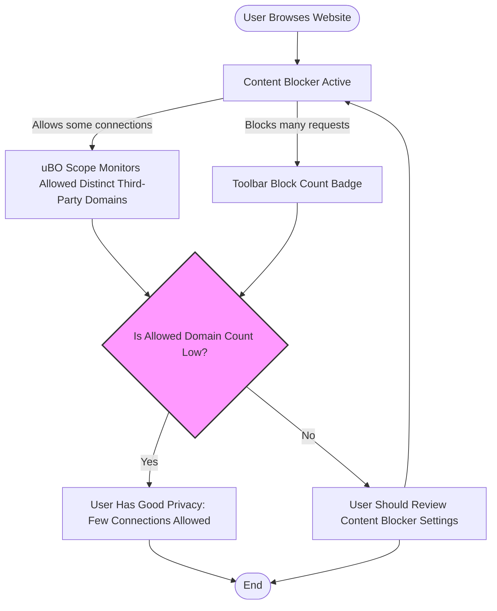

# Debunking Block Count Myths

## Understanding Why Block Counts Are Not the Best Privacy Measure

### Workflow Overview

**Task Description:**
This guide explains why relying on the number of blocked requests (block counts) displayed by content blockers is misleading when assessing your online privacy. It teaches you how to realistically evaluate privacy tools using uBO Scope’s unique insights.

**Prerequisites:**
- You have uBO Scope installed and active in your supported browser.
- Basic familiarity with content blockers and how they display block counts.
- Access to uBO Scope’s popup interface to view real-time third-party connection details.

**Expected Outcome:**
- You will understand why block counts alone do not indicate blocking effectiveness.
- You will learn to interpret privacy from the perspective of distinct third-party connections.
- You will be empowered to avoid common pitfalls in evaluating content blockers.

**Time Estimate:** 10 minutes

**Difficulty Level:** Beginner to Intermediate

---

## Step-by-Step Instructions

### 1. Recognize What the Toolbar Badge Really Shows

- The uBO Scope toolbar badge number reflects the **count of distinct third-party domains your browser connected to during a browsing session**.
- A lower badge count indicates better privacy as it means fewer third-party servers were actually allowed.
- Importantly, this count ignores the number of blocked requests but focuses on connections that were successful (or stealth-blocked).

**Outcome:** You know the badge count is about distinct live connections, not cumulative block numbers.

### 2. Understand Why High Block Counts Can Be Misleading

- Content blockers with a higher block count may ironically allow connections to more unique third-party servers.
- This happens because some blockers log many blocked resource requests from the same or less significant domains yet still let connections slip through to other domains.
- uBO Scope reveals that the **key measure is the number of distinct allowed third-party domains, not how many requests were blocked overall**.

**Tip:** Always cross-verify blocker effectiveness by checking distinct allowed connections, not just block tally.

### 3. Avoid Relying on 'Ad Blocker Test' Webpages

- Many so-called "ad blocker test" sites produce artificial or unrealistic network requests that do not reflect actual browsing conditions.
- These pages cannot detect stealth blocking techniques used by advanced blockers, so their results are unreliable.
- uBO Scope provides accurate, real-world monitoring by capturing every remote server connection initiated by your browser tabs.

**Warning:** Do not trust these test sites to judge your content blocker’s performance.

### 4. Use uBO Scope to Assess Your Privacy Realistically

Follow this workflow:

- Open uBO Scope’s popup panel for your current tab.
- Review the **allowed** section to see which third-party domains are successfully connected.
- Compare the number of these allowed domains to the block count your content blocker shows.
- A high block count with many allowed third-party domains means the blocker might not be providing strong privacy despite the block metrics.

**Verification:** If uBO Scope shows fewer unique third-party domains connected, your privacy is better.

### 5. Keep in Mind Real-World Privacy Practices

- Not all third-party connections are harmful: CDNs or essential services often count as legitimate third parties.
- uBO Scope helps differentiate legitimate third parties from unnecessary or risky ones by showing real connections.
- Use uBO Scope data to fine-tune your content blocker or filtering rules.

---

## Practical Examples

### Example 1: Comparing Block Counts Using uBO Scope

| Content Blocker | Block Count (Toolbar) | uBO Scope Allowed Domains | Interpretation |
|-----------------|----------------------|---------------------------|----------------|
| Blocker A       | 150                  | 20                        | High block count, fewer unique allowed domains means strong privacy |
| Blocker B       | 200                  | 50                        | Higher block count but more allowed domains means potentially weaker privacy |

Use uBO Scope’s data to see past the block count and interpret real blocking impact.

### Example 2: Ignoring Unreliable 'Ad Blocker Test' Sites

- You visit a test page claiming your blocker fails.
- Instead of relying on its results, open uBO Scope to inspect actual third-party connections.
- You find only a handful of third parties allowed, confirming your blocker is effective despite the test failure.

---

## Troubleshooting & Tips

### Common Misconceptions

- **My blocker with more blocks is better.**
  - False: More blocks can mean many repeated blocks on the same domains or trivial requests.
- **Test sites reflect real browsing privacy.**
  - False: They simulate unrealistic conditions and cannot detect stealth blocking.

### Best Practices

- Use uBO Scope to monitor distinct third-party domain connections, not just block counts.
- Regularly check the popup panel for each active tab to understand real-time network activity.
- Combine uBO Scope with your content blocker’s filter lists to optimize blocking rules targeting excessive or risky third parties.

### Performance Considerations

- uBO Scope operates passively and uses efficient session data storage.
- It processes network event data with delayed batching to minimize performance impact.

### Alternative Approaches

- Use uBO Scope data to provide feedback or improvements to filter list maintainers.
- Employ uBO Scope as a diagnostic aid alongside other privacy analysis tools but do not rely on block count numbers extracted from toolbar badges alone.

---

## Next Steps & Related Content

- Explore the [Understanding the Toolbar Badge](https://example.com/guides/getting-started-workflows/understanding-badge-count) guide to deepen your insight on badge counts.
- Use [Reviewing Third-Party Connections](https://example.com/guides/getting-started-workflows/reviewing-domain-connections) to learn how to analyze connection lists in the popup interface.
- Consult [Interpreting Results: Legitimate vs. Risky Third-Parties](https://example.com/guides/applied-scenarios-best-practices/interpreting-results-legitimate-vs-risky) for criteria to evaluate which domains pose privacy risks.
- Visit the [uBO Scope GitHub repository](https://github.com/gorhill/uBO-Scope) for source code, updates, and community discussions.

---

<Tip>
Trust the number of distinct third-party domains your browser connects to—not the block count—to accurately evaluate your privacy status.
</Tip>

<Warning>
Avoid benchmark sites that test blockers under artificial conditions; these do not reflect real-world blocking effectiveness.
</Warning>

<Info>
uBO Scope complements content blockers by exposing real network connections, enabling truly informed privacy assessments.
</Info>

---

## Summary Diagram: Evaluating Privacy with uBO Scope

---